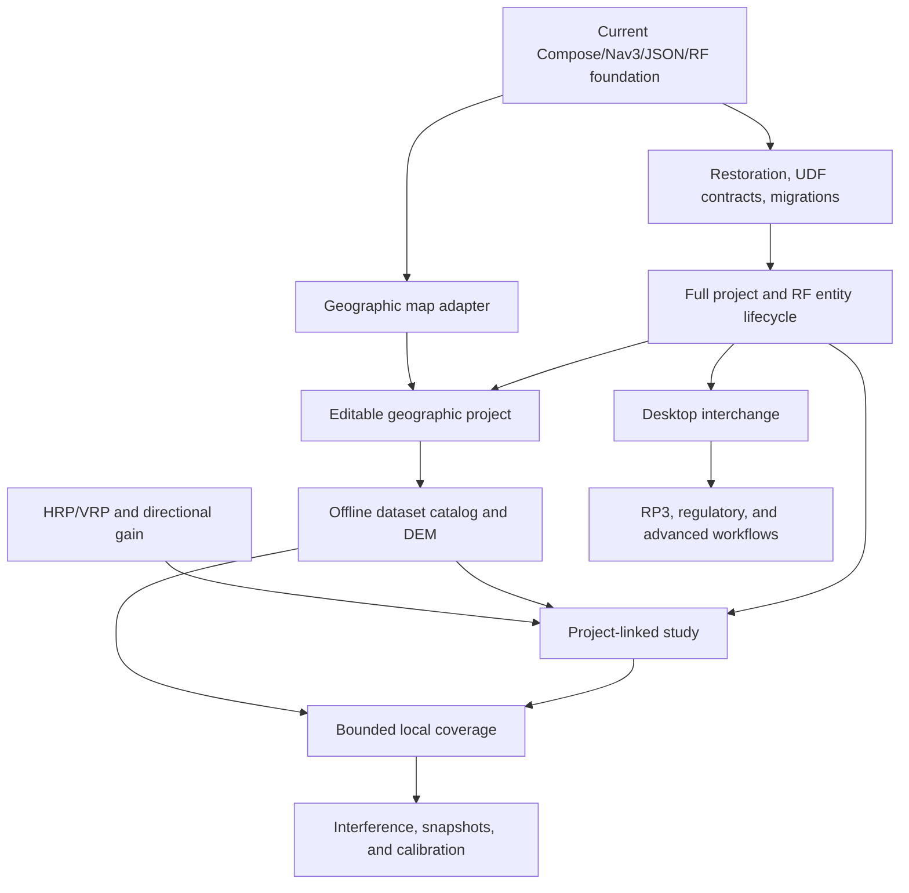

# Android Application Map

> Evidence baseline: August 24, 2026. This document separates the Android capabilities that exist in the repository from foundations, plans, and blocked work. It does not claim complete functional or numerical parity with ATX Plan desktop or RadioPlanner.

## 1. Mobile product objective

ATX Plan Android is an **offline-first companion to the desktop product that can also complete bounded engineering tasks on its own**. A phone or tablet should support field preparation, local RF inventory, data inspection, calculations that fit the device resource budget, and reproducible evidence. Remote providers may add data or accelerate exceptional workloads, but they must not be a hidden requirement for opening local projects or running the supported local baseline.

The mobile experience is task-oriented rather than a copy of the desktop window layout. It must account for touch input, adaptive layouts, intermittent connectivity, process death, storage pressure, battery use, memory, and thermal limits.

### Current usable slice

The repository now provides a working foundation slice:

1. launch an adaptive Compose shell;
2. navigate among Dashboard, Projects, Engineering Map, Studies, and Data Catalog with Navigation 3;
3. load a schema-versioned project catalog from private storage;
4. create and select local projects;
5. inspect a synthetic demonstration project with one RF network, three sites, sectors, and study summaries;
6. inspect site positions and active-sector azimuths on a local technical canvas;
7. calculate a free-space link budget locally;
8. run unit tests and a Compose instrumented navigation test.

This slice is not yet the mobile engineering MVP defined later in the roadmap. It has no cartographic basemap, terrain profile, antenna pattern, persisted study result, raster coverage, desktop-project interchange, or advanced propagation engine.

## 2. Status vocabulary

| Status | Meaning | Required evidence |
|---|---|---|
| **Delivered** | Android code in the current repository provides a bounded, observable behavior. | Source path plus a test, build artifact, or reproducible interaction. |
| **Foundation** | A real technical base exists, but the complete product capability or hardening gate is not finished. | Configuration or code exists, with its limits stated explicitly. |
| **Planned** | Scope, dependency, and acceptance gate are defined, but implementation is not present. | Target phase and verifiable acceptance criteria. |
| **Blocked** | Work must not be represented as available until a legal, product, data, compatibility, or technical decision is made. | Named decision and evidence that clears the block. |

A feature delivered on desktop is not delivered on Android. A screen or enum alone is a foundation, not an implemented engineering workflow.

## 3. Current Android baseline

| Area | Status | Evidence in the repository | Current limit |
|---|---|---|---|
| Android identity | Delivered | Namespace and application ID are `com.gecesars.atxplan`; version is `0.1.0`. | Public distribution still depends on licensing, signing, privacy, and release policy. |
| Android compatibility | Delivered | `minSdk 23`, `targetSdk 36`, `compileSdk 36.1`; Java 17 bytecode. | A formal physical-device support matrix is still required. |
| Build configuration | Foundation | Gradle 9.3.1, AGP 9.1.1, Kotlin 2.2.10, Compose BOM 2026.04.01, lint configured to abort on errors. | Release shrinking and signing are not configured. |
| CI | Delivered | GitHub Actions builds unit tests, lint, debug APK, and debug test APK with JDK 21 and SDK 36.1. | Connected instrumented tests are not run by that workflow. |
| Local build evidence | Delivered | Debug APK and test APK exist; latest lint report has 0 errors and 9 dependency-version warnings. | This is development evidence, not a signed release gate. |
| Compose shell | Delivered | `MainActivity` hosts `AtxPlanTheme` and `AtxPlanApp`; Material 3 and edge-to-edge are active. | The product still needs complete accessibility, localization enforcement, and process-restoration coverage. |
| Adaptive UI | Delivered | Bottom navigation is used on compact widths and a navigation rail at 900 dp or wider. | Only the top-level shell is adaptive; feature layouts need broader device testing. |
| Navigation 3 | Foundation | Navigation 3 `NavDisplay` drives five top-level destinations. | Routes use an in-memory `Any` back stack; saved-state restoration, deep links, and feature-owned typed routes are not delivered. |
| UDF/ViewModel | Foundation | `AppUiState`, `StateFlow`, `AppViewModel`, lifecycle-aware collection, callbacks, notices, and storage-error rollback exist. | There are no explicit `Action`/`Effect` contracts, use-case layer, injected dispatchers, or ViewModel tests. |
| Project repository | Delivered | `ProjectRepository` is implemented by `FileProjectRepository` in private app storage. | Only one catalog file is supported; there is no Room database or portable project container. |
| Atomic JSON catalog | Delivered | Typed kotlinx.serialization JSON, schema 1, `AtomicFile`, `fd.sync`, 5 MiB limit, future-schema rejection, and preservation of invalid content. | Atomicity covers each individual write; saves are not serialized, and migration/concurrency/failure-injection tests do not exist yet. |
| Project operations | Delivered | Load, create, select, save, optimistic update, and rollback on save failure. | Rename, delete, duplicate, archive, import, and entity CRUD are not delivered; overlapping optimistic saves are not coordinated. |
| Domain model | Foundation | Kotlin models cover catalog, project, network, RF system, site, sector, geographic point, and study summary with validation. | Receiver, scenario snapshot, dataset, artifact, full study request/result, and unit value types are not modeled yet. |
| Demonstration data | Delivered | Missing storage is seeded with a clearly synthetic São Paulo FM project: one network, three sites, one sector per site, and two study summaries. | It is demonstration data and must not be used as an engineering reference. |
| Dashboard | Delivered | Shows selected project, local project/site/study counts, foundation status, and shortcuts. | It summarizes catalog data only. |
| Projects screen | Delivered | Lists, selects, and creates projects with name/customer validation; shows schema and selected-project details. | It does not edit project entities or lifecycle operations beyond create/select. |
| Engineering Map screen | Foundation | Offline Compose Canvas plots local site positions and active-sector azimuth rays with semantic description. | It is not a geographic map: no projection, basemap, pan/zoom, editing, scale, tiles, attribution, or DEM. |
| Studies screen | Delivered | Validated form executes the local free-space link calculation and renders explicit result terms. | Result remains in ViewModel memory and is not tied to project endpoints or persisted as a study artifact. |
| Data Catalog screen | Foundation | Shows an honest static capability inventory and planned gates. | It does not install, inspect, download, or remove datasets. |
| RF calculator | Delivered | Pure Kotlin computes FSPL/P.525, EIRP, received power, fade margin, midpoint first Fresnel radius, thermal noise floor, and SNR. | No geodesic path, terrain, curvature, clutter, antenna pattern, diffraction, fading variability, or model edition manifest. |
| Unit tests | Delivered | Nine passing tests cover project validation/serialization, RF formulas/invalid inputs, and an English-only production-source guard. | Repository atomicity/concurrency, ViewModel state, navigation, and screen forms lack unit coverage. |
| Instrumented test | Delivered | One passing Compose test on Android 16 opens Studies from Dashboard and verifies the link-budget entry point. | It is a smoke test only and is not part of current CI. |
| Backup policy | Delivered | Application backup is disabled in the manifest. | A selective backup/restore policy must be designed before user datasets or portable projects are introduced. |
| Product language | Delivered baseline | Production UI, domain/storage diagnostics, demo content, tests, and these documents are in English; `EnglishOnlySourceTest` guards common Portuguese source terms. | The blacklist is a regression aid, not complete linguistic proof; new resource/file types must enter the guard. |

## 4. Current screens

| Screen | Current behavior | Status | Next boundary |
|---|---|---|---|
| **Dashboard** | Project metrics, offline message, quick navigation, selected-project summary. | Delivered | Persisted jobs, diagnostics, and real dataset availability. |
| **Projects** | Catalog list, project selection, create dialog, network/study summary. | Delivered | Full project and RF entity CRUD, migration, delete/duplicate/archive. |
| **Engineering Map** | Local coordinate normalization, site markers, active-sector azimuth strokes, site list. | Foundation | Real map adapter, geographic camera, offline source, editing, attribution, DEM. |
| **Studies** | Manual RF parameters and deterministic free-space link results. | Delivered | Endpoint selection, terrain profile, LOS, curvature, persisted study request/result. |
| **Data Catalog** | Static matrix of delivered and planned capabilities. | Foundation | Dataset inventory, storage budget, import/download, validation, and removal. |

## 5. User profiles

| Profile | Priority mobile task | Relationship to desktop |
|---|---|---|
| Field technician | Inspect assets, verify coordinates, record notes and measurements. | Produces auditable inputs for the main project. |
| Link engineer | Check endpoints, terrain, LOS, Fresnel, and a bounded link budget. | Performs rapid local screening and can reproduce advanced work on desktop. |
| Coverage engineer | Inspect existing results and run resource-bounded local grids. | Uses desktop or an optional service for large areas and heavy engines. |
| RF planner | Maintain projects, networks, sites, sectors, receivers, and parameters. | Uses the same vocabulary, units, and provenance rules as ATX Plan. |
| Regulatory analyst | Inspect evidence and collect field inputs. | Regulatory conclusions remain blocked until legal and numerical gates pass. |
| Data administrator | Install regional offline packages and inspect license, hash, coverage, and storage. | Shares data provenance policy with the ATX ecosystem. |

## 6. Desktop/RadioPlanner capability map

Priorities:

- **P0:** required for the offline mobile MVP;
- **P1:** required for a broadly capable mobile product;
- **P2:** advanced, scale-dependent, or selectively valuable on mobile;
- **P3:** no implementation commitment until reprioritized.

Roadmap phases `F0` through `F8` are defined in `ROADMAP.md`.

### 6.1 Foundation, projects, and operation

| Reference capability | Android status | Priority | Target | Acceptance boundary |
|---|---:|---:|---:|---|
| Adaptive project-oriented shell | Delivered | P0 | F0 | Five areas render on compact and expanded layouts. |
| Navigation 3 top-level switching | Foundation | P0 | F1 | Add restorable typed routes, process-death tests, and internal destination contracts. |
| UDF/ViewModel/repository boundary | Foundation | P0 | F1 | Add explicit actions/effects, use cases, DI, dispatchers, and ViewModel tests. |
| Local project catalog | Delivered | P0 | F0/F2 | Schema-1 atomic JSON catalog loads, creates, selects, and saves projects. |
| Versioned durable persistence | Foundation | P0 | F2 | Add tested migrations, project assets, jobs, and a database/file ownership model. |
| Project lifecycle | Foundation | P0 | F2 | Add rename, duplicate, archive, delete, recovery, and consistency checks. |
| Desktop `.atxp` interchange | Blocked | P0 | F6 | Approve schema contract, capability negotiation, fixtures, and lossless handling of unsupported content. |
| Scenarios and immutable snapshots | Planned | P1 | F5 | Recalculation creates a new execution without overwriting source inputs/results. |
| RadioPlanner `.rp3` import | Blocked | P2 | F6/F7 | Approve provenance, legal corpus, hostile-file limits, conversion report, and supported subset. |
| Durable jobs | Planned | P0 | F1/F3 | Persist progress/cancel/retry/checkpoint state and recover after process death. |
| Offline help and diagnostics | Planned | P1 | F6 | Searchable embedded help and a sanitized diagnostic package. |

### 6.2 RF entities and scenarios

| Reference capability | Android status | Priority | Target | Acceptance boundary |
|---|---:|---:|---:|---|
| RF system/network model | Foundation | P1 | F2 | Existing typed model becomes editable and persisted with shared profiles. |
| Sites | Foundation | P0 | F2 | Existing validated model gains create/edit/delete and map placement. |
| Sectors | Foundation | P0 | F2 | Existing validated RF fields gain CRUD, typed units, and antenna reference. |
| Receivers/CPE | Planned | P0 | F2 | Model, CRUD, thresholds, losses, gain, height, and link endpoint selection. |
| Study summaries | Foundation | P0 | F2/F4 | Existing enum/summary becomes a versioned request, execution, result, and artifact. |
| Band, technology, channel, and noise profiles | Planned | P1 | F5 | Versioned schema with no unexplained defaults. |
| LTE/5G, MIMO, and modulation tables | Planned | P2 | F7 | Formula/table provenance and fixtures per edition/vendor. |
| FWA downlink/uplink | Planned | P2 | F7 | Separate TX/RX chains and direction-specific results. |
| Simulcast and air-to-ground | Planned | P2 | F7 | Dedicated use cases and explicit parameter sets. |

### 6.3 Map, GIS, and offline data

| Reference capability | Android status | Priority | Target | Acceptance boundary |
|---|---:|---:|---:|---|
| Technical site/azimuth canvas | Foundation | P0 | F0/F3 | Existing canvas remains a diagnostic view, not a cartographic claim. |
| Geographic 2D map | Planned | P0 | F3 | Renderer spike, lifecycle, gestures, camera, scale, attribution, and tests. |
| Offline basemap | Planned | P0 | F3 | Authorized local package, storage budget, integrity, and airplane-mode test. |
| Controlled online provider | Planned | P1 | F3 | HTTPS, terms, cache, attribution, client identity, and no bulk download. |
| GeoTIFF/HGT DEM | Planned | P0 | F3 | Adapter, explicit NoData, CRS, hash/license, and known fixtures. |
| Terrain profile | Planned | P0 | F4 | Geodesic sampling, monotonic distance, interpolation tests, and tile provenance. |
| Dataset catalog and acquisition | Planned | P1 | F3 | Envelope plan, disk preflight, consent, `.part`, resume, validation, SHA-256, atomic promotion. |
| Point/line/polygon layers | Planned | P1 | F6 | Start with validated GeoJSON/CSV and explicit CRS/size limits. |
| Nine-class clutter | Planned | P2 | F7 | Licensed categorical source, mapping table, and numerical fixtures. |
| Buildings | Planned | P2 | F7 | Geometry/height policy, spatial index, and mobile benchmark. |
| IBGE population | Blocked | P2 | F7 | Mobile package format, license, update policy, and storage benchmark. |
| Full GIS editing | Planned | P3 | Later | Validated user demand and usable mobile editing design. |

### 6.4 Antennas

| Reference capability | Android status | Priority | Target | Acceptance boundary |
|---|---:|---:|---:|---|
| Sector azimuth and electrical tilt fields | Foundation | P0 | F2/F4 | Existing fields gain canonical value types and directional-gain use. |
| HRP/VRP model | Planned | P0 | F4 | Canonical representation, cyclic horizontal interpolation, vertical convention, and fixtures. |
| PAT/PRN/CSV/TXT/JSON import | Planned | P1 | F4/F6 | Defensive parser, preview, normalization report, and corpus. |
| Antenna library | Planned | P1 | F4 | Versioned source/hash, tags, search, and TX/RX association. |
| Polar/Cartesian plots | Planned | P1 | F4 | Accessible renderer, angular query, and golden screenshots. |
| Directional gain | Planned | P0 | F4 | Azimuth/tilt conventions and quadrant/boundary tests. |
| 3D pattern | Planned | P2 | F7 | Numerical and graphics benchmark on reference devices. |
| Arrays and synthesis | Planned | P3 | Later | Coherent amplitude/phase domain and independent fixtures. |

### 6.5 Terrain, propagation, and link studies

| Reference capability | Android status | Priority | Target | Acceptance boundary |
|---|---:|---:|---:|---|
| Manual free-space link form | Delivered | P0 | F0/F4 | Current form validates and exposes all implemented terms. |
| FSPL/P.525 | Delivered | P0 | F0/F4 | Unit test matches 900 MHz over 10 km to declared tolerance. |
| EIRP and received power | Delivered | P0 | F0/F4 | Gains and losses remain explicit and tested. |
| Thermal noise and SNR | Delivered | P0 | F0/F4 | Bandwidth in hertz and receiver noise figure are tested. |
| Midpoint first Fresnel radius | Delivered | P0 | F0/F4 | Path-fraction and invalid-input behavior are tested. |
| Endpoint geodesy, curvature, and LOS | Planned | P0 | F4 | Independent fixtures and documented tolerances. |
| Persisted link study and manifest | Planned | P0 | F4 | Project-linked request/result survives restart and exports fingerprint/provenance. |
| Hata | Planned | P1 | F5 | Strict urban/suburban/open ranges and golden cases. |
| 3GPP UMa | Planned | P1 | F5 | LOS/NLOS and edition are explicit. |
| P.526/Bullington/Deygout | Planned | P1 | F5 | Full terrain profile, reference vectors, and intermediate terms. |
| ITM/P.1812/P.1546 | Blocked | P2 | F7 | Approve Kotlin/native/service backend, runtime/license, edition, and numerical parity. |
| P.528/FCC curves | Blocked | P2 | F7 | Approve official runtime/data, mobile use case, and fixtures. |

### 6.6 Coverage, interference, and measurements

| Reference capability | Android status | Priority | Target | Acceptance boundary |
|---|---:|---:|---:|---|
| Coverage study type/status enum | Foundation | P1 | F5 | Existing metadata must not be presented as a computed coverage result. |
| Small power/field grid | Planned | P1 | F5 | Blocked/cancelable computation, explicit NoData, and preflight resource budget. |
| Best server and overlap | Planned | P1 | F5 | Correct linear aggregation and tested categorical output. |
| C/(I+N) | Planned | P1 | F5 | Noise and included signals are recorded in the manifest. |
| RSRP/RSRQ/EPRE/throughput | Planned | P2 | F7 | Validated technology models and versioned parameters. |
| Large-area coverage | Blocked | P2 | F7 | Thermal/memory benchmark and native or optional-service contract. |
| Snapshot comparison | Planned | P1 | F5 | Grid alignment, numerical tolerance, and threshold transitions. |
| Measurement import | Planned | P1 | F6/F7 | Validated CSV/GeoJSON with timestamp, quality, and source. |
| Calibration | Planned | P2 | F7 | Immutable raw samples, holdout, metrics, and parameter audit. |

### 6.7 Regulatory, export, and distribution

| Reference capability | Android status | Priority | Target | Acceptance boundary |
|---|---:|---:|---:|---|
| FM/TV and D/U regulatory workflow | Blocked | P2 | F7 | Legal scope, normative sources, datasets, engines, and inconclusive-result policy. |
| CSV/JSON/GeoJSON | Planned | P0 | F4/F6 | Documented schemas, units, version, and supported round trip. |
| Physical/classified GeoTIFF | Planned | P1 | F5/F6 | CRS, transform, NoData, palette, metadata, and external-reader validation. |
| KMZ/PNG | Planned | P1 | F6 | Geographic alignment, attribution, and size limits. |
| JSON/HTML report | Planned | P1 | F6 | Input fingerprint, effective inputs, warnings, and versions. |
| Paginated PDF | Planned | P2 | F7 | Template, pagination, and visual accessibility. |
| Signed Android release | Blocked | P0 | F8 | License, signing, SBOM, privacy, backup, device matrix, and release-channel approval. |

## 7. Product boundaries

### The mobile app must

- keep local projects and supported calculations usable without a network;
- state when memory, battery, missing data, unsupported capability, or model validity limits a result;
- preserve units, angular conventions, versions, and provenance;
- provide field-appropriate inspection and editing;
- produce artifacts that can be verified outside the device;
- expose remote compute only as an explicit, replaceable option;
- use English for all product-facing UI, diagnostics, tests, and documentation.

### The mobile app does not yet claim

- complete functional or numerical equivalence with any RadioPlanner version;
- `.rp3` binary round trip;
- `.atxp` read/write compatibility;
- regulatory certification;
- terrain-aware or normative propagation;
- a real cartographic map;
- antenna-pattern-aware gain;
- raster coverage;
- continent-scale computation on-device;
- cloud collaboration or silent background synchronization;
- unrestricted access to third-party tiles or datasets.

## 8. Capability dependencies

The current calculator is a legitimate delivered baseline, but it does not satisfy the terrain-aware link-study milestone by itself.

## 9. Parity rule

An Android capability may be labeled **validated parity** only when all of the following exist:

1. identical input meaning, unit, geometry, and model edition;
2. independent fixtures and, where legally permitted, a frozen reference corpus;
3. tolerance by intermediate term, not only by aggregate result;
4. approved provenance and licensing;
5. a reproducible comparative result in CI or a recorded bench;
6. explicit handling of unsupported data and implementation differences.

Until that gate, permitted labels are **supported on Android**, **partial import**, **foundation**, or **planned**, according to evidence.

## 10. Open decisions

| Decision | Status | Required output |
|---|---|---|
| Product license and public distribution policy | Blocked | License file, third-party inventory, data policy, and owner approval. |
| Physical-device support matrix | Planned | Minimum, reference, and high-capability devices across supported Android versions. |
| Navigation restoration contract | Planned | Typed routes, saved back stack, process-death behavior, and tests. |
| JSON catalog evolution versus Room | Planned | Persistence ADR, migration policy, ownership model, and transition fixtures. |
| Android ↔ desktop `.atxp` contract | Blocked | Container/schema contract, read/write matrix, migrations, and fixtures. |
| Geographic renderer and offline map format | Planned | Comparative spike, license review, and lifecycle/performance report. |
| Heavy-compute backend | Planned | Kotlin/native benchmark and optional-service contract. |
| Mobile regulatory scope | Blocked | Allowed use cases, warnings, sources, and validation standard. |

## 11. Maintenance rules

- Change a status only in the same change set that adds or removes its evidence.
- Link every delivered capability to tests and a completed roadmap gate.
- Record irreversible or high-cost decisions in ADRs before adding central dependencies.
- Keep desktop and Android status separate.
- Do not promote a screen, enum, mock, or dependency to Delivered unless the end-to-end behavior exists.
- Keep every heading, table, note, and user-facing example in English.
