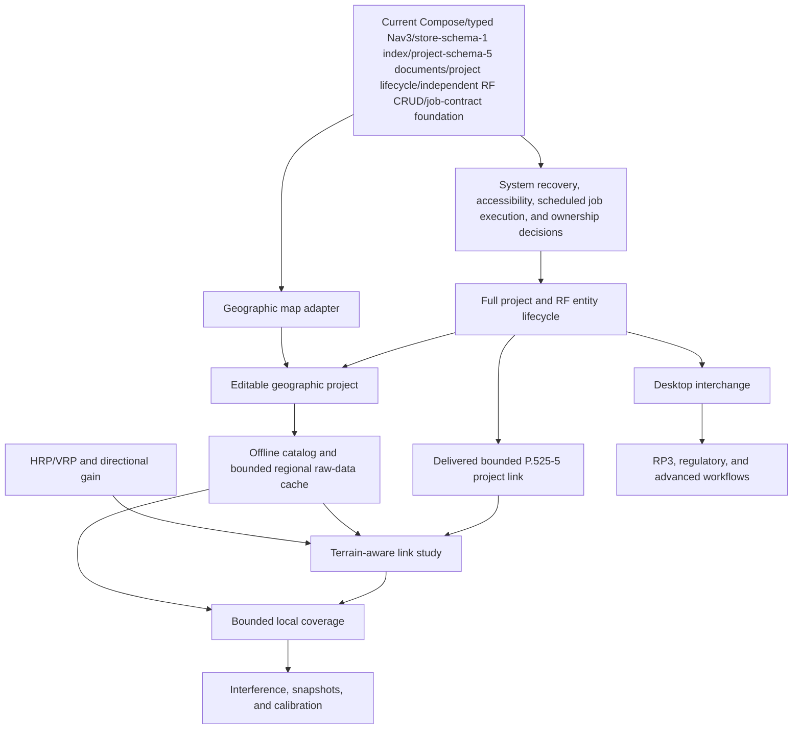

# Android Application Map

> Evidence baseline: August 27, 2026. This document separates the Android capabilities that exist in the repository from foundations, plans, and blocked work. It does not claim complete functional or numerical parity with ATX Plan desktop or RadioPlanner.

## 1. Mobile product objective

ATX Plan Android is an **offline-first companion to the desktop product that can also complete bounded engineering tasks on its own**. A phone or tablet should support field preparation, local RF inventory, data inspection, calculations that fit the device resource budget, and reproducible evidence. Remote providers may add data or accelerate exceptional workloads, but they must not be a hidden requirement for opening local projects or running the supported local baseline.

The mobile experience is task-oriented rather than a copy of the desktop window layout. It must account for touch input, adaptive layouts, intermittent connectivity, process death, storage pressure, battery use, memory, and thermal limits.

### Current usable slice

The repository now provides a working foundation slice:

1. launch an adaptive Compose shell with a compact phone-density implementation for Dashboard and Projects;
2. navigate among Dashboard, Projects, Engineering Map, Studies, and Data Catalog with Navigation 3;
3. load or explicitly migrate a schema-5 project catalog stored as a small atomic index plus immutable SHA-256 project documents, including atomic indexed schema-4-to-5 promotion;
4. create, select, rename, transactionally duplicate, archive, restore, and transactionally hard-delete local projects;
5. add a linked RF network, transmitter site/sector, and receiver through one validated, transactional Add RF Path flow;
6. independently create, edit, and delete project-scoped networks, sites, sectors, and receivers through the compact Manage RF Assets screen, with stale-write and RF-reference checks;
7. inspect a synthetic demonstration project with one RF network, three sites, sectors, and study summaries;
8. inspect sites and active-sector azimuths in an offline Web Mercator coordinate viewport, fit/pan/zoom/select them, and persist a stale-safe location-only site move;
9. calculate a manual free-space link budget locally, or select a stored sector and compatible receiver to calculate and persist a bounded ITU-R P.525-5 project link study;
10. install and verify the bundled IBGE 2022 national attribute index in private storage, then search and inspect municipality summaries entirely offline;
11. plan and explicitly acquire a small regional raw-data envelope from the fixed Copernicus GLO-30 DSM, ESA WorldCover, and experimental OpenStreetMap building-way sources, with bounded processing and inventory;
12. run JVM and Android tests for the delivered domain, persistence, project-link study, dataset, UDF, form, and navigation behavior.

This slice is not yet the mobile engineering MVP defined later in the roadmap. The persisted project-link result is a deliberately bounded free-space record: downloaded DSM and land-cover COGs are not raster-sampled or consumed by RF calculations, and there is no bare-earth DTM, cartographic basemap, terrain profile, Earth-curvature clearance, LOS or Fresnel-clearance analysis, diffraction, RF clutter mapping, directional antenna-pattern loss, raster coverage, study export, desktop-project interchange, `.rp3` support, or full RadioPlanner parity.

## 2. Status vocabulary

| Status | Meaning | Required evidence |
|---|---|---|
| **Delivered** | Android code in the current repository provides a bounded, observable behavior. | Source path plus a test, build artifact, or reproducible interaction. |
| **Foundation** | A real technical base exists, but the complete product capability or hardening gate is not finished. | Configuration or code exists, with its limits stated explicitly. |
| **Planned** | Scope, dependency, and acceptance gate are defined, but implementation is not present. | Target phase and verifiable acceptance criteria. |
| **Blocked** | Work must not be represented as available until a legal, product, data, compatibility, or technical decision is made. | Named decision and evidence that clears the block. |

A feature delivered on desktop is not delivered on Android. A screen or enum alone is a foundation, not an implemented engineering workflow.

## 3. Current Android baseline

| Area | Status | Evidence in the repository | Current limit |
|---|---|---|---|
| Android identity | Delivered | Namespace and application ID are `com.gecesars.atxplan`; version is `0.1.0`. | Public distribution still depends on licensing, signing, privacy, and release policy. |
| Android compatibility | Delivered | `minSdk 23`, `targetSdk 36`, `compileSdk 36.1`; Java 17 bytecode. | A formal physical-device support matrix is still required. |
| Build configuration | Foundation | Gradle 9.3.1, AGP 9.1.1, Kotlin 2.2.10, Compose BOM 2026.04.01, lint configured to abort on errors. | Release shrinking and signing are not configured. |
| CI | Delivered | GitHub Actions builds unit tests, lint, debug APK, and debug test APK with JDK 21 and SDK 36.1. | Connected instrumented tests are not run by that workflow. |
| Local build evidence | Delivered | Debug APK and test APK exist; latest lint report has 0 errors and 12 dependency/tooling warnings. | This is development evidence, not a signed release gate. |
| Compose shell | Delivered | `MainActivity` hosts `AtxPlanTheme` and `AtxPlanApp`; Material 3 and edge-to-edge are active. | The product still needs complete accessibility, localization enforcement, and process-restoration coverage. |
| Adaptive UI | Delivered | Bottom navigation is used on compact widths and a navigation rail at 720 dp or wider. Rail labels/header collapse to five accessible icons below 520 dp height. Dashboard metrics, Studies fields/results, RF and project-name editor fields, the compact adaptive Duplicate, Archive, and Delete Project dialogs, archived-project cards/actions, the map canvas/site list, and Data cards use bounded responsive layouts. The Activity resizes for the IME so short landscape editors and dialogs retain reachable content and actions. | The shell and bounded feature density are adaptive; wider device coverage and full adaptive list/detail patterns still need testing. |
| Compact phone density | Delivered baseline | Scalable typography, 16 dp Dashboard/Projects gutters, 12 dp field-heavy screen gutters, compact shared components, responsive fields/cards/map height, and explicit 48 dp minimums on controls changed by the pass are implemented. Manual checks used one physical Android 16 phone at 1280 × 2772 pixels and 520 dpi: portrait at font scales 1.15 and 1.30, plus landscape at 1.15. Separate Android 16/API 36 emulator checks at 1080 × 2400 pixels and 420 dpi covered Duplicate Project and Delete Project at font scales 1.0/1.30 in portrait and short landscape with Gboard open/closed. Archive Project/actions and the archived-project card were reachable in portrait at font scales 1.0/1.30/2.0 and in landscape at 1.30. Manage RF Assets and the IBGE Data Catalog have deterministic 360 × 480 dp/font-scale-1.30 automated reachability checks. Five project-link cases at that size and scale cover searchable endpoint selectors/save action, complete saved details, lazy history, collision-safe sector identity, and the explicit no-compatible-receiver state. A fresh 1080 × 2400/font-scale-1.30 manual Catalog run verified the dense metrics, source/limitation text, unaccented municipality search, results, and selected details. | These are bounded physical-device and emulator observations, not a device, aspect-ratio, theme, font-scale, or accessibility matrix. No system font-scale override or clamp is used. |
| Navigation 3 | Foundation | `NavDisplay` uses serializable stable-ID `AtxRoute` keys, a saveable typed back stack, bounded fallback for unknown routes, and nested RF-path, project-name, and project-scoped RF-asset editors. Saved-instance-state restoration is tested for all three nested route families. | Deep links, deleted-ID recovery UX, adaptive list/detail, and true process-death/rotation testing across supported devices are not complete. |
| UDF/ViewModel | Foundation | Explicit actions/effects, structured problem/recovery values, injected use cases/dispatchers, calculation cancellation, ViewModel transition tests, and a pure regional job/reconciliation contract are implemented. Catalog mutations rebase generically on the latest catalog inside the repository transaction, persist before publication, and return the latest durable catalog without writing for rejected/no-op outcomes. | Feature-level ViewModels, cross-instance catalog observation, DI/scoping policy, job runner/scheduler/UI wiring, diagnostics/observability, accessibility, and system recovery remain. |
| Project repository | Delivered | `ProjectRepository` is implemented by `FileProjectRepository` in private app storage. The current schema-5 project model is stored through a small atomic index backed by immutable, SHA-256-addressed project documents. | There is no Room database, portable project container, multi-process writer policy, or user-facing recovery/export workflow. |
| Indexed project persistence | Delivered baseline | Strict UTF-8 JSON uses an atomic store-schema-1 index declaring project schema 5 plus immutable project-schema-5 documents verified by SHA-256 and byte length. Legacy project schemas 1–4 migrate to project schema 5. For an indexed project-schema-4 catalog, every migrated immutable project-schema-5 document is written and verified before the replacement store-schema-1 index declaring project schema 5 becomes the commit point, so a document or index failure leaves the previous reachable index declaring project schema 4 authoritative. The index retains a 5 MiB limit, each project document has a conservative 8 MiB limit, and the shared mutex still protects latest-catalog read-transform-write mutation. | Unreferenced immutable documents can remain after a failed or superseded commit because garbage collection is not implemented. Recovery/export UX, multi-process policy, Android storage-exhaustion/interruption evidence, backup, and a portable ownership contract remain. |
| Artifact store | Foundation | A private content-addressed store can stage, size-bound, SHA-256-verify, deduplicate, inspect, and copy immutable artifact bytes. Project schema 5 can persist bounded artifact references and structural records that may point to them. Regional acquisition uses a separate bounded dataset cache and inventory rather than project artifact references. | No user import workflow, artifact-management UI, project attachment flow, garbage collection, export package, ownership cleanup, or reference-aware regional removal is delivered. The project-link record is persisted inside its project document and does not make either store a completed result-package workflow. The IBGE and regional data foundations do not make an antenna, GIS, terrain, coverage, regulatory, or report workflow functional. |
| Project operations | Foundation | Load, create, select, rename, duplicate, archive, restore, hard-delete, and transactional mutation are delivered. Archive retains the unchanged aggregate with an archive timestamp/original index, removes it from active selection/metrics, and chooses a deterministic active fallback. Restore reinserts the unchanged aggregate at the original index clamped to the latest catalog and selects it. Complete-snapshot checks reject stale, repeated, or missing archive/restore operations without writes. Hard deletion remains a separate active-project operation. Add RF Path persists one linked network/site/sector/receiver without exposing partial state. Independent network, site, sector, and receiver create/edit/delete mutations execute against the latest durable project, reject stale expected entities, preserve reference invariants, block deletion of a referenced network, and require explicit deletion of a site's contained sectors. A map-specific site move changes only coordinates through the same durable receipt pipeline. The project-link mutation rejects a stale reviewed project, missing endpoints, incompatible networks, and ID collisions before appending one result. Duplication preserves existing immutable study records and their original snapshotted source-project identity instead of rebasing history to the copy's root ID. | Local archive is not hard-delete recovery/undo, backup, export, synchronization, or artifact recovery. Unreadable/future-index recovery, import, artifact ownership/cleanup, and aggregate-level source-project lineage remain. Reference-aware deletion covers live RF network/sector/receiver and site/sector relationships; persisted project-link records hold immutable snapshots rather than live endpoint references, while dependency policy for scenarios, antenna records, GIS records, and external packages remains incomplete. |
| Domain model | Foundation | Kotlin schema-5 models include active/archive invariants, `ArchivedProject` lifecycle metadata, serializable engineering value types, typed coordinates, receiver/CPE and receiver/sector network references, richer RF fields, and bounded structural records for antenna patterns, GIS layers, study scenarios, coverage snapshots, regulatory studies, artifact references, and import provenance. A `ProjectLinkStudyRecord` holds immutable project/network/endpoint/effective-RF snapshots, mean-Earth geometry, result provenance and terms, warnings, and a canonical SHA-256 input/geometry fingerprint; aggregate validation requires one matching completed point-to-point summary. | The other non-RF records are persistence foundations, not implemented import, GIS, antenna, coverage, regulatory, or report workflows. Existing legacy primitive entity fields still need staged migration. Terrain-aware and portable/exported study artifacts remain planned beyond the bounded P.525-5 record. |
| Demonstration data | Delivered | Missing storage is seeded with a clearly synthetic São Paulo FM project: one network, three sites, one sector per site, and two study summaries. | It is demonstration data and must not be used as an engineering reference. |
| Dashboard | Delivered | Shows the selected active project and active project/site/study counts, foundation status, and shortcuts; archived projects and their entities are excluded from active metrics. Its metric row responds to compact width and accessibility font scale. | It summarizes catalog data only; broader layout and accessibility testing remains. |
| Projects and nested editors | Foundation | Projects lists/selects/creates active projects, opens compact adaptive duplication/archive/exact-keyword deletion dialogs, shows a collapsible archived-project section with retained counts/timestamp/restore, opens saveable project-name and Add RF Path editors, and links the selected project to the compact Manage RF Assets screen. | These are bounded project-operation slices; hard-delete recovery/export, artifact lifecycle, broader process-restoration evidence, and broader device testing remain. |
| Engineering Map screen | Foundation | An offline Compose coordinate viewport uses tested Web Mercator projection, antimeridian-aware project fit, pan, anchored pinch zoom, metric scale, site selection, accessible site-list alternatives, active-sector azimuths, explicit grid attribution, and a durable location-only site editor. Elevation is shown as either a stored project value or explicit `NoData`, with a warning that relocation does not resample it. | No basemap, map-package lifecycle, third-party tiles, DEM sampler, terrain, IBGE geometry rendering, GIS-feature renderer, receiver move, or map performance gate is delivered. G4 remains open. |
| Studies screen | Delivered bounded slice | The manual form still executes an in-memory free-space calculation. A separate compact project-link composer uses searchable lazy selectors for a stored sector and network-compatible stored receiver, snapshots their effective values, runs the bounded P.525-5 calculation, saves the immutable record and matching completed summary through the project transaction, and renders the latest result, expandable complete persisted details, and lazy timestamp-ordered history after durable commit. | The saved record has mean-Earth endpoint geometry and AGL-only inclined distance, not evaluated stored ground elevation, DEM/terrain, Earth-curvature clearance/effective-Earth propagation, LOS, Fresnel clearance, diffraction, clutter/buildings/vegetation, atmospheric gas/rain/variability, directional pattern loss, coverage, export, or RadioPlanner parity. |
| Data Catalog screen | Delivered bounded slices | Shows the capability matrix and verified bundled IBGE index, plus a compact regional raw-data flow for a WGS 84 envelope. The regional foundation uses only fixed HTTPS hosts, bounds initial/redirect URLs to 2,048 characters, requires source-license review, enforces a 384 MiB plan budget and per-artifact caps, resumes only provenance-valid GET partials, records same-origin completion provenance/hashes/licenses, serializes acquisition and inventory operations application-wide across repository instances, indexes bounded TIFF metadata, and derives deterministic building GeoJSON from tiny opt-in OSM way requests. A separate non-executing foundation provides canonical E6 plans, semantic/execution fingerprints, strict job/CAS records with future-artifact checkpoint rejection, and pure reconciliation decisions with contextual terminal/nonterminal outcome auditing, separate record guards/scheduler targets, deterministic extra-target cancellation, unreadable-ID preservation, record-absence cancel guards, and typed generation exhaustion. | Regional acquisition serialization is in-process, not multi-process, and execution remains screen-bound; the job foundation is not wired to the screen, a reconciliation executor, a shared runner, or Android schedulers and is not process-recovery evidence. Copernicus GLO-30 is a DSM, not a bare-earth DTM; raster samples, terrain profiles, RF clutter mapping, building heights, arbitrary import/removal, garbage collection, sector polygons, exact containment, map integration, and population-by-coverage remain absent. |
| RF computation | Delivered bounded slice | Pure Kotlin `RfCalculator` implements ITU-R P.525-5 free-space loss plus EIRP, received power, fade margin, midpoint first Fresnel radius, thermal noise floor, and SNR with explicit provenance. `ProjectLinkStudyEngine` adds a spherical mean-Earth great-circle endpoint distance/bearing, relative azimuth and elevation angle, and an inclined distance computed only from horizontal distance and the difference between endpoint AGL antenna heights; the selected effective RF inputs and completed result are persisted in the immutable project record. | The stored transmitter-site ground elevation is snapshotted but not evaluated; receiver ground elevation, DEM sampling, and a terrain profile are not delivered. Earth-curvature clearance/effective-Earth propagation, LOS, Fresnel clearance, diffraction, clutter, directional antenna patterns, fading variability, coverage, exports, and full RadioPlanner parity are also absent. |
| JVM tests | Delivered baseline | The current 364-test JVM suite passes with no failures or skips. Regional additions cover fixed-source planning/transfer/cache/inventory/processing, cross-instance serialization and provenance hardening, canonical semantic/execution goldens, exact job/license/state invariants, atomic store/CAS faults, and pure reconciliation decisions alongside the prior model, RF, geographic, persistence, form, and English-only coverage. | The job tests do not prove UIDT/WorkManager, notifications, UI observation, or process/reboot recovery. A desktop semantic-fixture runner, terrain/LOS/Fresnel-clearance goldens, property testing, accessibility, performance, export, transformer fault automation, and complete system-flow coverage remain. |
| Instrumented tests | Delivered baseline | The complete connected suite contains 72 tests with no failures or skips on the Android 16/API 36 `Medium_Phone_API_36.1` emulator at system font scale 1.30. Three regional Catalog cases cover plan/license/start callbacks, explicit live-snapshot refresh, and running/cancel/limitation reachability at 360 × 480 dp/font-scale-1.30. All 5 `StudiesScreenTest` cases, the real-storage `FileProjectRepositoryMigrationTest`, and the real-`AtomicFile` `FileRegionalJobRepositoryTest` remain green on the same emulator. The preceding 18-test revision passed on the physical Android 16 reference phone. | A fresh physical run, API 23 dataset execution, true system-reclaim process termination, broader accessibility automation, a formal device matrix, and CI execution remain. |
| Manual archive lifecycle evidence | Delivered bounded evidence | On the API 36 emulator, Archive Project/actions and the archived-project card were reachable in portrait at font scales 1.0/1.30/2.0 and in landscape at 1.30. A force-stop/relaunch retained the archived record; after restore, another cycle retained the active selected project. | This is not Android Backup or system-reclaim restoration proof and does not establish every process-death timing or a support matrix. |
| Manual project-link persistence evidence | Delivered bounded evidence | At system font scale 1.30 on the API 36 emulator, a stored endpoint study was calculated and saved, then reopened after a force-stop/relaunch with the same scalar terms, provenance, warnings, and fingerprint. | This is one observed local-storage path, not Android Backup, arbitrary system-reclaim timing, or broad device evidence. |
| Backup policy | Delivered | Application backup is disabled in the manifest. | A selective backup/restore policy must be designed before user datasets or portable projects are introduced. |
| Product language | Delivered baseline | Production UI, domain/storage diagnostics, demo content, tests, and these documents are in English; `EnglishOnlySourceTest` guards common Portuguese terms in Kotlin, XML, JSON, and text production resources while allowing pinned official source identifiers. | The blacklist is a regression aid, not complete linguistic proof; each new user-visible resource type must enter the guard. |

## 4. Current screens

| Screen | Current behavior | Status | Next boundary |
|---|---|---|---|
| **Dashboard** | Compact responsive project metrics, offline message, quick navigation, and selected-project summary. | Delivered | Job observation/execution beyond the non-wired persistence foundation, diagnostics, broader dataset summaries, and broader device/accessibility evidence. |
| **Projects** | Compact wrapping active-project cards, selection/create/duplication/archive/deletion dialogs, a collapsible archived-project section with restore, schema/details, and entry to nested project-name, Add RF Path, and Manage RF Assets editors. | Foundation | Hard-delete recovery/export, artifact lifecycle, richer linked-deletion scope, and broader device/accessibility evidence. |
| **Rename Project** | Saveable compact name draft, explicit impact statement, transactional local save, durable-success return, normalized dirty-exit protection, and stale competing-rename rejection. | Delivered bounded slice | Metadata editing, richer conflict diagnostics, and broader device/accessibility evidence. |
| **Duplicate Project** | Compact adaptive dialog with a saveable normalized name draft. The transaction copies the latest durable source aggregate, assigns a fresh root ID/timestamps, leaves the source unchanged, appends and selects the durable copy, and closes the dialog only after completion is observable. | Delivered bounded slice | Source-lineage/duplication provenance and broader device/accessibility evidence. |
| **Archive and Restore Project** | The compact archive dialog reports retained project-scoped counts and refreshes a stale reviewed snapshot before confirmation. A successful transaction moves the unchanged aggregate out of active selection/metrics and records archive time/original index. The archived card restores the exact reviewed record at a deterministic clamped position and selects it after durable commit. | Delivered bounded slice | Local archive is not backup/export/sync or permanent-delete recovery; external assets, unreadable/future-catalog recovery, and broader device/accessibility evidence remain. |
| **Delete Project** | Compact adaptive dialog reports current project-scoped counts and requires exact `DELETE`. The transaction structurally compares the reviewed active aggregate with the latest durable version, rejects stale changes, atomically removes an unchanged target, preserves other projects, selects a deterministic neighbor, and closes only after durable absence is observable. Archived projects must be restored first. | Delivered bounded slice | Hard-delete undo/recovery/export, project-owned external assets, deleted-route recovery, and broader device/accessibility evidence. |
| **Add RF Path** | Validated saveable draft creates one linked selected-system RF network, site/sector, and receiver through one repository transaction. | Delivered bounded slice | Reusable profile editing and process-death end-to-end proof. |
| **Manage RF Assets** | Compact project-scoped lists and dialogs create, edit, and delete networks, sites, sectors, and receivers independently. Mutations use exact expected entities for stale detection; network deletion reports and blocks sector/receiver references, site deletion discloses contained-sector impact, and preserved per-network receiver profiles are identified as read-only compatibility references. | Delivered bounded slice | Editing/removing individual compatibility profiles, bulk operations, undo, artifact attachment, dependency impact for future live-reference study/scenario/antenna/GIS records, full process-death coverage, and broader device/accessibility evidence. |
| **Engineering Map** | Offline Web Mercator coordinate grid with antimeridian-aware fit, pan/pinch camera, metric scale, site selection, active-sector azimuths, accessible site list, explicit no-basemap attribution, stored-elevation/`NoData` disclosure, and durable coordinate-only site moves. | Foundation | Authorized offline basemap/package lifecycle, renderer decision, receiver move, DEM sampling, IBGE geometry, GIS layers, performance, and G4 evidence. |
| **Studies** | Manual RF parameters plus a project-linked ITU-R P.525-5 flow that selects a stored sector/compatible receiver, snapshots effective inputs, derives bounded mean-Earth/AGL-only geometry, persists an immutable fingerprinted record, and reopens saved terms and warnings from the selected project. | Delivered bounded slice | DEM/terrain profile, Earth-curvature clearance, LOS/Fresnel clearance, diffraction/clutter/pattern loss, export/portable manifest, coverage, `.rp3`, and full RadioPlanner parity. |
| **Data Catalog** | Capability matrix, verified first-use installation and offline municipality inspection for the bundled IBGE 2022 attribute index, plus explicit planning/acquisition/processing of small regional GLO-30 DSM, WorldCover, and experimental OSM building-way selections. | Delivered bounded slices | Wire the delivered job contract/store foundation to a shared runner, API-specific schedulers, notifications, and tested process recovery; raster sampling, bare-earth DTM, RF clutter mapping, building heights, arbitrary import/removal, garbage collection, sector geometry, map integration, and coverage-population analysis also remain. |

## 5. User profiles

| Profile | Priority mobile task | Relationship to desktop |
|---|---|---|
| Field technician | Inspect assets, verify coordinates, record notes and measurements. | Produces auditable inputs for the main project. |
| Link engineer | Check endpoints, terrain, LOS, Fresnel, and a bounded link budget. | Performs rapid local screening and can reproduce advanced work on desktop. |
| Coverage engineer | Inspect existing results and run resource-bounded local grids. | Uses desktop or an optional service for large areas and heavy engines. |
| RF planner | Maintain projects, networks, sites, sectors, receivers, and parameters. | Uses the same vocabulary, units, and provenance rules as ATX Plan. |
| Regulatory analyst | Inspect evidence and collect field inputs. | Regulatory conclusions remain blocked until legal and numerical gates pass. |
| Data administrator | Inspect the release-managed national IBGE package and explicitly acquire a small, fixed-catalog regional raw-data envelope with license, hash, provenance, storage, and processing status. | Shares data provenance policy with the ATX ecosystem; arbitrary packages and lifecycle administration remain planned. |

## 6. Desktop/RadioPlanner capability map

Priorities:

- **P0:** required for the offline mobile MVP;
- **P1:** required for a broadly capable mobile product;
- **P2:** advanced, scale-dependent, or selectively valuable on mobile;
- **P3:** no implementation commitment until reprioritized.

Roadmap phases `F0` through `F8` are defined in `ROADMAP.md`.

### 6.1 Foundation, projects, and operation

| Reference capability | Android status | Priority | Target | Acceptance boundary |
|---|---:|---:|---:|---|
| Adaptive project-oriented shell | Delivered | P0 | F0 | Five areas render on compact and expanded layouts; compact feature density has physical Android 16 portrait checks at approximately 394 dp and font scales 1.15/1.30 plus a baseline landscape check. |
| Navigation 3 top-level switching | Foundation | P0 | F1 | Typed stable-ID save/restore and nested editor exist; add deep links, deleted-ID UX, true process-death/device flows, and feature ownership. |
| UDF/ViewModel/repository boundary | Foundation | P0 | F1 | Explicit actions/effects, structured recovery, use cases, injected dispatchers, generic latest-catalog transactional rebase, persist-before-publish state, and tests exist; split features and define DI/jobs/observability. |
| Local project catalog | Delivered baseline | P0 | F0/F2 | A store-schema-1 atomic index references immutable SHA-256 project documents using project schema 5; legacy schemas 1–4 migrate before the replacement index commit, and project lifecycle and bounded project-link mutations persist through the indexed store. |
| Versioned durable persistence | Foundation | P0 | F2 | Index/document migration, integrity, failed-publication, no-op, document-reuse, latest-catalog tests, content-addressed artifact bytes, and bounded per-job `AtomicFile` records with strict CAS/fault isolation exist. Add job retention/migration/UI/execution, unreadable/future-index recovery/export, garbage collection, backup, multi-process policy, and a portable file-ownership contract. |
| Project lifecycle | Foundation | P0 | F2 | Rename, transactional duplication, archive/restore, bounded hard deletion, and independent network/site/sector/receiver CRUD with stale/reference checks are delivered. The delivered project-link record retains endpoint snapshots rather than live entity references. Add hard-delete recovery/export, artifact ownership/cleanup, lineage/provenance, dependency policy for future live-reference study/scenario/GIS/antenna records, and broader consistency checks. |
| Desktop `.atxp` interchange | Blocked | P0 | F6 | Approve schema contract, capability negotiation, fixtures, and lossless handling of unsupported content. |
| Scenarios and immutable snapshots | Foundation | P1 | F4/F5 | The bounded P.525-5 project-link flow appends an immutable fingerprinted endpoint/effective-input/result snapshot. General scenario editors, artifact-backed executions, comparison, and recalculation policy remain planned. |
| RadioPlanner `.rp3` import | Blocked | P2 | F6/F7 | Approve provenance, legal corpus, hostile-file limits, conversion report, and supported subset. |
| Durable jobs | Foundation | P0 | F1/F3 | Passive E6 plan, dual fingerprints, exact license snapshots, scheduler generations, provider-attempt/checkpoint/outcome invariants including future-artifact checkpoint rejection and contextual terminal/nonterminal outcome validation, strict lifecycle/CAS records, bounded private per-job storage, overlapping-path/unreadable-record ownership guards, and cancel-first reconciliation with separate expected-record guards, concrete scheduler targets, deterministic extra-target cancellation, unreadable-ID preservation, guarded record-absent cancellation, non-mutating invalid-terminal-outcome reports, and typed generation-exhaustion orphaning are delivered. Shared runner, atomic reconciliation executor, Data-screen persist/observation, UIDT/WorkManager, notifications, production checkpoint writing/inventory validation, and process/reboot recovery remain planned. |
| Offline help and diagnostics | Planned | P1 | F6 | Searchable embedded help and a sanitized diagnostic package. |

### 6.2 RF entities and scenarios

| Reference capability | Android status | Priority | Target | Acceptance boundary |
|---|---:|---:|---:|---|
| RF system/network model | Foundation | P1 | F2 | Combined Add RF Path and Manage RF Assets create/edit/delete persisted networks. Deletion is blocked while sectors or receivers reference the network; shared profiles and the complete desktop field set remain. |
| Sites | Delivered bounded slice | P0 | F2/F3 | Manage RF Assets independently creates/edits/deletes validated sites; deleting a non-empty site requires explicit contained-sector deletion. Engineering Map can select and persist a stale-safe coordinate-only move without normalizing unrelated imported fields. Drag placement, receiver movement, and dependencies from future records remain. |
| Sectors | Delivered bounded slice | P0 | F2 | Independent create/edit/delete uses typed command values, project-wide ID checks, site ownership, optional validated network references, and stale expected-entity checks. Antenna assignment and the complete desktop field set remain. |
| Receivers/CPE | Delivered bounded slice | P0 | F2 | Independent create/edit/delete preserves validated typed coordinates, required network reference, sensitivity, losses, gain, height, azimuth, tilt, and stale expected-entity checks. Preserved per-network compatibility profiles are visible and remain unchanged on edit; compatible receivers can be selected by the bounded project-link flow. Individual compatibility-profile editing/removal and richer CPE workflows remain. |
| Study summaries and project-link records | Foundation | P0 | F2/F4 | The bounded P.525-5 flow atomically appends one immutable `ProjectLinkStudyRecord` plus its matching completed point-to-point summary. General versioned requests, artifact-backed executions, exports, scenarios, and other study types remain planned. |
| Band, technology, channel, and noise profiles | Planned | P1 | F5 | Versioned schema with no unexplained defaults. |
| LTE/5G, MIMO, and modulation tables | Planned | P2 | F7 | Formula/table provenance and fixtures per edition/vendor. |
| FWA downlink/uplink | Planned | P2 | F7 | Separate TX/RX chains and direction-specific results. |
| Simulcast and air-to-ground | Planned | P2 | F7 | Dedicated use cases and explicit parameter sets. |

### 6.3 Map, GIS, and offline data

| Reference capability | Android status | Priority | Target | Acceptance boundary |
|---|---:|---:|---:|---|
| Geographic coordinate viewport | Delivered bounded slice | P0 | F3 | Pure Kotlin tests cover Web Mercator projection/camera math, project fit, anchored zoom transformations, metric-scale math, and location-only mutation semantics. The Compose grid renders project sites and active azimuths with pan/pinch controls, attribution, and accessible list alternatives; its interaction tests cover site selection and coordinate-editor safety. This is not a basemap or GIS renderer. |
| Geographic 2D basemap | Planned | P0 | F3 | Renderer/package decision, licensed offline source, lifecycle, attribution, performance, and airplane-mode evidence. |
| Offline basemap | Planned | P0 | F3 | Authorized local package, storage budget, integrity, and airplane-mode test. |
| Controlled online provider | Foundation | P1 | F3 | Fixed allowlisted HTTPS hosts, source-license acceptance, bounded plans/artifacts, resumable GET staging, bounded transient retry, hashes, provenance, atomic inventory, and a non-wired durable job contract/store are delivered for the regional catalog. Provider policy revalidation, runner/scheduler integration, provider-specific load shedding, and general package lifecycle remain. |
| GeoTIFF/HGT elevation | Foundation | P0 | F3 | Copernicus GLO-30 DSM and WorldCover COGs receive bounded TIFF/BigTIFF metadata indexing with CRS/`NoData` reporting when present. Raster samples are not decoded, HGT is not implemented, and there is no bare-earth DTM or terrain adapter. |
| Terrain profile | Planned | P0 | F4 | Geodesic sampling, monotonic distance, interpolation tests, and tile provenance. |
| Bundled IBGE attribute catalog | Delivered bounded slice | P1 | F3 | A strict manifest, disk preflight, bounded `.part` extraction, dual SHA-256 verification, SQLite validation, atomic promotion, update cleanup, source/CRS/license metadata, and offline municipality UI are tested with the real packaged asset. |
| User/regional dataset acquisition | Foundation | P1 | F3 | A maximum 1-degree envelope, 384 MiB plan ceiling, per-source caps, explicit consent, GET resume, bounded transient GET/read-only-POST retry, validation/processing, SHA-256/provenance/license inventory, fixed providers, and the separate job contract/store/reconciliation foundation are delivered. SAF/arbitrary import, process-durable execution, ownership, reference-aware removal, and garbage collection remain. |
| Point/line/polygon layers | Planned | P1 | F6 | Start with validated GeoJSON/CSV and explicit CRS/size limits. |
| Nine-class clutter | Planned | P2 | F7 | Licensed categorical source, mapping table, and numerical fixtures. |
| Buildings | Foundation | P2 | F7 | Tiny opt-in OSM building-way requests are capped at 0.05 degrees per axis, 25 km², and 16 MiB, then processed into deterministic WGS 84 GeoJSON. Multipolygon relations, heights, completeness, spatial indexing, RF use, and mobile benchmarks remain. |
| IBGE municipality and sector attributes | Delivered bounded slice | P2 | F3/F7 | The national release-managed package retains 468,099 sector attribute rows and 5,570 municipality summaries with explicit `NoData`, provenance, hashes, and portable envelopes. Redistribution terms and broader API/device evidence remain release gates. |
| Population by coverage | Blocked | P2 | F7 | Requires census-sector polygons, a validated coverage/geometry intersection model, numerical fixtures, resource budgets, provenance, and an inconclusive-result policy. Bounding envelopes are insufficient. |
| Full GIS editing | Planned | P3 | Later | Validated user demand and usable mobile editing design. |

### 6.4 Antennas

| Reference capability | Android status | Priority | Target | Acceptance boundary |
|---|---:|---:|---:|---|
| Sector azimuth and electrical tilt fields | Foundation | P0 | F2/F4 | Canonical command value types and boundary tests exist; legacy persisted sector primitives and directional-gain use remain. |
| HRP/VRP model | Planned | P0 | F4 | Canonical representation, cyclic horizontal interpolation, vertical convention, and fixtures. |
| PAT/PRN/CSV/TXT/JSON import | Planned | P1 | F4/F6 | Defensive parser, preview, normalization report, and corpus. |
| Antenna library | Planned | P1 | F4 | Versioned source/hash, tags, search, and TX/RX association. |
| Polar/Cartesian plots | Planned | P1 | F4 | Accessible renderer, angular query, and golden screenshots. |
| Directional gain | Planned | P0 | F4 | Azimuth/tilt conventions and quadrant/boundary tests. |
| 3D pattern | Planned | P2 | F7 | Numerical and graphics benchmark on reference devices. |
| Arrays and synthesis | Planned | P3 | Later | Coherent amplitude/phase domain and independent fixtures. |

### 6.5 Terrain, propagation, and link studies

| Reference capability | Android status | Priority | Target | Acceptance boundary |
|---|---:|---:|---:|---|
| Manual free-space link form | Delivered | P0 | F0/F4 | Current form validates and exposes all implemented terms. |
| FSPL/P.525-5 | Delivered | P0 | F0/F4 | Unit test matches 900 MHz over 10 km to declared tolerance; provenance identifies Recommendation ITU-R P.525-5 (11/2024). |
| EIRP and received power | Delivered | P0 | F0/F4 | Gains and losses remain explicit and tested. |
| Thermal noise and SNR | Delivered | P0 | F0/F4 | Bandwidth in hertz and receiver noise figure are tested. |
| Midpoint first Fresnel radius | Delivered | P0 | F0/F4 | Path-fraction and invalid-input behavior are tested. |
| Mean-Earth endpoint geometry | Delivered bounded slice | P0 | F4 | Stored sector/receiver coordinates produce spherical great-circle horizontal distance and initial bearing using a fixed 6,371,008.8 m mean-Earth radius. Relative azimuth/elevation are stored; inclined distance uses only the two AGL antenna heights over a flat reference. Unit tests cover known paths, antimeridian behavior, invalid endpoints, and canonical record validation. |
| Terrain path, Earth-curvature clearance, LOS, and Fresnel clearance | Planned | P0 | F4 | Requires DEM sampling, ground elevations, effective-Earth policy, independent fixtures, intermediate terms, and documented tolerances. The delivered midpoint Fresnel radius is not path clearance. |
| Persisted bounded project-link result | Delivered bounded slice | P0 | F4 | A selected stored sector and compatible receiver produce an immutable schema-5 record with endpoint/effective-RF snapshots, mean-Earth geometry, P.525-5 terms/provenance, warnings, and a canonical SHA-256 input/geometry fingerprint; the repository persists it and a matching completed summary before UI publication. |
| Portable link-study manifest and export | Planned | P0 | F4/F6 | CSV/JSON/export packaging must identify schema, build, units, provenance, fingerprints, artifacts, and unsupported terms and must be verifiable outside app state. |
| Hata | Planned | P1 | F5 | Strict urban/suburban/open ranges and golden cases. |
| 3GPP UMa | Planned | P1 | F5 | LOS/NLOS and edition are explicit. |
| P.526/Bullington/Deygout | Planned | P1 | F5 | Full terrain profile, reference vectors, and intermediate terms. |
| ITM/P.1812/P.1546 | Blocked | P2 | F7 | Approve Kotlin/native/service backend, runtime/license, edition, and numerical parity. |
| P.528/FCC curves | Blocked | P2 | F7 | Approve official runtime/data, mobile use case, and fixtures. |

### 6.6 Coverage, interference, and measurements

| Reference capability | Android status | Priority | Target | Acceptance boundary |
|---|---:|---:|---:|---|
| Coverage study type/status enum | Foundation | P1 | F5 | Existing metadata must not be presented as a computed coverage result. |
| Small power/field grid | Planned | P1 | F5 | Blocked/cancelable computation, explicit NoData, and preflight resource budget. |
| Best server and overlap | Planned | P1 | F5 | Correct linear aggregation and tested categorical output. |
| C/(I+N) | Planned | P1 | F5 | Noise and included signals are recorded in the manifest. |
| RSRP/RSRQ/EPRE/throughput | Planned | P2 | F7 | Validated technology models and versioned parameters. |
| Large-area coverage | Blocked | P2 | F7 | Thermal/memory benchmark and native or optional-service contract. |
| Snapshot comparison | Planned | P1 | F5 | Grid alignment, numerical tolerance, and threshold transitions. |
| Measurement import | Planned | P1 | F6/F7 | Validated CSV/GeoJSON with timestamp, quality, and source. |
| Calibration | Planned | P2 | F7 | Immutable raw samples, holdout, metrics, and parameter audit. |

### 6.7 Regulatory, export, and distribution

| Reference capability | Android status | Priority | Target | Acceptance boundary |
|---|---:|---:|---:|---|
| FM/TV and D/U regulatory workflow | Blocked | P2 | F7 | Legal scope, normative sources, datasets, engines, and inconclusive-result policy. |
| CSV/JSON/GeoJSON | Planned | P0 | F4/F6 | Documented schemas, units, version, and supported round trip. |
| Physical/classified GeoTIFF | Planned | P1 | F5/F6 | CRS, transform, NoData, palette, metadata, and external-reader validation. |
| KMZ/PNG | Planned | P1 | F6 | Geographic alignment, attribution, and size limits. |
| JSON/HTML report | Planned | P1 | F6 | Input fingerprint, effective inputs, warnings, and versions. |
| Paginated PDF | Planned | P2 | F7 | Template, pagination, and visual accessibility. |
| Signed Android release | Blocked | P0 | F8 | License, signing, SBOM, privacy, backup, device matrix, and release-channel approval. |

## 7. Product boundaries

### The mobile app must

- keep local projects and supported calculations usable without a network;
- state when memory, battery, missing data, unsupported capability, or model validity limits a result;
- preserve units, angular conventions, versions, and provenance;
- provide field-appropriate inspection and editing;
- produce artifacts that can be verified outside the device;
- expose remote compute only as an explicit, replaceable option;
- use English for all product-facing UI, diagnostics, tests, and documentation.

### The mobile app does not yet claim

- complete functional or numerical equivalence with any RadioPlanner version;
- `.rp3` binary round trip;
- `.atxp` read/write compatibility;
- regulatory certification;
- terrain-aware propagation, a complete normative workflow, or regulatory conclusions;
- a real cartographic map;
- antenna-pattern-aware gain;
- raster coverage;
- continent-scale computation on-device;
- cloud collaboration or silent background synchronization;
- unrestricted access to third-party tiles or arbitrary datasets.

## 8. Capability dependencies

The current manual calculator and persisted project-linked P.525-5 record are legitimate delivered bounded slices. Mean-Earth endpoint geometry and AGL-only inclined distance do not satisfy the DEM/terrain, Earth-curvature clearance, LOS/Fresnel-clearance, propagation-loss, export, coverage, `.rp3`, or RadioPlanner-parity milestones.

## 9. Parity rule

An Android capability may be labeled **validated parity** only when all of the following exist:

1. identical input meaning, unit, geometry, and model edition;
2. independent fixtures and, where legally permitted, a frozen reference corpus;
3. tolerance by intermediate term, not only by aggregate result;
4. approved provenance and licensing;
5. a reproducible comparative result in CI or a recorded bench;
6. explicit handling of unsupported data and implementation differences.

Until that gate, permitted labels are **supported on Android**, **partial import**, **foundation**, or **planned**, according to evidence.

## 10. Open decisions

| Decision | Status | Required output |
|---|---|---|
| Product license and public distribution policy | Blocked | License file, third-party inventory, data policy, and owner approval. |
| Physical-device support matrix | Foundation | One Android 16 device (approximately 394 dp wide in portrait, density 520) has manual portrait evidence at font scales 1.15/1.30 and baseline landscape evidence; minimum, reference, and high-capability devices across supported Android versions, aspect ratios, themes, and accessibility settings remain. |
| Navigation restoration contract | Foundation | Stable-ID typed save/restore and nested-route tests exist; decide deep links/feature ownership and prove deleted-ID, process-death, rotation, and device flows. |
| Indexed JSON store evolution versus Room | Foundation | The schema-5 project model, explicit legacy 1→2→3→4→5 migrations, atomic index, immutable SHA-256 project documents, atomic indexed schema-4-to-5 promotion, and content-addressed artifact-store foundation exist. Approve garbage collection, portable artifact ownership, unreadable/future-index recovery/export, backup, multi-process, and future-schema policy. |
| Android ↔ desktop `.atxp` contract | Blocked | Container/schema contract, read/write matrix, migrations, and fixtures. |
| Geographic renderer and offline map format | Planned | Comparative spike, license review, and lifecycle/performance report. |
| IBGE derivative redistribution and upstream chain | Blocked for public release | Owner-approved redistribution terms/NOTICE policy plus a reproducible official-archive-to-index recipe or full cross-check. The Android transformation currently consumes a pinned desktop-derived index. |
| Heavy-compute backend | Planned | Kotlin/native benchmark and optional-service contract. |
| Mobile regulatory scope | Blocked | Allowed use cases, warnings, sources, and validation standard. |

## 11. Maintenance rules

- Change a status only in the same change set that adds or removes its evidence.
- Link every delivered capability to tests and its roadmap gate state; a bounded delivered slice must not imply that the full gate is complete.
- Record irreversible or high-cost decisions in ADRs before adding central dependencies.
- Keep desktop and Android status separate.
- Do not promote a screen, enum, mock, or dependency to Delivered unless the end-to-end behavior exists.
- Keep every heading, table, note, and user-facing example in English.
