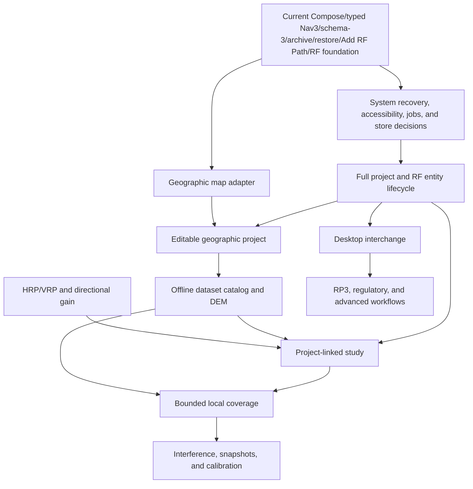

# Android Application Map

> Evidence baseline: August 27, 2026. This document separates the Android capabilities that exist in the repository from foundations, plans, and blocked work. It does not claim complete functional or numerical parity with ATX Plan desktop or RadioPlanner.

## 1. Mobile product objective

ATX Plan Android is an **offline-first companion to the desktop product that can also complete bounded engineering tasks on its own**. A phone or tablet should support field preparation, local RF inventory, data inspection, calculations that fit the device resource budget, and reproducible evidence. Remote providers may add data or accelerate exceptional workloads, but they must not be a hidden requirement for opening local projects or running the supported local baseline.

The mobile experience is task-oriented rather than a copy of the desktop window layout. It must account for touch input, adaptive layouts, intermittent connectivity, process death, storage pressure, battery use, memory, and thermal limits.

### Current usable slice

The repository now provides a working foundation slice:

1. launch an adaptive Compose shell with a compact phone-density implementation for Dashboard and Projects;
2. navigate among Dashboard, Projects, Engineering Map, Studies, and Data Catalog with Navigation 3;
3. load or explicitly migrate a schema-versioned project catalog from private storage;
4. create, select, rename, transactionally duplicate, archive, restore, and transactionally hard-delete local projects;
5. add a linked RF network, transmitter site/sector, and receiver through one validated, transactional Add RF Path flow;
6. inspect a synthetic demonstration project with one RF network, three sites, sectors, and study summaries;
7. inspect site positions and active-sector azimuths on a local technical canvas;
8. calculate a free-space link budget locally;
9. run JVM and Android tests for the delivered domain, persistence, UDF, form, and navigation behavior.

This slice is not yet the mobile engineering MVP defined later in the roadmap. It has no cartographic basemap, terrain profile, antenna pattern, persisted study result, raster coverage, desktop-project interchange, or advanced propagation engine.

## 2. Status vocabulary

| Status | Meaning | Required evidence |
|---|---|---|
| **Delivered** | Android code in the current repository provides a bounded, observable behavior. | Source path plus a test, build artifact, or reproducible interaction. |
| **Foundation** | A real technical base exists, but the complete product capability or hardening gate is not finished. | Configuration or code exists, with its limits stated explicitly. |
| **Planned** | Scope, dependency, and acceptance gate are defined, but implementation is not present. | Target phase and verifiable acceptance criteria. |
| **Blocked** | Work must not be represented as available until a legal, product, data, compatibility, or technical decision is made. | Named decision and evidence that clears the block. |

A feature delivered on desktop is not delivered on Android. A screen or enum alone is a foundation, not an implemented engineering workflow.

## 3. Current Android baseline

| Area | Status | Evidence in the repository | Current limit |
|---|---|---|---|
| Android identity | Delivered | Namespace and application ID are `com.gecesars.atxplan`; version is `0.1.0`. | Public distribution still depends on licensing, signing, privacy, and release policy. |
| Android compatibility | Delivered | `minSdk 23`, `targetSdk 36`, `compileSdk 36.1`; Java 17 bytecode. | A formal physical-device support matrix is still required. |
| Build configuration | Foundation | Gradle 9.3.1, AGP 9.1.1, Kotlin 2.2.10, Compose BOM 2026.04.01, lint configured to abort on errors. | Release shrinking and signing are not configured. |
| CI | Delivered | GitHub Actions builds unit tests, lint, debug APK, and debug test APK with JDK 21 and SDK 36.1. | Connected instrumented tests are not run by that workflow. |
| Local build evidence | Delivered | Debug APK and test APK exist; latest lint report has 0 errors and 12 dependency/tooling warnings. | This is development evidence, not a signed release gate. |
| Compose shell | Delivered | `MainActivity` hosts `AtxPlanTheme` and `AtxPlanApp`; Material 3 and edge-to-edge are active. | The product still needs complete accessibility, localization enforcement, and process-restoration coverage. |
| Adaptive UI | Delivered | Bottom navigation is used on compact widths and a navigation rail at 720 dp or wider. Rail labels/header collapse to five accessible icons below 520 dp height. Dashboard metrics, Studies fields/results, RF and project-name editor fields, the compact adaptive Duplicate, Archive, and Delete Project dialogs, archived-project cards/actions, the map canvas/site list, and Data cards use bounded responsive layouts. The Activity resizes for the IME so short landscape editors and dialogs retain reachable content and actions. | The shell and bounded feature density are adaptive; wider device coverage and full adaptive list/detail patterns still need testing. |
| Compact phone density | Delivered baseline | Scalable typography, 16 dp Dashboard/Projects gutters, 12 dp field-heavy screen gutters, compact shared components, responsive fields/cards/map height, and explicit 48 dp minimums on controls changed by the pass are implemented. Manual checks used one physical Android 16 phone at 1280 × 2772 pixels and 520 dpi: portrait at font scales 1.15 and 1.30, plus landscape at 1.15. Separate Android 16/API 36 emulator checks at 1080 × 2400 pixels and 420 dpi covered Duplicate Project and Delete Project at font scales 1.0/1.30 in portrait and short landscape with Gboard open/closed. Archive Project/actions and the archived-project card were reachable in portrait at font scales 1.0/1.30/2.0 and in landscape at 1.30. | These are bounded physical-device and emulator observations, not a device, aspect-ratio, theme, font-scale, or accessibility matrix. No system font-scale override or clamp is used. |
| Navigation 3 | Foundation | `NavDisplay` uses serializable stable-ID `AtxRoute` keys, a saveable typed back stack, bounded fallback for unknown routes, and nested RF-path and project-name editors; saved-instance-state restoration is tested. | Deep links, deleted-ID recovery UX, adaptive list/detail, and true process-death/rotation testing across supported devices are not complete. |
| UDF/ViewModel | Foundation | Explicit actions/effects, structured problem/recovery values, injected use cases/dispatchers, calculation cancellation, and ViewModel transition tests are implemented. Catalog mutations rebase generically on the latest catalog inside the repository transaction, persist before publication, and return the latest durable catalog without writing for rejected/no-op outcomes. | Feature-level ViewModels, cross-instance catalog observation, DI/scoping policy, durable jobs, diagnostics/observability, accessibility, and system recovery remain. |
| Project repository | Delivered | `ProjectRepository` is implemented by `FileProjectRepository` in private app storage. | Only one catalog file is supported; there is no Room database or portable project container. |
| Transactional JSON catalog | Delivered baseline | Strict UTF-8 kotlinx.serialization JSON, schema 3, explicit chained 1→2→3 and direct 2→3 migrations, `AtomicFile`, `fd.sync`, 5 MiB limit, and a shared mutex protect complete latest-catalog read-transform-write mutation. Tests preserve original bytes across migration failure, corruption, future schema, malformed UTF-8, size limits, failed writes, no-op writes, and concurrent instances. | Recovery/export UX for unreadable/future catalogs, multi-process policy, Android storage-exhaustion/interruption evidence, external asset/file ownership, backup, and the long-term JSON-versus-Room decision remain. |
| Project operations | Foundation | Load, create, select, rename, duplicate, archive, restore, hard-delete, and transactional mutation are delivered. Archive retains the unchanged aggregate with an archive timestamp/original index, removes it from active selection/metrics, and chooses a deterministic active fallback. Restore reinserts the unchanged aggregate at the original index clamped to the latest catalog and selects it. Complete-snapshot checks reject stale, repeated, or missing archive/restore operations without writes. Hard deletion remains a separate active-project operation. Add RF Path persists one linked network/site/sector/receiver without exposing partial state. | Local archive is not hard-delete recovery/undo, backup, export, synchronization, or external-asset recovery. Unreadable/future-catalog recovery, import, project-owned external-asset policy, independent RF-entity CRUD, and impact-aware linked deletion are not delivered. A duplicate does not yet record source-project lineage or a duplication-provenance marker. |
| Domain model | Foundation | Kotlin models now include schema-3 active/archive invariants, `ArchivedProject` lifecycle metadata, serializable engineering value types, typed coordinate, receiver/CPE, and receiver/sector network references with duplicate/referential validation. | Existing legacy primitive entity fields still need staged migration; scenario snapshots, datasets, artifacts, and full study request/results remain. |
| Demonstration data | Delivered | Missing storage is seeded with a clearly synthetic São Paulo FM project: one network, three sites, one sector per site, and two study summaries. | It is demonstration data and must not be used as an engineering reference. |
| Dashboard | Delivered | Shows the selected active project and active project/site/study counts, foundation status, and shortcuts; archived projects and their entities are excluded from active metrics. Its metric row responds to compact width and accessibility font scale. | It summarizes catalog data only; broader layout and accessibility testing remains. |
| Projects and nested editors | Foundation | Projects lists/selects/creates active projects, opens compact adaptive duplication/archive/exact-keyword deletion dialogs, shows a collapsible archived-project section with retained counts/timestamp/restore, opens a saveable rename editor, and opens a saveable Add RF Path editor that transactionally adds one linked RF path. | These are bounded project-operation slices and Add RF Path is one combined create slice, not complete project lifecycle or independent RF-entity CRUD; broader device testing remains. |
| Engineering Map screen | Foundation | Offline Compose Canvas plots local site positions and active-sector azimuth rays with semantic description. | It is not a geographic map: no projection, basemap, pan/zoom, editing, scale, tiles, attribution, or DEM. |
| Studies screen | Delivered | Validated form executes the local free-space link calculation and renders explicit result terms. | Result remains in ViewModel memory and is not tied to project endpoints or persisted as a study artifact. |
| Data Catalog screen | Foundation | Shows an honest static capability inventory and planned gates. | It does not install, inspect, download, or remove datasets. |
| RF calculator | Delivered | Pure Kotlin computes FSPL/P.525, EIRP, received power, fade margin, midpoint first Fresnel radius, thermal noise floor, and SNR; each in-memory result carries explicit model, implementation, execution, data-source, methodology, and limitation provenance. | No geodesic path, terrain, curvature, clutter, antenna pattern, diffraction, fading variability, or persisted execution manifest. |
| JVM tests | Delivered baseline | The current 162-test JVM suite passes and covers model/value boundaries, references and JSON round trips, RF formulas, schema migrations/storage faults/latest-catalog concurrency, transactional archive/restore/duplication/deletion selection/conflict/no-op policy, application use cases, form parsing, ViewModel transitions, and English-only source hygiene. | Property/numerical golden, accessibility, performance, export, and complete system-flow coverage remain. |
| Instrumented tests | Delivered baseline | The current 40-test suite passes with no failures or skips on the Android 16/API 36 `Medium_Phone_API_36.1` emulator; the final connected run used font scale 1.30. It exercises typed route/draft restoration, mutation completion/recovery, rename/duplication/archive/restore/deletion snapshot and durable-state behavior, deterministic active selection/restoration, Activity recreation, and persisted Add RF Path. The preceding 18-test revision passed on the physical Android 16 reference phone. | A fresh physical run of the current suite, true system-reclaim process termination, broader accessibility automation, a formal device matrix, and CI execution remain. |
| Manual archive lifecycle evidence | Delivered bounded evidence | On the API 36 emulator, Archive Project/actions and the archived-project card were reachable in portrait at font scales 1.0/1.30/2.0 and in landscape at 1.30. A force-stop/relaunch retained the archived record; after restore, another cycle retained the active selected project. | This is not Android Backup or system-reclaim restoration proof and does not establish every process-death timing or a support matrix. |
| Backup policy | Delivered | Application backup is disabled in the manifest. | A selective backup/restore policy must be designed before user datasets or portable projects are introduced. |
| Product language | Delivered baseline | Production UI, domain/storage diagnostics, demo content, tests, and these documents are in English; `EnglishOnlySourceTest` guards common Portuguese source terms. | The blacklist is a regression aid, not complete linguistic proof; new resource/file types must enter the guard. |

## 4. Current screens

| Screen | Current behavior | Status | Next boundary |
|---|---|---|---|
| **Dashboard** | Compact responsive project metrics, offline message, quick navigation, and selected-project summary. | Delivered | Persisted jobs, diagnostics, real dataset availability, and broader device/accessibility evidence. |
| **Projects** | Compact wrapping active-project cards, selection/create/duplication/archive/deletion dialogs, a collapsible archived-project section with restore, schema/details, and entry to nested project-name and Add RF Path editors. | Foundation | Hard-delete recovery/export, independent network/site/sector/receiver CRUD, linked-deletion impact, and broader device/accessibility evidence. |
| **Rename Project** | Saveable compact name draft, explicit impact statement, transactional local save, durable-success return, normalized dirty-exit protection, and stale competing-rename rejection. | Delivered bounded slice | Metadata editing, richer conflict diagnostics, and broader device/accessibility evidence. |
| **Duplicate Project** | Compact adaptive dialog with a saveable normalized name draft. The transaction copies the latest durable source aggregate, assigns a fresh root ID/timestamps, leaves the source unchanged, appends and selects the durable copy, and closes the dialog only after completion is observable. | Delivered bounded slice | Source-lineage/duplication provenance and broader device/accessibility evidence. |
| **Archive and Restore Project** | The compact archive dialog reports retained project-scoped counts and refreshes a stale reviewed snapshot before confirmation. A successful transaction moves the unchanged aggregate out of active selection/metrics and records archive time/original index. The archived card restores the exact reviewed record at a deterministic clamped position and selects it after durable commit. | Delivered bounded slice | Local archive is not backup/export/sync or permanent-delete recovery; external assets, unreadable/future-catalog recovery, and broader device/accessibility evidence remain. |
| **Delete Project** | Compact adaptive dialog reports current project-scoped counts and requires exact `DELETE`. The transaction structurally compares the reviewed active aggregate with the latest durable version, rejects stale changes, atomically removes an unchanged target, preserves other projects, selects a deterministic neighbor, and closes only after durable absence is observable. Archived projects must be restored first. | Delivered bounded slice | Hard-delete undo/recovery/export, project-owned external assets, deleted-route recovery, and broader device/accessibility evidence. |
| **Add RF Path** | Validated saveable draft creates one linked selected-system RF network, site/sector, and receiver through one repository transaction. | Delivered bounded slice | Edit/delete, reusable profiles, process-death end-to-end proof, and study endpoint selection. |
| **Engineering Map** | Local coordinate normalization, site markers, active-sector azimuth strokes, site list. | Foundation | Real map adapter, geographic camera, offline source, editing, attribution, DEM. |
| **Studies** | Manual RF parameters and deterministic free-space link results. | Delivered | Endpoint selection, terrain profile, LOS, curvature, persisted study request/result. |
| **Data Catalog** | Static matrix of delivered and planned capabilities. | Foundation | Dataset inventory, storage budget, import/download, validation, and removal. |

## 5. User profiles

| Profile | Priority mobile task | Relationship to desktop |
|---|---|---|
| Field technician | Inspect assets, verify coordinates, record notes and measurements. | Produces auditable inputs for the main project. |
| Link engineer | Check endpoints, terrain, LOS, Fresnel, and a bounded link budget. | Performs rapid local screening and can reproduce advanced work on desktop. |
| Coverage engineer | Inspect existing results and run resource-bounded local grids. | Uses desktop or an optional service for large areas and heavy engines. |
| RF planner | Maintain projects, networks, sites, sectors, receivers, and parameters. | Uses the same vocabulary, units, and provenance rules as ATX Plan. |
| Regulatory analyst | Inspect evidence and collect field inputs. | Regulatory conclusions remain blocked until legal and numerical gates pass. |
| Data administrator | Install regional offline packages and inspect license, hash, coverage, and storage. | Shares data provenance policy with the ATX ecosystem. |

## 6. Desktop/RadioPlanner capability map

Priorities:

- **P0:** required for the offline mobile MVP;
- **P1:** required for a broadly capable mobile product;
- **P2:** advanced, scale-dependent, or selectively valuable on mobile;
- **P3:** no implementation commitment until reprioritized.

Roadmap phases `F0` through `F8` are defined in `ROADMAP.md`.

### 6.1 Foundation, projects, and operation

| Reference capability | Android status | Priority | Target | Acceptance boundary |
|---|---:|---:|---:|---|
| Adaptive project-oriented shell | Delivered | P0 | F0 | Five areas render on compact and expanded layouts; compact feature density has physical Android 16 portrait checks at approximately 394 dp and font scales 1.15/1.30 plus a baseline landscape check. |
| Navigation 3 top-level switching | Foundation | P0 | F1 | Typed stable-ID save/restore and nested editor exist; add deep links, deleted-ID UX, true process-death/device flows, and feature ownership. |
| UDF/ViewModel/repository boundary | Foundation | P0 | F1 | Explicit actions/effects, structured recovery, use cases, injected dispatchers, generic latest-catalog transactional rebase, persist-before-publish state, and tests exist; split features and define DI/jobs/observability. |
| Local project catalog | Delivered baseline | P0 | F0/F2 | Schema-3 transactional JSON loads, explicitly migrates 1→2→3 or 2→3, creates/selects/renames/duplicates/archives/restores/hard-deletes, and persists catalog mutations. |
| Versioned durable persistence | Foundation | P0 | F2 | Migration/corruption/UTF-8/latest-catalog concurrency and no-op-write tests exist; add unreadable/future-catalog recovery/export, assets, jobs, backup, multi-process policy, and a database/file ownership decision. |
| Project lifecycle | Foundation | P0 | F2 | Rename, transactional duplication, archive/restore, and bounded transactional hard deletion are delivered; add hard-delete recovery/export, project-owned external-asset policy, lineage/provenance policy, independent RF CRUD/linked deletion, and broader consistency checks. |
| Desktop `.atxp` interchange | Blocked | P0 | F6 | Approve schema contract, capability negotiation, fixtures, and lossless handling of unsupported content. |
| Scenarios and immutable snapshots | Planned | P1 | F5 | Recalculation creates a new execution without overwriting source inputs/results. |
| RadioPlanner `.rp3` import | Blocked | P2 | F6/F7 | Approve provenance, legal corpus, hostile-file limits, conversion report, and supported subset. |
| Durable jobs | Planned | P0 | F1/F3 | Persist progress/cancel/retry/checkpoint state and recover after process death. |
| Offline help and diagnostics | Planned | P1 | F6 | Searchable embedded help and a sanitized diagnostic package. |

### 6.2 RF entities and scenarios

| Reference capability | Android status | Priority | Target | Acceptance boundary |
|---|---:|---:|---:|---|
| RF system/network model | Foundation | P1 | F2 | Combined Add RF Path creates and persists one network; independent CRUD and shared profiles remain. |
| Sites | Foundation | P0 | F2 | Combined Add RF Path creates one validated transmitter site; edit/delete and map placement remain. |
| Sectors | Foundation | P0 | F2 | Combined creation uses typed command values and persists an explicit network reference; independent CRUD, full entity-type migration, and antenna reference remain. |
| Receivers/CPE | Foundation | P0 | F2 | Validated typed model, network reference, thresholds, losses, gain, height, JSON round trip, and combined creation are delivered; independent CRUD and link-study endpoint selection remain. |
| Study summaries | Foundation | P0 | F2/F4 | Existing enum/summary becomes a versioned request, execution, result, and artifact. |
| Band, technology, channel, and noise profiles | Planned | P1 | F5 | Versioned schema with no unexplained defaults. |
| LTE/5G, MIMO, and modulation tables | Planned | P2 | F7 | Formula/table provenance and fixtures per edition/vendor. |
| FWA downlink/uplink | Planned | P2 | F7 | Separate TX/RX chains and direction-specific results. |
| Simulcast and air-to-ground | Planned | P2 | F7 | Dedicated use cases and explicit parameter sets. |

### 6.3 Map, GIS, and offline data

| Reference capability | Android status | Priority | Target | Acceptance boundary |
|---|---:|---:|---:|---|
| Technical site/azimuth canvas | Foundation | P0 | F0/F3 | Existing canvas remains a diagnostic view, not a cartographic claim. |
| Geographic 2D map | Planned | P0 | F3 | Renderer spike, lifecycle, gestures, camera, scale, attribution, and tests. |
| Offline basemap | Planned | P0 | F3 | Authorized local package, storage budget, integrity, and airplane-mode test. |
| Controlled online provider | Planned | P1 | F3 | HTTPS, terms, cache, attribution, client identity, and no bulk download. |
| GeoTIFF/HGT DEM | Planned | P0 | F3 | Adapter, explicit NoData, CRS, hash/license, and known fixtures. |
| Terrain profile | Planned | P0 | F4 | Geodesic sampling, monotonic distance, interpolation tests, and tile provenance. |
| Dataset catalog and acquisition | Planned | P1 | F3 | Envelope plan, disk preflight, consent, `.part`, resume, validation, SHA-256, atomic promotion. |
| Point/line/polygon layers | Planned | P1 | F6 | Start with validated GeoJSON/CSV and explicit CRS/size limits. |
| Nine-class clutter | Planned | P2 | F7 | Licensed categorical source, mapping table, and numerical fixtures. |
| Buildings | Planned | P2 | F7 | Geometry/height policy, spatial index, and mobile benchmark. |
| IBGE population | Blocked | P2 | F7 | Mobile package format, license, update policy, and storage benchmark. |
| Full GIS editing | Planned | P3 | Later | Validated user demand and usable mobile editing design. |

### 6.4 Antennas

| Reference capability | Android status | Priority | Target | Acceptance boundary |
|---|---:|---:|---:|---|
| Sector azimuth and electrical tilt fields | Foundation | P0 | F2/F4 | Canonical command value types and boundary tests exist; legacy persisted sector primitives and directional-gain use remain. |
| HRP/VRP model | Planned | P0 | F4 | Canonical representation, cyclic horizontal interpolation, vertical convention, and fixtures. |
| PAT/PRN/CSV/TXT/JSON import | Planned | P1 | F4/F6 | Defensive parser, preview, normalization report, and corpus. |
| Antenna library | Planned | P1 | F4 | Versioned source/hash, tags, search, and TX/RX association. |
| Polar/Cartesian plots | Planned | P1 | F4 | Accessible renderer, angular query, and golden screenshots. |
| Directional gain | Planned | P0 | F4 | Azimuth/tilt conventions and quadrant/boundary tests. |
| 3D pattern | Planned | P2 | F7 | Numerical and graphics benchmark on reference devices. |
| Arrays and synthesis | Planned | P3 | Later | Coherent amplitude/phase domain and independent fixtures. |

### 6.5 Terrain, propagation, and link studies

| Reference capability | Android status | Priority | Target | Acceptance boundary |
|---|---:|---:|---:|---|
| Manual free-space link form | Delivered | P0 | F0/F4 | Current form validates and exposes all implemented terms. |
| FSPL/P.525 | Delivered | P0 | F0/F4 | Unit test matches 900 MHz over 10 km to declared tolerance. |
| EIRP and received power | Delivered | P0 | F0/F4 | Gains and losses remain explicit and tested. |
| Thermal noise and SNR | Delivered | P0 | F0/F4 | Bandwidth in hertz and receiver noise figure are tested. |
| Midpoint first Fresnel radius | Delivered | P0 | F0/F4 | Path-fraction and invalid-input behavior are tested. |
| Endpoint geodesy, curvature, and LOS | Planned | P0 | F4 | Independent fixtures and documented tolerances. |
| Persisted link study and manifest | Planned | P0 | F4 | Project-linked request/result survives restart and exports fingerprint/provenance. |
| Hata | Planned | P1 | F5 | Strict urban/suburban/open ranges and golden cases. |
| 3GPP UMa | Planned | P1 | F5 | LOS/NLOS and edition are explicit. |
| P.526/Bullington/Deygout | Planned | P1 | F5 | Full terrain profile, reference vectors, and intermediate terms. |
| ITM/P.1812/P.1546 | Blocked | P2 | F7 | Approve Kotlin/native/service backend, runtime/license, edition, and numerical parity. |
| P.528/FCC curves | Blocked | P2 | F7 | Approve official runtime/data, mobile use case, and fixtures. |

### 6.6 Coverage, interference, and measurements

| Reference capability | Android status | Priority | Target | Acceptance boundary |
|---|---:|---:|---:|---|
| Coverage study type/status enum | Foundation | P1 | F5 | Existing metadata must not be presented as a computed coverage result. |
| Small power/field grid | Planned | P1 | F5 | Blocked/cancelable computation, explicit NoData, and preflight resource budget. |
| Best server and overlap | Planned | P1 | F5 | Correct linear aggregation and tested categorical output. |
| C/(I+N) | Planned | P1 | F5 | Noise and included signals are recorded in the manifest. |
| RSRP/RSRQ/EPRE/throughput | Planned | P2 | F7 | Validated technology models and versioned parameters. |
| Large-area coverage | Blocked | P2 | F7 | Thermal/memory benchmark and native or optional-service contract. |
| Snapshot comparison | Planned | P1 | F5 | Grid alignment, numerical tolerance, and threshold transitions. |
| Measurement import | Planned | P1 | F6/F7 | Validated CSV/GeoJSON with timestamp, quality, and source. |
| Calibration | Planned | P2 | F7 | Immutable raw samples, holdout, metrics, and parameter audit. |

### 6.7 Regulatory, export, and distribution

| Reference capability | Android status | Priority | Target | Acceptance boundary |
|---|---:|---:|---:|---|
| FM/TV and D/U regulatory workflow | Blocked | P2 | F7 | Legal scope, normative sources, datasets, engines, and inconclusive-result policy. |
| CSV/JSON/GeoJSON | Planned | P0 | F4/F6 | Documented schemas, units, version, and supported round trip. |
| Physical/classified GeoTIFF | Planned | P1 | F5/F6 | CRS, transform, NoData, palette, metadata, and external-reader validation. |
| KMZ/PNG | Planned | P1 | F6 | Geographic alignment, attribution, and size limits. |
| JSON/HTML report | Planned | P1 | F6 | Input fingerprint, effective inputs, warnings, and versions. |
| Paginated PDF | Planned | P2 | F7 | Template, pagination, and visual accessibility. |
| Signed Android release | Blocked | P0 | F8 | License, signing, SBOM, privacy, backup, device matrix, and release-channel approval. |

## 7. Product boundaries

### The mobile app must

- keep local projects and supported calculations usable without a network;
- state when memory, battery, missing data, unsupported capability, or model validity limits a result;
- preserve units, angular conventions, versions, and provenance;
- provide field-appropriate inspection and editing;
- produce artifacts that can be verified outside the device;
- expose remote compute only as an explicit, replaceable option;
- use English for all product-facing UI, diagnostics, tests, and documentation.

### The mobile app does not yet claim

- complete functional or numerical equivalence with any RadioPlanner version;
- `.rp3` binary round trip;
- `.atxp` read/write compatibility;
- regulatory certification;
- terrain-aware or normative propagation;
- a real cartographic map;
- antenna-pattern-aware gain;
- raster coverage;
- continent-scale computation on-device;
- cloud collaboration or silent background synchronization;
- unrestricted access to third-party tiles or datasets.

## 8. Capability dependencies

The current calculator is a legitimate delivered baseline, but it does not satisfy the terrain-aware link-study milestone by itself.

## 9. Parity rule

An Android capability may be labeled **validated parity** only when all of the following exist:

1. identical input meaning, unit, geometry, and model edition;
2. independent fixtures and, where legally permitted, a frozen reference corpus;
3. tolerance by intermediate term, not only by aggregate result;
4. approved provenance and licensing;
5. a reproducible comparative result in CI or a recorded bench;
6. explicit handling of unsupported data and implementation differences.

Until that gate, permitted labels are **supported on Android**, **partial import**, **foundation**, or **planned**, according to evidence.

## 10. Open decisions

| Decision | Status | Required output |
|---|---|---|
| Product license and public distribution policy | Blocked | License file, third-party inventory, data policy, and owner approval. |
| Physical-device support matrix | Foundation | One Android 16 device (approximately 394 dp wide in portrait, density 520) has manual portrait evidence at font scales 1.15/1.30 and baseline landscape evidence; minimum, reference, and high-capability devices across supported Android versions, aspect ratios, themes, and accessibility settings remain. |
| Navigation restoration contract | Foundation | Stable-ID typed save/restore and nested-route tests exist; decide deep links/feature ownership and prove deleted-ID, process-death, rotation, and device flows. |
| JSON catalog evolution versus Room | Foundation | Schema 3 and explicit 1→2→3/2→3 migrations exist; approve the long-term store, external asset/file ownership, unreadable/future-catalog recovery/export, backup, multi-process, and future-schema policy. |
| Android ↔ desktop `.atxp` contract | Blocked | Container/schema contract, read/write matrix, migrations, and fixtures. |
| Geographic renderer and offline map format | Planned | Comparative spike, license review, and lifecycle/performance report. |
| Heavy-compute backend | Planned | Kotlin/native benchmark and optional-service contract. |
| Mobile regulatory scope | Blocked | Allowed use cases, warnings, sources, and validation standard. |

## 11. Maintenance rules

- Change a status only in the same change set that adds or removes its evidence.
- Link every delivered capability to tests and its roadmap gate state; a bounded delivered slice must not imply that the full gate is complete.
- Record irreversible or high-cost decisions in ADRs before adding central dependencies.
- Keep desktop and Android status separate.
- Do not promote a screen, enum, mock, or dependency to Delivered unless the end-to-end behavior exists.
- Keep every heading, table, note, and user-facing example in English.
