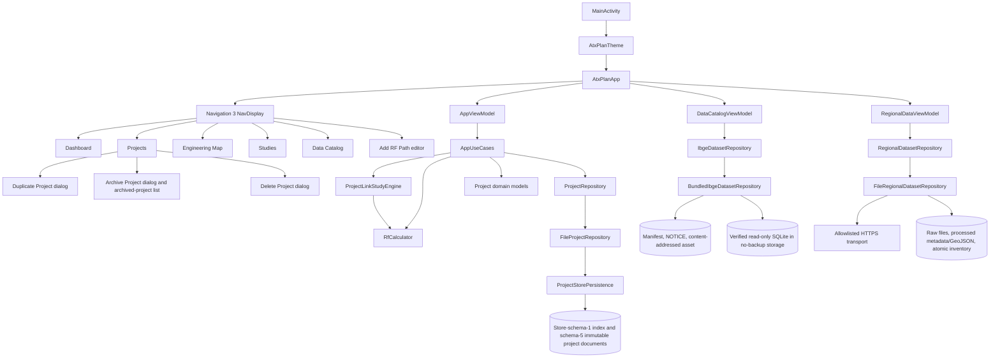
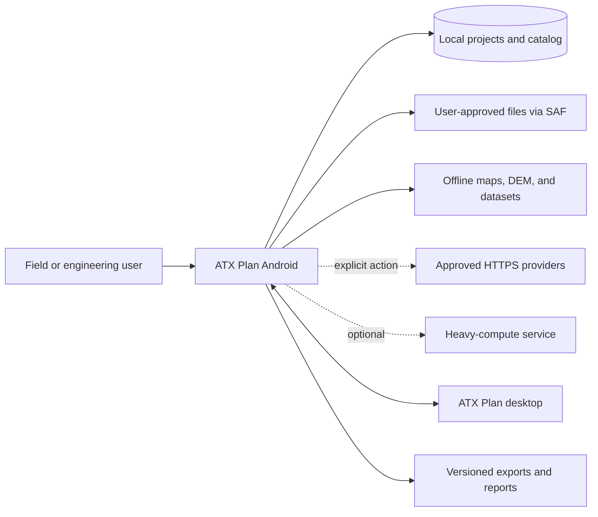
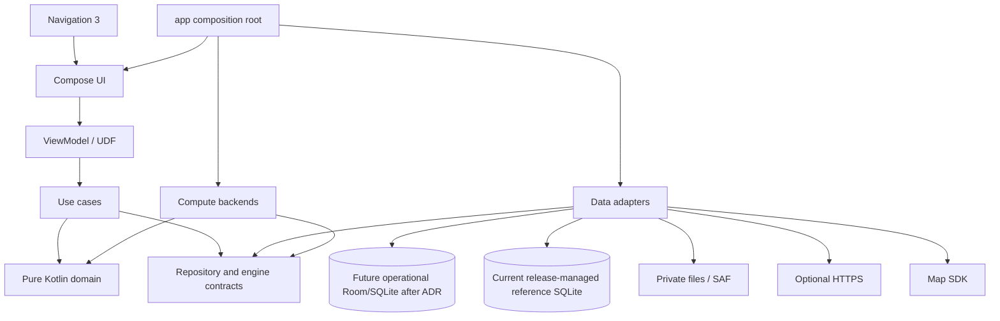
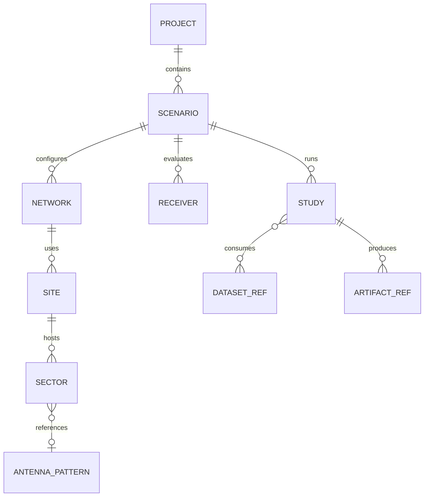

# Android Architecture

> Architecture baseline and target as of August 27, 2026. The repository contains a working Compose application, typed/saveable Navigation 3 routes, explicit UDF and use-case boundaries, a transactional schema-5 project store with a small atomic index and immutable SHA-256 project documents, explicit 1→2→3→4→5, 2→3→4→5, 3→4→5, and indexed 4→5 migrations, a content-addressed artifact-store foundation, validated RF-domain models, transactional project lifecycle operations, independent RF-entity CRUD, a combined Add RF Path editor, a bounded RF calculator, a persisted project-linked ITU-R P.525-5 study, a separate feature ViewModel/repository for the bundled verified IBGE 2022 attribute index, and a screen-bound fixed-source regional raw-data acquisition/processing foundation. Sections labeled Target or Planned describe the next architecture and must not be read as delivered functionality; the regional cache is not a bare-earth DTM, terrain/clutter engine, or process-durable job, and the project-link slice is not terrain-aware analysis or complete RadioPlanner parity.

## 1. Architecture goals

The architecture must let the application:

- operate offline with local projects and previously installed data;
- preserve ATX domain meaning, units, precision, and provenance;
- keep Compose and Android out of the numerical core;
- survive rotation, Activity recreation, and process death;
- execute I/O and heavy computation off the main thread with progress and cancellation;
- replace map, elevation, storage, and compute adapters;
- migrate durable data without loss;
- exchange an explicitly supported project subset with desktop;
- scale from local Kotlin to native code or an optional service without changing study semantics;
- remain testable by layer and by complete workflow;
- expose all product-facing code, UI, tests, diagnostics, and documentation in English.

## 2. Current implementation

### 2.1 Runtime structure



### 2.2 Current status by concern

| Concern | Status | Current implementation | Important limitation |
|---|---|---|---|
| Composition root | Delivered | `MainActivity` applies the theme and hosts `AtxPlanApp`. | Dependency construction still occurs in the ViewModel factory. |
| UI shell | Delivered | Compose Material 3, edge-to-edge, custom light/dark theme. | Full accessibility/device-matrix validation remains. |
| Adaptive navigation | Delivered | Bottom navigation on compact width; navigation rail at 720 dp or wider; rail labels/header collapse to accessible icons below 520 dp height. | Feature contents are not all adaptive list/detail layouts. |
| Navigation 3 | Foundation | Serializable stable-ID `AtxRoute` keys, a saveable typed back stack, safe unknown-route fallback, and nested RF-path and project-name editors have saved-instance-state tests. | Deep links, deleted-ID UX, route ownership, and true process-death/rotation/device-matrix flows remain. |
| State management | Foundation | Immutable state, explicit actions/effects, structured problems/recovery, injected use cases/dispatchers, an explicit mutation-completion counter, cancellation, and ViewModel tests. `DataCatalogViewModel` owns IBGE preparation/search, while `RegionalDataViewModel` owns envelope drafts, source selection, license acceptance, planning, screen-bound acquisition progress/cancellation, and inventory refresh. A separate pure regional job model/reconciler validates durable state decisions without UI ownership. Serialized project-catalog mutations rebase generically on the latest repository catalog and publish only after persistence. | Regional transfers are intentionally in-app and do not survive process death. The job foundation is not observed by a ViewModel or scheduler. Most project/RF screens still share `AppViewModel`; cross-instance catalog observation, DI/scoping, runner/scheduler integration, broader observability, accessibility, and system recovery remain. |
| Repository boundary | Delivered | `ProjectRepository` separates project state from file persistence, `IbgeDatasetRepository` separates packaged SQLite data, `RegionalDatasetRepository` separates fixed-source planning results from regional cache/download/processing infrastructure, and `RegionalJobRepository` provides bounded non-executing job persistence. | Arbitrary user datasets, job execution/retention, map sources, raster-sample elevation, studies, and exchange still need their target ports or integrations. |
| Project persistence | Delivered baseline | Strict UTF-8 project-schema-5 JSON uses a 5 MiB atomic store-schema-1 control index and immutable, independently verified project documents bounded to a conservative 8 MiB each. Explicit 1→2→3→4→5, 2→3→4→5, and 3→4→5 project migrations are present. Indexed project-schema-4 migration writes and verifies all replacement project-schema-5 documents before atomically publishing a replacement store-schema-1 index declaring project schema 5; failure leaves the previous index declaring project schema 4 authoritative. A process mutex protects latest-catalog read-transform-write transactions; migration, fault, no-op, corruption, and reuse tests are present. | Unreadable/future-store recovery/export, reachability cleanup, backup, multi-process policy, storage-exhaustion/interruption system evidence, lazy document loading, and the long-term operational-store decision remain. |
| Artifact persistence | Foundation | A private streaming content-addressed project store validates operation limits and optional expected SHA-256, syncs and promotes immutable blobs, deduplicates verified content, and reports available, missing, or corrupt states. Regional data is deliberately held in a separate bounded private cache with its own inventory. | No import/attachment UI, document-reference transaction, export, ownership policy, garbage collection, reference-aware regional removal, or artifact-backed study-result workflow consumes the project store yet. The bounded project-link result is stored inside its immutable-addressed project document. |
| Domain | Foundation | Schema-5 project/RF/study models and validation are implemented. Separate dataset models describe the bundled IBGE package and the regional fixed catalog, WGS 84 bounds, selections, source licenses, bounded plans/artifacts, cache policy, transfer/processing state, processed outputs, and path-keyed provenance inventory schema 2 with nested source snapshots. Regional job models add a passive E6 plan, semantic/execution identities, exact accepted licenses, strict state/checkpoint/progress invariants, and pure reconciliation actions. | Regional records describe cached source material or a future execution contract, not project GIS layers or RF inputs. The inventory retains one current record per path and has no content-addressed history/pins. The job model is not wired to execution. Copernicus GLO-30 is a DSM rather than a bare-earth DTM; raster samples, terrain profiles, RF clutter mapping, interpreted building heights, coverage, and regulatory conclusions remain absent. |
| Project workflow | Delivered bounded slices | Create/select/rename/duplicate/archive/restore/delete use cases operate through repository transactions. Archive retains the complete aggregate with its timestamp/original index while excluding it from active selection/metrics; restore reinserts it deterministically and selects it. Complete reviewed snapshots protect archive, restore, and logical hard delete from stale concurrent state. | Local archive is not backup/export/sync or hard-delete recovery. Unreadable/future-store recovery, physical orphan cleanup, and source-lineage/duplication-provenance remain. |
| RF entity workflow | Delivered bounded slice | A project-scoped compact manager creates, edits, and deletes networks, sites, sectors, and receivers independently. Exact entity snapshots reject stale edits/deletes; referenced network deletion is blocked with sector/receiver counts, site-sector cascade requires explicit confirmation, and preserved per-network receiver profiles are surfaced as read-only compatibility references. The combined Add RF Path flow remains available, and the Studies screen can select a stored sector plus a network-compatible stored receiver. | Individual compatibility-profile editing/removal, terrain-aware link studies, bulk editing/import, artifact workflows, and full process-death/device-matrix proof remain. |
| RF engine | Delivered bounded slice | Pure Kotlin `RfCalculator` implements ITU-R P.525-5 free-space loss, EIRP, received power, margin, midpoint Fresnel radius, noise floor, and SNR with explicit provenance. `ProjectLinkStudyEngine` adds fixed-radius mean-Earth great-circle endpoint distance/bearing, relative azimuth/elevation, and an inclined distance based only on the AGL antenna-height difference, then creates a persisted immutable fingerprinted record. | The stored transmitter-site ground elevation is snapshotted but not evaluated; receiver ground elevation, DEM sampling, and a terrain profile are not delivered. Earth-curvature clearance/effective-Earth propagation, LOS, Fresnel clearance, diffraction, clutter, directional patterns, coverage, export, `.rp3`, and full RadioPlanner parity are also absent. |
| Engineering map | Foundation | Compose renders an offline Web Mercator coordinate grid using pure domain camera math, project fit, pan, anchored pinch zoom, metric scale, site selection, active azimuth rays, an accessible site list, and a coordinate-only durable site move. The UI explicitly distinguishes stored elevation from `NoData` and states that movement does not resample it. | No basemap package, third-party tiles, DEM sampling, terrain, IBGE polygon/map integration, GIS features, receiver move, or map performance gate is delivered. It is not a cartographic basemap or GIS engine. |
| Dataset catalog | Delivered bounded slices | The screen prepares and queries the release-managed national IBGE package and also plans/acquires a small regional envelope from fixed Copernicus GLO-30 DSM, WorldCover, and experimental OSM `building`/`building:part` way sources. The regional path enforces fixed HTTPS hosts, same-origin redirects, a 384 MiB plan ceiling, per-artifact/Overpass caps, source-license acceptance, eligible GET resume, SHA-256/provenance inventory schema 2, a 24-hour verified live cache with force refresh, TIFF metadata-only indexing, and deterministic building GeoJSON. A separate job-contract/store foundation exists outside the screen. | Regional execution is not process-durable, and the screen does not create or observe job records. No append-only snapshot index/pins, arbitrary import/removal, garbage collection, bare-earth DTM, raster sampling, terrain profile, RF clutter mapping, interpreted building heights, relations/holes, sector polygons, map integration, exact containment, or population-by-coverage exists. |
| Tests | Delivered baseline | The current 364 JVM tests pass with no failures or skips. Regional additions cover fixed-source planning/transfer/cache/inventory/processing, cross-instance serialization and provenance hardening, canonical semantic/execution goldens, job/license/state invariants, atomic store/CAS faults, and pure reconciliation decisions. The complete 72-test Android 16/API 36 emulator suite is green at system font scale 1.30, including 3 regional Catalog cases, 5 Studies Compose cases, 1 real-storage schema-4-to-5 migration/integrity/reopen test, and 1 real-`AtomicFile` regional-job test. | The job tests are JVM foundation evidence, not scheduler or process-recovery evidence. A fresh physical run, API 23 dataset execution, broader accessibility automation, performance, export, true system-reclaim process death, and a formal device matrix remain. |
| Build automation | Delivered baseline | CI runs unit tests, lint, and debug/test APK assembly; current local lint has 0 errors and 12 dependency/tooling warnings. | Connected test and signed release are outside current CI. |
| Product language | Delivered baseline | Production UI/errors/demo/tests are English and a unit test scans Kotlin, XML, JSON, and text production resources for common Portuguese terms while allowing official identifiers. | The blacklist is partial and must cover every future user-visible resource type. |

## 3. Principles

1. **Domain first:** entities, units, and formulas do not import Android, Compose, persistence, network, or map SDKs.
2. **Unidirectional data flow:** UI emits intent; ViewModels coordinate; immutable state returns to UI.
3. **Local source of truth:** network operations update validated local state; the UI does not render transient remote responses as authoritative data.
4. **Repository boundary:** features depend on contracts, never directly on DAO, HTTP, SAF, or a map SDK.
5. **Version every durable boundary:** catalog, project, dataset, engine request/result, and artifact format carry a version.
6. **Reproducible results:** physical outputs record effective inputs, implementation, edition, hashes, fallbacks, and warnings.
7. **Explicit capability:** unsupported or missing data produces a diagnostic, never silent loss or fabricated values.
8. **Progressive modularization:** keep package boundaries now and extract Gradle modules only when the API and benefit are proven.
9. **Mobile resources are finite:** memory, storage, battery, thermal behavior, and time are study inputs.
10. **Replaceable compute:** Kotlin, native, and optional remote backends implement one versioned contract.
11. **English-only product:** code identifiers, UI, errors, tests, and documentation use English, except proper names and required source terminology.

## 4. Target context



Rules:

- local projects and supported results remain available without HTTPS or service access;
- external access states purpose, source, license, and impact;
- desktop exchange uses schema/capability negotiation;
- every external file is untrusted, including files selected by the user.

## 5. Target layers and dependency direction



### UI layer

Renders state, collects actions, manages presentation navigation, accessibility, and adaptive layout. It does not read files/databases or implement RF formulas.

#### Information-density and typography contract

ATX Plan is an information-dense engineering tool, so compact layout is a functional requirement rather than a reason to disable Android accessibility settings. The UI therefore:

- honors the system font scale and never clamps or replaces it;
- uses compact semantic type roles instead of display-sized text for routine screen headings;
- keeps interactive targets at least 48 dp even when visual padding is reduced;
- reduces redundant outer, card, and section spacing before reducing readable type;
- uses multi-column fields only when measured width and font scale leave every label, value, and unit readable;
- never truncates engineering values, units, provenance, warnings, or limitations to gain space;
- may constrain noncritical navigation labels and decorative summaries when their full meaning remains available through semantics;
- validates compact phones and larger windows separately instead of applying one fixed-density layout everywhere.

The current compact pass is measured on a physical Android 16 phone at approximately 394 dp portrait width and `fontScale = 1.15`. Responsive fallbacks were also inspected in portrait at `fontScale = 1.30`, after which the original setting was restored. Baseline landscape checks verified the short-height navigation rail, wide feature layouts, and the resized project-name editor with the IME before rotation was restored. This physical evidence remains bounded to one reference device.

The compact adaptive Duplicate Project and Delete Project dialogs were separately validated on an Android 16/API 36 emulator at 1080 × 2400 pixels and 420 dpi, at `fontScale = 1.0` and `fontScale = 1.30`, in portrait and short landscape with Gboard open and closed. Archive Project/actions and the archived-project card were reachable in portrait at font scales 1.0, 1.30, and 2.0 and in landscape at 1.30. Manage RF Assets has an automated 360 × 480 dp/font-scale-1.30 check for horizontal tabs, a scrollable long editor, persistent actions, and blocked reference deletion, plus a 1080 × 2400 visual inspection. The Data Catalog has a separate 360 × 480 dp/font-scale-1.30 test for Ready/search/selection/limitations and preparation/failure/query states; a fresh 1080 × 2400/font-scale-1.30 manual run verified dense metrics, source/limitation text, unaccented search, four visible results, and selected envelope details. Five project-link cases at 360 × 480 dp/font-scale-1.30 cover searchable selectors and save action, complete saved details, lazy timestamp-ordered history, collision-safe sector identity, and the incompatible-receiver empty state. The exact `DELETE` field remained fully visible, and actions remained reachable through bounded responsive/scroll layouts. No system font-scale override or clamp was used. These observations are not a complete accessibility or device matrix.

A bounded manual force-stop/relaunch retained an archived record. After restore, a second force-stop/relaunch retained that project as active and selected. This confirms the previously observed legacy schema-3 source path; current code chains it through schema 4 to schema 5. It is not proof of Android Backup, schema-5 interruption recovery at every checkpoint, system-reclaim restoration, every process-death timing, or broader device support.

A separate historical API 36 cold-launch check placed the schema-2 fixture in private app storage and observed its promotion to a schema-4 index and immutable project document while retaining project identity, receiver, and network references. A current real-storage instrumentation test promotes an indexed project-schema-4 fixture to project schema 5 and verifies integrity, injected-field stripping, absence of `AtomicFile` sidecar residue, and stable reopen while intentionally retaining the immutable legacy document. JVM fault injection covers document-before-index ordering and failed publication.

### Domain/application layer

Contains entities, value objects, policies, use cases, and repository/engine contracts. It remains pure Kotlin wherever possible.

### Data/infrastructure layer

Implements repositories, DAOs, codecs, file catalogs, network clients, GIS adapters, and external engines. Infrastructure models are mapped at the boundary.

### Composition root

The `:app` module selects concrete adapters, scopes dependencies, starts navigation, and applies process-level policies. Feature Composables do not construct repositories.

## 6. Module plan

The current single `:app` module is acceptable while boundaries stabilize. The target topology is incremental:

```text
:app                 composition root, Activity, top-level navigation
:core:model          IDs, shared domain models, problems, provenance
:core:units          physical quantities and angular conventions
:core:database       Room, DAOs, schemas, and migrations
:core:files          private files, SAF, imports/exports, atomic staging
:core:network        controlled HTTP, authentication, cache policy
:core:compute        job/engine contracts, scheduler, backends
:core:geo            coordinates, CRS, grids, tiles, GIS contracts
:core:designsystem   theme, components, icons, accessibility
:core:testing        fixtures, fakes, matchers, golden utilities

:feature:projects
:feature:rf
:feature:map
:feature:datasets
:feature:antenna
:feature:link
:feature:coverage
:feature:measurements
:feature:settings
:feature:help
```

Rules:

- a feature may depend on core contracts, not another concrete feature;
- feature coordination uses typed navigation or shared use cases;
- `core:model` and `core:units` remain Android-free;
- database/network/file models do not leak to UI;
- native engines remain behind `core:compute`;
- circular module dependencies are prohibited.

Extract a module only when its API is stable, tests need Android-free execution, backend substitution is required, or build isolation has measured value.

## 7. UDF and ViewModel

### Current flow

The current app implements an explicit unidirectional application path:

```text
Composable callback
  -> AppUiAction
  -> AppViewModel
  -> injected application use case
  -> transactional repository or RF calculator boundary
  -> AppUiState and optional AppUiEffect
  -> lifecycle-aware Compose collection
```

This is a tested application foundation. It is not yet the final per-feature UDF or durable-job contract.

Current strengths:

- immutable top-level state;
- private mutable `StateFlow` and read-only public state;
- lifecycle-aware collection;
- explicit `AppUiAction` and one-time `AppUiEffect` types;
- structured problem codes, English user messages, and recovery actions;
- constructor-injected use cases plus replaceable storage/computation dispatchers;
- cancellation propagation and stale-result protection for link calculations;
- a mutex-protected mutation path that waits for catalog load, evaluates every mutation against the latest catalog inside `ProjectRepository.updateCatalog`, persists changes before publishing, and rebases rejected/no-op outcomes to that latest catalog without a write;
- ViewModel tests for success, recoverable failure/retry, invalid mutation, archive/restore/duplication/deletion conflict and no-op behavior, ordering, concurrency, cancellation, and stale calculation results.

Current gaps:

- one application-wide ViewModel owns unrelated feature state;
- dependency assembly still occurs in the ViewModel factory and no DI/scoping policy is approved;
- effects are currently limited to notices and do not yet cover external navigation/pickers;
- durable jobs, progress/checkpoints, correlation, and sanitized diagnostic export are not modeled;
- selected durable state and feature context still need true process-death system-flow evidence;
- accessibility and adaptive feature-flow validation remain incomplete.

### Target feature contract

```kotlin
// Planned contract example; not current repository code.
data class LinkUiState(
    val input: LinkInputUi,
    val result: LinkResultUi?,
    val execution: ExecutionUi,
    val problem: ProblemUi?,
)

sealed interface LinkAction
sealed interface LinkEffect
```

Rules:

- durable state belongs to repositories, not `remember`;
- small draft state may use `SavedStateHandle`;
- files, rasters, and results travel by ID, never through Bundle/back stack;
- one-time external picker/navigation work uses effects;
- physical validation remains in domain;
- ViewModels do not own Activity, map view, or navigation controller.

Every data screen models empty, loading, content, recoverable error, blocking problem, retry, and progress/cancellation where relevant.

The current Data Catalog uses explicit `CHECKING`, `INSTALLING`, `VALIDATING`, `READY`, and `FAILED` states. Preparation failure never substitutes municipality/population data and exposes retry. Queries are debounced, bounded, executed off the main thread, reject stale completions, distinguish failure from a valid empty result, and retain selection only while its municipality remains in the returned set.

## 8. Navigation 3

### Current implementation

- Navigation 3 runtime and UI version 1.1.6 are dependencies;
- a sealed `AtxRoute : NavKey` contract serializes bounded stable IDs instead of class names;
- five top-level routes plus `RfPathEditorRoute(projectId)` feed `NavDisplay`;
- `rememberSerializable` and `NavBackStackSerializer` save and restore the typed stack through Android saved instance state;
- unsupported, oversized, or malformed persisted route IDs resolve through a bounded safe fallback;
- routes carry only stable project IDs and the repository resolves project content;
- a compact bottom bar and expanded rail select destinations;
- top-level selection intentionally replaces the stack while the RF-path and project-name editors nest above Projects;
- Dashboard can navigate to Projects, Map, and Studies;
- instrumentation covers the Dashboard-to-Studies smoke path and serialized restoration of top-level, unknown, malformed, and nested-editor routes.

### Current limits

- saved-instance-state restoration tests do not replace a true system process-kill/relaunch flow;
- no external deep links or feature registration/ownership API exists;
- a project removed while an editor route is restored has bounded empty/error handling but not a complete recovery workflow;
- rotation, background/foreground, phone/tablet, and broad device-matrix behavior remain unverified;
- top-level replacement means back navigation between areas is intentionally minimal.

### Target contract

- typed route keys with no scattered strings;
- observable, saveable, restorable back stack;
- routes carry small IDs; repositories resolve full objects;
- each feature registers entries through an explicit API;
- central parser validates external deep links;
- adaptive list/detail keeps business rules shared;
- Activity Result API remains at the UI boundary;
- missing or deleted IDs produce a recoverable destination state.

Initial target destinations:

```text
Dashboard
Projects
ProjectDetail(projectId)
EntityEditor(projectId, entityType, entityId?)
EngineeringMap(projectId, selectionId?)
DataCatalog
LinkSetup(projectId, sectorId?, receiverId?)
LinkResult(studyId)
Settings
Help(topic?)
```

Adoption closes only after rotation, process death, invalid deep link, and phone/tablet tests pass.

## 9. Domain model

### Delivered foundation

The current pure Kotlin/serialization domain includes:

- schema-5 `ProjectCatalog` with active and archived collections, selected active-project ID, uniqueness across both collections, and stale-selection fallback that never selects an archived project;
- `ArchivedProject`, which retains one unchanged `PlannerProject` aggregate plus a non-negative archive timestamp and original active-list index used as a bounded restoration hint;
- `PlannerProject` with identity, name, customer, notes, timestamps, demo flag, networks, sites, receivers, study summaries, bounded project-link records, antenna/GIS/scenario/coverage/regulatory records, artifact references, and optional import provenance;
- `RfNetwork` with system, active state, downlink/uplink configuration, duplex/threshold/channel-plan/technology carrier fields, and legacy payload retention;
- `RadioSystem` values for generic, FM, TV, LTE, 5G NR, land mobile, FWA, and air-to-ground;
- `RadioSite` with validated location, optional elevation/tower height, and unique sectors;
- `GeoPoint` latitude/longitude validation;
- `Sector` with active flag, azimuth, electrical tilt, transmit/receive chain fields, antenna-pattern references, equipment metadata, frequency, and a backward-compatible nullable network reference;
- `Receiver`/CPE with typed coordinate, height, gain, system loss, sensitivity, noise figure, azimuth/tilt, equipment metadata, per-network profiles, and a required project-local network reference;
- aggregate duplicate and referential-integrity validation for RF entities, antenna patterns, scenarios, project records, and artifacts, including unique project-link IDs and an exact matching completed point-to-point summary for every project-link record;
- a validated `DuplicateProjectCommand`/result/use case that reads the latest durable source inside the transaction, generates a fresh route-safe root project ID and root timestamps, preserves the project-scoped nested graph and references, appends the copy, and selects it without changing the source;
- an `ArchiveProjectCommand`/result/status/use case that treats the complete reviewed active aggregate as an optimistic conflict token, retains it unchanged with an archive timestamp/original index, removes it from active selection/metrics, and selects the next, previous, or empty active state deterministically;
- a `RestoreProjectCommand`/result/status/use case that compares the complete reviewed archive record, reinserts its unchanged aggregate at the original index clamped to the latest active list, removes the archive record, and selects the restored project;
- a `DeleteProjectCommand`/result/status/use case that treats the complete reviewed aggregate as an optimistic conflict token, compares it structurally with the latest durable project, returns unchanged stale/missing outcomes, and atomically removes only an unchanged target while preserving other aggregate instances/order and choosing the next, previous, or empty selection deterministically;
- a validated `AddRfPathCommand`/result/use case that generates stable IDs and creates one linked network, site/sector, and receiver as one immutable catalog transition;
- typed independent RF mutation commands/results for all network/site/sector/receiver create, update, and delete operations, with immutable IDs, exact-snapshot conflict detection, project-local reference validation, network deletion impact, and explicitly confirmed site-sector cascade;
- versioned carrier records for antenna patterns, GIS layers, study scenarios, coverage snapshots, regulatory records, project artifacts, and import provenance; these are storage/domain foundations and do not claim that their parsers, datasets, engines, or regulatory decisions exist;
- `ProjectLinkStudyRecord`, which immutably stores project/network/endpoint/effective-link-budget snapshots, mean-Earth geometry, the P.525-5 result/provenance, warnings, terrain `NO_DATA`, and a canonical lowercase SHA-256 fingerprint over the input and geometry;
- `StudySummary`, study types, and lifecycle statuses, including the matching completed point-to-point summary persisted with each bounded project-link record;
- factory-created user projects and a synthetic demonstration project.

An enum entry or summary does not mean the corresponding study engine exists.

### Target aggregate



Delivered engineering value objects:

- `LatitudeDegrees`, `LongitudeDegrees`, and `GeoCoordinate`;
- `DistanceKm` and `HeightM`;
- `FrequencyMHz` and `BandwidthMHz`;
- `PowerDbm`, `GainDbi`, and `LossDb`;
- `AzimuthDegrees` and `TiltDegrees`.

They validate construction and deserialization and retain primitive numeric JSON representation. The combined Add RF Path command uses them at the UI/domain boundary. Existing legacy `RfNetwork`, `GeoPoint`, and `Sector` persisted fields remain primitive `Double` values and require staged migration rather than an incompatible rewrite.

Still-planned unit/domain types include linear power, dBW, a reusable elevation-angle type, a complete CRS/NoData policy, and generalized engine/request/result/manifest provenance values beyond the bounded project-link record.

Target conventions:

- SI is canonical and conversions happen at boundaries;
- dB, dBm, dBW, dBi, dBd, and dBµV/m are distinct types;
- interfering powers are summed linearly;
- `Double` is the numerical reference precision;
- longitude is canonical in `[-180, 180)`;
- azimuth starts north and increases clockwise;
- elevation is positive above the horizon;
- positive-down electrical tilt is converted explicitly;
- NoData, below threshold, not computed, and failed are distinct;
- grids preserve CRS, transform, extent, resolution, NoData, and resampling policy.

The delivered project-link input is an immutable snapshot and each successful run appends a new record instead of overwriting prior evidence. That behavior is not yet generalized to other study types or exported artifact manifests.

## 10. RF computation

### Delivered calculator and bounded project-link engine

`RfCalculator` is pure Kotlin and validates finite/positive operational inputs. Its provenance identifies Recommendation ITU-R P.525-5 (11/2024). It computes:

```text
FSPL = 32.447783 + 20 log10(f_MHz) + 20 log10(d_km)
EIRP = TX power - TX loss + TX antenna gain
Received = EIRP - FSPL - additional loss + RX gain - RX loss
Noise = -174 dBm/Hz + 10 log10(bandwidth_Hz) + receiver noise figure
Margin = received power - receiver sensitivity
SNR = received power - noise floor
Fresnel radius = sqrt(lambda * d1 * d2 / total distance), lambda = 299,792,458 m/s / f_Hz
```

The `-174 dBm/Hz` thermal-noise density is an explicit nominal-290 K approximation. The manual screen calculates the first Fresnel radius at the path midpoint; this scalar is not a clearance result. Tests cover the 900 MHz/10 km FSPL baseline, explicit signs, invalid physical inputs, thermal-noise bandwidth conversion, result terms, and P.525-5 provenance.

`ProjectLinkStudyEngine` is the delivered bounded project-linked adapter:

- it accepts a selected stored project/site/sector and a stored receiver that directly references, or has a compatibility profile for, the sector network;
- it snapshots project/network names and IDs, endpoint coordinates/names/IDs, stored transmitter ground elevation without evaluating it, sector azimuth/tilt, AGL antenna heights, compatibility-profile presence, actual non-null overrides, and all effective link-budget values;
- `MeanEarthGeodesy` calculates spherical great-circle horizontal distance and initial bearing from the endpoint coordinates using the fixed 6,371,008.8 m mean-Earth radius;
- relative azimuth and elevation angle are derived from that endpoint geometry;
- inclined distance is `hypot(horizontalDistance, receiverAgl - transmitterAgl)`, so site elevation, receiver ground elevation, DEM data, terrain, and Earth-curvature clearance do not enter the distance;
- the inclined distance becomes the P.525-5 distance, with zero additional path loss; midpoint Fresnel radius remains a scalar radius, not a clearance computation;
- the immutable record stores the result/provenance, `NO_DATA` terrain state, warnings, and a canonical SHA-256 input/geometry fingerprint. Construction recomputes geometry, the fingerprint, and the RF result to reject inconsistent serialized records.

`RunProjectLinkStudyUseCase` compares the complete reviewed project with the latest project, rejects missing endpoints, incompatible networks, and ID collisions, and atomically appends the record plus one matching completed point-to-point summary. `AppViewModel` runs this through the repository transaction, blocks a concurrent project-link save, publishes the committed catalog only after persistence, and retains the previous durable catalog on storage failure.

### Not delivered by the bounded RF slice

- ellipsoidal or terrain-sampled path geodesy beyond the delivered fixed-radius endpoint inverse;
- DEM/site-ground-elevation geometry or a terrain profile;
- Earth-curvature clearance or effective-Earth factor;
- LOS or Fresnel clearance along a path;
- clutter/building/indoor loss derived from datasets;
- HRP/VRP or directional antenna gain;
- diffraction, troposcatter, fading, time/location variability;
- Hata, 3GPP, ITM, P.1812, P.1546, P.528, or FCC curves;
- portable/exported request/result package, artifact-backed manifest, or desktop/RadioPlanner parity bench;
- coverage calculation, `.rp3` interchange, or full RadioPlanner parity.

### Application use cases

Delivered use cases load and transactionally update the catalog, create/select/rename/duplicate/archive/restore/delete projects, add the combined RF path, calculate the manual bounded link budget, and run/persist the bounded project-linked P.525-5 study described above. `RenameProjectUseCase` changes the validated name, may advance the update timestamp, preserves project identity and its nested graph, and rejects a command whose expected durable name is stale. `DuplicateProjectUseCase` intentionally resolves the source from the latest durable catalog inside the repository transaction. It normalizes and validates the requested name, creates a fresh route-safe root ID and fresh root creation/update timestamps, deep-copies the aggregate containers while retaining project-scoped nested IDs, references, data, order, demonstration flag, and study timestamps, leaves the source unchanged, appends the copy, and selects it. Existing immutable project-link records keep their original snapshotted source project ID/name and are not rewritten to the new root ID. That preserves calculation history but does not create a separate aggregate-level source-project lineage or duplication-provenance marker.

`ArchiveProjectUseCase` compares the complete reviewed active aggregate with the latest durable aggregate. A successful transition moves that unchanged aggregate into `archivedProjects` with an injected archive timestamp and its original active index, removes it from active selection and metrics, and applies the same deterministic next/previous/empty selection policy used by permanent deletion. `RestoreProjectUseCase` compares the complete reviewed `ArchivedProject` record with the latest durable record, reinserts the unchanged aggregate at its original index clamped to the latest active-list size, removes the archive record, and selects the restored project. Stale, already-archived/already-active, and missing outcomes are typed no-ops. The UI publishes archive/restore success only when the committed catalog makes it observable.

`DeleteProjectUseCase` compares the complete reviewed active aggregate with the latest durable aggregate inside the transaction. A changed, missing, or archived target is a typed no-op; an unchanged active target is removed as one catalog transition while other projects and order remain unchanged and selection moves to the next project, the previous project when last, or none when empty. The compact UI requires exact `DELETE`, reports current project-scoped collection counts, and waits for observable durable absence. Hard deletion remains distinct from archive: the local archive cannot recover a permanently deleted project and is not backup, export, synchronization, or external-asset recovery. `AddRfPathUseCase` accepts typed drafts and injected ID/clock providers; its result carries the committed catalog projection and linked entities.

The delivered IBGE flow is intentionally narrower than a general acquisition use case. `DataCatalogViewModel` asks `IbgeDatasetRepository.prepare()` to validate or install the immutable bundled package, then issues bounded municipality queries. The repository emits byte progress and typed preparation/query failures; there is no network, user-selected package, or project mutation in this flow.

Remaining target use cases include:

```text
UpdateProjectMetadata
InstallUserDatasetPackage
BuildTerrainProfile
ImportAntennaPattern
RunTerrainAwareLinkStudy
RunCoverageStudy
CompareSnapshots
ImportMeasurements
ExportStudyPackage
InspectProvenance
```

Use cases accept domain commands, define transaction boundaries, return typed problems/warnings, and expose progress/cancellation for long work.

## 11. Repositories and ports

### Current repository

`ProjectRepository` exposes `loadCatalog()` and `updateCatalog(transform)`. The compatibility view remains one complete in-memory `ProjectCatalog`, while schema-5 persistence splits its physical ownership by project. The update contract loads the latest durable view, applies one pure transform, avoids storage writes when the result is equal, writes only changed project documents, and publishes a replacement index only after every referenced document is durable. `AppViewModel` uses this generic rebase boundary for project operations, Add RF Path, independent RF mutations, and the bounded project-link study; it publishes only the repository-returned catalog after persistence succeeds.

`FileProjectRepository` also implements `ProjectArtifactRepository`. The Android-independent `ProjectStorePersistence`, legacy migrator, document codecs, and content-addressed artifact store:

- retain `atx_project_catalog_v1.json` as the control filename so installed project-schema-1/2/3 catalogs and indexed project-schema-4 stores are discovered, while the current format stores a small store-schema-1 index declaring project schema 5 there;
- store immutable project documents under hash-only `atx_project_documents/sha256/<prefix>/<digest>.json` paths;
- store immutable artifact blobs under hash-only `atx_project_artifacts/sha256/<prefix>/<digest>.blob` paths and use a private staging directory;
- use strict UTF-8 and reject unknown keys for the current store-schema-1 index and project-schema-5 documents; the bounded legacy decoder tolerates historical unknown keys only after version-aware sanitization;
- seed the demonstration catalog only when no control payload exists;
- bound the index/legacy input to 5 MiB and each project document to 8 MiB; artifact calls require an explicit streaming limit no greater than 512 MiB;
- reject future or malformed store/document schemas, invalid UTF-8/JSON, unknown store discriminators, identity mismatch, byte-length mismatch, and SHA-256 mismatch without repairing or overwriting the committed index;
- explicitly migrate schema 1 through 2, 3, and 4 to 5; schema 2 through 3 and 4 to 5; schema 3 through 4 to 5; or schema 4 directly to 5;
- remove fields that did not belong to each legacy contract before decode so untrusted old input cannot inject current-schema content;
- when an existing indexed project-schema-4 store is loaded, write and verify every migrated project-schema-5 immutable document first and publish the replacement store-schema-1 index declaring project schema 5 only as the final atomic commit point;
- write, sync, read back, and verify immutable project documents before atomically publishing the index; a failure can leave only an unreachable immutable file while the prior control bytes remain authoritative;
- reuse unchanged document references for selection, archive, restore, and other index-only transitions;
- validate and optionally match expected artifact hashes, deduplicate only verified content, and distinguish available, missing, and corrupt artifact states;
- use `AtomicFile.startWrite/finishWrite/failWrite` plus `fd.sync` for the control index and project documents;
- share a process-wide mutex across repository instances and run storage work through the injected storage dispatcher.

Automated storage tests cover legacy 1/2/3/4 migration to schema 5, indexed schema-4 document-before-index ordering and failed-promotion preservation, hostile legacy-field injection, failed document/index publication, unknown/future discriminators, stale selection, missing/corrupt documents, hash and size checks, immutable-document reuse, no-op writes, artifact limits/deduplication/corruption, and latest-catalog transactions. `AtomicFile` and immutable addressing protect the in-process Android path; the mutex is not a multi-process locking policy, and no reachability garbage collector is delivered.

### Current bundled IBGE repository

`BundledIbgeDatasetRepository` implements the separate `IbgeDatasetRepository` contract for one immutable, release-managed dataset:

- a 64 KiB bounded, strict UTF-8/strict-schema manifest is checked against compiled release identity, exact source/asset hashes, counts, sizes, CRS, attribution, license caveat, and the no-geometry flag;
- the content-addressed 22,133,986-byte gzip asset is streamed from `assets/datasets/ibge`, never loaded wholly into memory;
- installation uses `noBackupFilesDir/datasets/ibge`, a unique `.part` file, a 70,926,336-byte output bound, 16 MiB safety allowance, compressed and database SHA-256, `fd.sync`, read-only SQLite validation, and atomic rename;
- only exact hash-named recomputable SQLite files and private staging files are eligible for cleanup; unrelated files are preserved;
- validation checks SQLite application/schema IDs, `quick_check`, bounded metadata, source identities, table/summary counts, unassigned and `NoData` counts, sector and municipality population sums, and a known municipality record;
- the Android database uses ordinary tables instead of desktop `STRICT`/`RTree` features and is opened read-only with no localized collators;
- municipality search is parameterized, result/length bounded, wildcard escaped, code aware, and accent/whitespace normalized without a network request.

The database contains all 468,099 sector attribute rows, 5,570 municipality summaries, and portable rectangle records, but no polygon geometry. Its immediate input is a pinned desktop-derived index; the official archive is independently pinned but is not parsed by the current transformer. This boundary, API 36.1-only runtime evidence, and unresolved redistribution review are recorded in `docs/IBGE_DATASET.md`.

### Current regional raw-data repository

`FileRegionalDatasetRepository` implements the separate `RegionalDatasetRepository` contract for one deliberately small, fixed source catalog:

- `RegionalDatasetPlanner` validates a non-antimeridian WGS 84 envelope no wider or taller than 1 degree, deterministically selects 1-degree Copernicus GLO-30 DSM tiles and 3-degree ESA WorldCover 2021 v200 COG tiles, and optionally creates one tiny ways-only OSM `building`/`building:part` union request;
- experimental buildings are opt-in and additionally bounded to 0.05 degrees per axis, 25 km², and a 16 MiB Overpass response; the processor retains bounded raw building/height/level/roof tags and an upstream OSM timestamp when supplied but does not interpret height or promise multipolygon relations, holes, addresses, or completeness;
- the plan has a 384 MiB ceiling, no more than 12 artifacts, source-specific artifact limits, and a free-space preflight that includes staging, processing, and safety allowance;
- `AllowlistedHttpsRegionalHttpTransport` accepts only HTTPS on the fixed Copernicus S3, ESA WorldCover S3, and pinned `lambert.openstreetmap.de` hosts, bounds both initial and resolved redirect URLs to 2,048 characters, bounds redirect count/timeouts, rejects cross-origin redirects before the redirected request is opened, and prevents arbitrary URL or host injection;
- bounded GET transfers retain validated `.part` and strong-ETag metadata for a later user-triggered resume; metadata requires a bounded effective URL on the requested HTTPS origin, incomplete metadata cannot claim acquisition time, and completed metadata requires bounded total bytes plus a valid nonfuture UTC completion timestamp; transient GET work receives at most three total attempts, while the fixed read-only Overpass POST receives at most two and always restarts its staging file; `Retry-After` is accepted only from 1-30 seconds inside that attempt budget, and HTTP 429 without it is not replayed;
- each raw result is size-bounded, SHA-256-verified, processed before final promotion, and recorded in atomically replaced path-keyed inventory schema 2 with a nested family/release/type/format/catalog/query/normalizer snapshot, stored license/provenance, requested and actual final URL, route policy, acquisition/check times, selection bounds, byte count, hash, and processing outcome; completed `READY`/`EXISTING` provenance requires bounded same-origin HTTPS effective URL, valid acquisition time, bytes, and SHA-256 together;
- every `FileRegionalDatasetRepository` instance shares one application-wide in-process mutex for acquisition and inventory loads; this prevents cross-instance staging/inventory races inside the app process but is not multi-process locking;
- the TIFF/BigTIFF processor validates bounded metadata and publishes a metadata index only; it does not decode raster samples or prove Cloud Optimized GeoTIFF layout;
- the building processor validates bounded UTF-8 Overpass JSON and publishes deterministic WGS 84 GeoJSON with actual final endpoint, raw-source provenance, optional `osm3s` source timestamp, and bounded raw tags, while counting unsupported/unclosed geometry rather than inventing it;
- verified live OSM data is reused for at most 24 hours; stale data refreshes only during another explicit acquisition, and a reviewed force-refresh checkbox bypasses a fresh cache entry. There is no timer, polling, or background refresh.

This is an acquisition and processing foundation, not a GIS or RF engine. Copernicus GLO-30 is a DSM that can include vegetation and buildings, not a bare-earth DTM. WorldCover categories are not RF clutter coefficients, and retained OSM height strings are not a trusted height model. The regional ViewModel launches work on an I/O dispatcher and requires the app to remain open; the application-wide repository mutex is not a process-durable worker or a multi-process policy. WorkManager/UIDT scheduling, network constraints, notification policy, durable process recovery, append-only snapshot history/pins, arbitrary import, ownership, removal, and garbage collection remain planned.

The shared semantics are defined in `docs/CROSS_PLATFORM_DATA_CONTRACT.md`. Android now delivers the half-open WGS 84 bounds, canonical family/release fields, nested acquisition source snapshot, requested/effective route identity, OSM query/normalizer versions, bounded schema-1 migration, live-cache/force-refresh behavior, and canonical-plan semantic/execution golden fixtures described there. Desktop execution of the semantic fixture, broader cross-language fixtures, append-only content identity/pins, and raster adapter parity remain **planned**; this contract does not imply that desktop behavior has already changed.

The first lifecycle increment delivers a passive microdegree canonical plan, separate semantic and Android-execution SHA-256 identities, exact accepted-license snapshots, a strict revisioned state/outcome model, bounded per-job private storage, and stale-decision-guarded pure reconciliation. It models scheduler generations, persisted cancellation priority, provider attempt ceilings, future-artifact checkpoint rejection, contextual terminal/nonterminal outcome auditing, and bounded complete snapshots containing stale/current targets. Reconciliation separates expected record generation from the concrete target scheduler tuple, rejects physical target reuse, deterministically cancels extra targets, preserves scheduler entries whose job ID is unreadable, and marks maximum-generation recovery as typed `scheduler-generation-exhausted` orphaning. A recordless cancellation declares expected record absence; a future executor must atomically re-read the job store before the scheduler effect. An invalid committed outcome on an immutable terminal record yields a guarded non-mutating `REPORT_TERMINAL_OUTCOME_INVALID` action instead of an illegal state rewrite. The execution lifecycle accepted in `docs/adr/0001-android-regional-data-lifecycle.md` remains **planned**: API 34+ long user-triggered transfers use Android [user-initiated data transfer jobs](https://developer.android.com/develop/background-work/background-tasks/uidt), while API 23-33 uses a constrained foreground [WorkManager long-running worker](https://developer.android.com/develop/background-work/background-tasks/persistent/how-to/long-running). A reconciliation executor, shared runner, scheduler adapters, notifications, Data-screen observation, and tested process/reboot recovery are absent. The current ViewModel path remains the only delivered execution path.

### Target ports

```text
ProjectRepository
RfCatalogRepository
AntennaRepository
IbgeDatasetRepository (delivered bounded contract)
RegionalDatasetRepository (delivered bounded contract)
RegionalJobRepository (delivered non-executing persistence foundation)
UserDatasetRepository (planned general contract)
ElevationProvider
MapSourceRepository
StudyRepository
ArtifactRepository
MeasurementRepository
ComputeBackend
ProjectExchangeCodec
```

A repository exposes domain models or stable projections, not Room entities, cursors, raw URIs, HTTP responses, or map-SDK types.

## 12. Persistence evolution

### Current durable format

```text
private files/
  atx_project_catalog_v1.json
  atx_project_documents/
    sha256/<prefix>/<digest>.json
  atx_project_artifacts/
    staging/
    sha256/<prefix>/<digest>.blob

APK assets/
  datasets/ibge/
    manifest.json
    NOTICE.txt
    ibge-census-sectors-2022-<compressed-sha256>.ibgedata

private no-backup files/
  datasets/ibge/<database-sha256>.sqlite
  datasets/regional/
    .atx-regional-inventory.json
    <fixed-source raw paths and .part files>
    processed/<metadata-index or building-GeoJSON paths>
    jobs/<uuid>.json[.bak]
```

The control file is a store-schema-1 index carrying project schema 5 and is the current project commit point. Project documents and artifact blobs are immutable content-addressed files. The bounded project-link record is serialized inside its project document; it is not a separate artifact or portable export. The separate IBGE manifest is the release-time asset commit point, and its content-addressed payload installs as a recomputable read-only database. Regional inventory schema 2 is the commit point for the separate fixed-source cache after raw validation and bounded processing; its map is keyed by relative path and retains only the current logical-path snapshot.

The separate regional job foundation stores one strict schema-1 JSON record per UUID under the no-backup `jobs/` directory. Each record is limited to 256 KiB and the directory to 64 identities. Android `AtomicFile`, `fd.sync`, readback verification, a process-wide mutex, immutable reviewed identity, and exact one-revision compare-and-set updates protect the in-process path. Invalid/future/oversized records are preserved and reported independently. These files are not created or observed by the current Data screen, do not execute work, have no retention/removal UI, and are not a multi-process database. The formats support current project aggregates, bounded artifacts, one global reference dataset, one bounded regional cache, and a non-executing job-state foundation; they are not a lazy project database, process-durable execution lifecycle, append-only regional snapshot index, portable project container, or general user/acquired dataset lifecycle.

### Current guarantees

- schema 5 is serialized, with fixture-backed 1→2→3→4→5, 2→3→4→5, 3→4→5, and 4→5 migration;
- indexed project-schema-4 promotion makes every migrated project-schema-5 document durable before publishing the replacement store-schema-1 index declaring project schema 5, and a failed promotion preserves the old authoritative index;
- changed documents are written, synced, and verified before the atomic index commit;
- complete read-transform-write catalog mutations are serialized in-process and evaluated against the latest durable catalog;
- invalid UTF-8, malformed/invalid JSON, unknown/future schema, integrity failure, and failed migration promotion do not replace committed control bytes;
- index, document, and artifact operation sizes are independently limited;
- unchanged immutable documents are reused, and artifact blobs are deduplicated only after verification;
- artifact availability is explicit as available, missing, or corrupt;
- archive records retain the complete project aggregate, archive timestamp, and original active-list index; archived projects are excluded from active selection/metrics;
- restore reinserts an unchanged aggregate at a deterministic bounded index and selects it;
- the ViewModel publishes only the repository-committed catalog, rebases rejected/no-op outcomes without writing, and exposes structured recovery state on storage failure;
- a successful bounded project-link transaction persists one immutable record and one matching completed point-to-point summary; save failure retains the previous catalog without exposing the uncommitted result;
- project hard deletion is a complete logical index transition; a failed write retains the previous reachable project aggregate and selection, while physical orphan cleanup is intentionally deferred;
- the pinned IBGE asset/database identity, counts, source hashes, CRS, attribution, limitations, and sizes are checked before the dataset becomes queryable;
- bundled-dataset extraction is output-bounded and streamed through a synced staging file with compressed and database hashes before atomic promotion;
- a failed/corrupt bundled install exposes a typed problem and no synthetic population/municipality result; the embedded package remains available for retry.
- regional plans and artifacts are bounded before transfer; raw and processed outputs are hashed/validated before inventory publication, and eligible GET partials retain bounded strong-ETag resume metadata.
- regional canonical plans normalize bounds to integer microdegrees and produce separate canonical semantic and Android-execution SHA-256 identities; the passive plan remains structurally decodable across catalog change and compatibility is checked explicitly;
- regional job records bind exact accepted-license snapshots, provider-specific attempt and cumulative-byte ceilings, monotonic checkpoint promotion, one committed inventory-entry outcome per completed artifact, immutable terminal state, and generation-scoped scheduler identity publication; record construction rejects checkpoints beyond the current artifact and mutation validation accepts a new checkpoint only for the previously current artifact; idempotent create, overlapping-path exclusion, unreadable-record fail-closed ownership, and single-revision CAS are covered independently of a scheduler;
- the pure regional reconciler never infers success, gives persisted cancellation priority, distinguishes active from finished scheduler observations, and validates every committed outcome with its owning record and indexed canonical artifact, including terminal records; an invalid terminal outcome emits guarded non-mutating `REPORT_TERMINAL_OUTCOME_INVALID` rather than changing immutable state;
- a bounded complete scheduler snapshot may contain stale and current targets for one job, from which reconciliation deterministically retains at most one matching target and emits cancellation for every extra, while rejecting reuse of one physical scheduler-kind/identity target across generations or job IDs; an entry whose job ID is represented by an unreadable record is preserved and not treated as recordless;
- record-derived reconciliation actions carry expected record revision, execution fingerprint, and expected record scheduler generation as stale-decision guards, while cancel/adopt actions independently carry the concrete target scheduler kind, generation, and identity; a recordless cancel explicitly expects record absence, and its future executor must atomically re-read the store before the external effect;
- missing-scheduler recovery at the maximum bounded generation emits a guarded `MARK_ORPHANED` problem with code `scheduler-generation-exhausted` instead of attempting an invalid generation increment; no action is executed by the foundation.

### Current gaps

- no recovery UI or export of an unreadable catalog;
- no true Android `AtomicFile` interruption/full-storage system test;
- no multi-process locking or external-writer conflict policy;
- no job-store retention/removal/migration policy, multi-process locking, production checkpoint writer/validator, scheduler adapter, shared runner, notification, UI observer, or actual process/reboot recovery;
- no artifact attachment/import UI, reachability garbage collection, portable export, or external-file ownership/recovery policy;
- no study result consumes the artifact-store foundation or provides a portable/exported manifest; the bounded project-link result is local project-document data only;
- project loading still materializes every document into the compatibility catalog view;
- no approved transition plan for project/job JSON versus Room/SQLite;
- no selective backup policy because backup is disabled;
- local archive does not provide hard-delete undo/recovery, backup, export, synchronization, or project-owned external-asset cleanup;
- no arbitrary dataset import, reference-aware removal/garbage collection, completed-output rollback, sector polygon package, basemap, bare-earth DTM, or raster-sampling lifecycle; resume is limited to eligible regional GET partials;
- no API 23 runtime execution of the bundled SQLite integration test;
- no approved IBGE redistribution terms or release-grade archive-to-index derivation proof.

### Target storage layout

Room/SQLite is the preferred candidate for relational project/job operational state after an ADR and migration plan. The standalone bundled-reference SQLite file does not make that project-store decision. Large files remain outside BLOB columns.

```text
files/
  projects/      manifests and small assets by ID
  datasets/      authorized packages and inventory
  artifacts/     immutable study outputs
  staging/       partial imports/downloads not yet promoted

databases/
  atx-mobile.db  projects, entities, jobs, and file references
```

Policy:

- export every public Room schema;
- test forward migration from every public version;
- prohibit destructive fallback for user data;
- preserve ID, unit, precision, and references in migration tests;
- stage, sync, validate, hash, and atomically promote large files;
- reference only validated final files from the database;
- garbage-collect only proven unreferenced files;
- use DataStore for small non-relational preferences;
- use Android Keystore for credentials;
- copy result-affecting preferences into study snapshots.

Backup remains disabled until the policy explicitly includes recoverable project data and excludes secrets, staging, recomputable cache, and data restricted by license/size.

## 13. Offline-first data flow

Current bundled IBGE flow:

```text
Data Catalog observes feature state
  -> read and validate strict pinned manifest
  -> reuse a fully verified content-addressed database, or preflight storage
  -> stream embedded gzip into bounded private staging
  -> verify compressed/database hashes and SQLite identity/content
  -> atomically promote read-only database
  -> issue bounded local municipality queries
```

Current fixed-catalog regional flow:

```text
Data Catalog observes RegionalDataViewModel state
  -> validate bounded WGS 84 envelope and selected fixed sources
  -> review exact plan, budget, limitations, and source licenses
  -> explicit in-app acquisition into bounded private staging
  -> resume eligible GET partial or start a bounded response
  -> reuse verified live OSM data up to 24 hours unless force refresh was reviewed
  -> hash, validate, and process TIFF metadata or building GeoJSON
  -> atomically promote raw/processed files and path-keyed provenance inventory schema 2
```

Delivered contract/store foundation plus planned durable regional execution:

```text
review canonical plan and exact license snapshots
  -> delivered: normalize E6 bounds and calculate semantic + Android execution fingerprints
  -> delivered foundation: validate/store a bounded revisioned job and derive reconciliation actions
  -> planned: API 34+ UIDT, or API 23-33 foreground WorkManager adapter
  -> one RegionalJobRunner transfers/processes one artifact at a time
  -> persist checkpoints, progress, cancel intent, and terminal outcome
  -> commit checkpoints/results to the delivered inventory schema and reconcile after process return
```

Only the contract/store/decision portion of the second flow is delivered. No UIDT service, WorkManager worker, `RegionalJobRunner`, production checkpoint integration, scheduler-backed reconciliation executor, notification implementation, or UI observation is delivered. Inventory schema 2 and the job store are separate persistence boundaries; neither makes the current acquisition process-durable.

A network failure never deletes the last valid local state.

Target resource states:

```text
Absent
Planned
Downloading(progress, resumable)
Validating
Ready(version, hash)
Stale(reason)
Invalid(reason)
MissingExternalPermission
```

The current IBGE manifest records ID/title, provider/source URLs, access date, attribution, unresolved license status, CRS, source archive/index/signature hashes, geometry availability, population field, counts, compressed/installed sizes and hashes, schema/application IDs, transformer version, and bounding-box limitation. Delivered regional inventory schema 2 records fixed dataset identity; nested family/release/data-type/file-format/catalog/query/normalizer and license/provenance metadata; requested/effective URL and route policy; local acquisition/check times; bounds; byte count; SHA-256; validation/processing state; processed output; ETag/last-modified when supplied; and explicit limitations. Its bounded schema-1 migration preserves stored source/license/provenance fields, maps fields absent from schema 1 through the known legacy catalog, leaves unavailable effective URL/acquisition time unknown, and atomically rewrites a valid primary or atomic backup; a valid backup replaces an invalid primary. The inventory is still path-keyed/current-snapshot-only and does not store an exact request-body fingerprint. The separate passive job plan does retain the request body/hash and both plan identities, but no acquisition currently creates that record. Content-addressed append-only snapshots, pins, historical retention, portable ownership/reference, dependency tracking, update/removal, garbage collection, and arbitrary-format parser contracts remain planned.

Community basemap endpoints must not be used for bulk prefetch. Offline packages require user files, an authorized source, or compatible infrastructure.

## 14. Map and GIS

### Current geographic coordinate viewport

The current `EngineeringMapScreen` is a bounded offline geographic foundation:

- projects WGS 84 site coordinates through tested Web Mercator math;
- fits selected-project sites across the antimeridian and supports pan plus anchor-preserving pinch zoom;
- renders a coordinate grid, metric scale, camera center, site markers, and active-sector azimuth rays;
- supports touch selection and accessible list-based select/center/edit controls;
- submits a full-snapshot stale-safe command that changes only the selected site's coordinates and publishes only after durable persistence;
- distinguishes stored project elevation from explicit `NoData` and warns that moving a site does not sample a DEM;
- provides a semantic content description and permanently labels the view as a local coordinate grid with no basemap or third-party tiles.

It remains a coordinate overlay rather than a cartographic basemap or GIS result. Neither the delivered IBGE attribute package nor cached regional DSM/land-cover/building outputs are consumed by this screen. The IBGE package contains no renderable polygons; the regional TIFF output is metadata-only, and the experimental building GeoJSON has no map or RF integration. G4 still requires a renderer/package decision, an authorized basemap source and lifecycle, general hostile-package handling, bare-earth DTM/raster sampling, geometry integration, airplane-mode map proof, and performance evidence. Pixel-level `NoData` is not present.

### Target map adapter

MapLibre Native Android is a preferred candidate because it aligns conceptually with desktop, but adoption requires a lifecycle/offline/license/size/performance spike.

The feature depends on app-owned contracts:

```text
MapViewport
MapLayerSpec
MapFeature
MapSelection
MapCommand
MapEvent
```

SDK types do not cross the adapter boundary.

GIS rules:

- EPSG:4326 is the canonical geographic input;
- distance and area use geodesy or an appropriate projection, never degrees directly;
- reprojection/resampling is explicit and versioned;
- imports require or declare CRS;
- vertex, band, pixel, compression, and size limits protect resources;
- physical, classified, and rendered layers remain separate;
- attribution remains visible and enters exported artifacts when required.

Format priorities:

- P0: validated GeoJSON/CSV, HGT/GeoTIFF raster sampling, approved offline basemap; bounded TIFF metadata indexing and experimental ways-only `building`/`building:part` GeoJSON processing are already delivered separately, without interpreted heights, relations, or holes;
- P1: output GeoTIFF, KMZ, and dataset packages;
- P2: GeoPackage, large vectors, clutter, buildings, census-sector polygons, and population-by-coverage. The bounded IBGE attribute/municipality index is already delivered separately.

## 15. Compute backends

### Common target contract

```text
ComputeRequest
  requestId, studyType, schemaVersion
  engineRequirement, inputSnapshot, datasetRefs, resourceBudget

ComputeProgress
  stage, completed, total, message, checkpoint

ComputeResult
  engineId, engineVersion, implementation
  outputs, intermediateTerms, warnings, fallbacks, validity
  inputFingerprint, outputFingerprint
```

### Level 1 — Local Kotlin

The current RF calculator demonstrates this level. Keep Kotlin as the first choice for units, geodesy, FSPL, LOS/Fresnel, link budget, and acceptable small grids. It is the numerical baseline before optimization.

### Level 2 — Planned native backend

Adopt only after benchmarks prove need and golden cases prove equivalence. Requirements include minimal versioned JNI, ABI tests, explicit memory ownership, cooperative cancellation, crash containment, diagnostics, SBOM/license, and Kotlin/native fixture comparison.

### Level 3 — Optional service

Use for large areas or heavy engines only when justified. It is not part of the offline MVP. Require explicit opt-in, Keystore credentials, data-transfer preview, idempotent fingerprinted request, resumable transfer, encryption, retention policy, progress/cancel/recovery, local result persistence, and engine/dataset identity.

Before execution, estimate cells/profiles/samples, input/intermediate/output memory, temporary/final storage, expected time, network need, and measured battery/thermal impact. Never reduce physical resolution silently.

## 16. Concurrency and durable work

Storage and computation dispatchers are injected through `AppUseCases`. Catalog read-transform-write operations are serialized by the repository and ViewModel mutation boundaries, and link calculations cancel superseded UI work. Regional acquisition and inventory loads are serialized application-wide across `FileRegionalDatasetRepository` instances by one in-process mutex, run from `RegionalDataViewModel` on an I/O dispatcher, support cooperative cancellation, own the single bounded provider-retry loop, and can resume an eligible GET partial after a later explicit action; this is neither multi-process locking nor a process-persistent worker.

The accepted target in `docs/adr/0001-android-regional-data-lifecycle.md` now has a delivered non-executing foundation:

- **delivered foundation:** canonical E6 plan, semantic/execution fingerprints, exact accepted-license snapshots, strict state/CAS validation with future-artifact checkpoint rejection, bounded per-job atomic storage, contextual terminal/nonterminal artifact-outcome validation, and pure reconciliation actions with separate record guards/concrete scheduler targets, deterministic extra-target cancellation, physical-target uniqueness, unreadable-ID preservation, record-absence cancel guards, non-mutating terminal audit reports, and typed generation exhaustion;
- **planned integration:** create the record from the reviewed Data screen before scheduler enqueue;
- use API 34+ [user-initiated data transfer jobs](https://developer.android.com/develop/background-work/background-tasks/uidt) for long user-started transfers;
- use API 23-33 constrained foreground [WorkManager long-running workers](https://developer.android.com/develop/background-work/background-tasks/persistent/how-to/long-running) as the compatibility path;
- route both schedulers through one `RegionalJobRunner`, which inherits sole ownership of the currently delivered repository retry policy;
- transfer and process one artifact at a time;
- persist progress, checkpoints, cancel intent, notification identity, and terminal state;
- reconcile persisted and scheduled state after process return or reboot without inferring success;
- retain only strong-ETag validated GET partials and never retain POST staging.

The current RF calculation is still small and bounded; durable or heavy work also requires:

- structured Kotlin coroutines;
- injected dispatchers;
- `viewModelScope` only for screen-bound recoverable work;
- persistent job ID and progress;
- cooperative cancellation between blocks;
- checkpoints when resume is worthwhile;
- CPU, memory, network, and provider parallelism limits;
- no blocking wait or raster work on the main thread.

On process return, target job state will be read from the delivered repository as queued, running, paused, completed, failed, canceled, or orphaned. The pure reconciler already refuses to infer success, but no UI or scheduler invokes it and no process-return behavior is delivered.

## 17. Desktop interoperability

The desktop uses versioned `.atxp` projects and supports capabilities the Android app does not. Compatibility must use a codec contract, not improvised direct database access. The first Android implementation target is a versioned portable ATX import package opened through SAF, bounded private staging, hashing, capability inspection, and import-copy with a loss report. Native `.rp3` parsing follows only after its separate legal, provenance, hostile-input, parser, and corpus gates close.

```text
ProjectInspection
  containerVersion
  schemaVersion
  capabilitiesPresent
  capabilitiesReadable
  capabilitiesWritable
  unsupportedItems
  requiredDatasets
  warnings
```

Open modes:

- **read-write** only when supported content can be preserved;
- **read-only** for safe inspection without rewriting unknown content;
- **import copy** with a conversion/loss report;
- **rejected** for unsafe version, integrity, or capability.

Unknown items are never discarded on save. Portable ATX import is **planned**; native `.rp3` remains **blocked** and must not use Java serialization, a .NET runtime, or an unbounded generic object decoder. Automatic multi-user synchronization is outside the MVP.

## 18. Dependency injection

No DI framework is currently present. Use cases, repository, dispatchers, calculator, ID generator, and clock use constructor/factory injection, while `AppViewModel.factory` still chooses `FileProjectRepository`. This is testable for the bounded foundation but does not define application/activity/ViewModel scopes or scale to alternate runtime backends.

The DI decision must provide clear Application/Activity/ViewModel scopes, backend/flavor bindings, easy fakes, measured startup cost, diagnostic errors, and no global service locator. Constructor injection remains the default contract regardless of framework.

## 19. Problems, diagnostics, and observability

Current code defines `AppProblem` with stable problem code, English user message, and recovery action. It distinguishes catalog load/save and link-budget failures, preserves invalid storage, blocks mutation after failed load, exposes Retry for catalog recovery, and emits one-time notice effects. The broader target taxonomy is:

```text
ValidationProblem
MissingDataProblem
UnsupportedCapabilityProblem
PermissionProblem
StorageProblem
NetworkProblem
IntegrityProblem
ComputeProblem
Canceled
UnexpectedProblem(correlationId)
```

Each problem separates English user message, recovery action, sanitized technical details, internal cause, severity, and whether a partial result is usable.

Logging rules:

- structured local logs with correlation/job/study ID;
- no tokens, project content, external paths, or coordinates by default;
- debug detail only in appropriate builds;
- diagnostic export requires preview and consent;
- remote telemetry is opt-in and needs approved privacy policy;
- numerical reproduction relies on a manifest, not logs.

## 20. Security and privacy

- request minimal permissions in context;
- use SAF instead of broad storage access;
- keep credentials in Android Keystore;
- use HTTPS, timeouts, bounded retries, and honest client identity;
- disable cleartext in production;
- limit import size, count, dimensions, compression, paths, and nesting;
- test path traversal, decompression bombs, malformed JSON/GIS, and polyglot files;
- never treat staging as valid data;
- validate ownership of database/file references;
- keep exported components minimal;
- exclude secrets, staging, and unsuitable datasets from any future backup;
- send no engineering data to an optional service without explicit consent.

Private Android storage alone is not a claim of application-level encryption. Encryption decisions require a threat model.

## 21. Reproducibility manifest

The delivered schema-5 `ProjectLinkStudyRecord` is an immutable local result record. It contains endpoint/effective-RF snapshots, mean-Earth/AGL-only geometry, engine ID, P.525-5 result provenance and terms, terrain `NO_DATA`, warnings, and a canonical SHA-256 input/geometry fingerprint. Record construction verifies that the fingerprint, geometry, link-budget distance, and recomputed result agree. It does not contain a portable application/build manifest, artifact references, DEM/dataset hashes, export schema, or RadioPlanner parity evidence.

Portable exported study executions still target a manifest such as:

```json
{
  "studyId": "uuid",
  "createdAt": "ISO-8601",
  "application": {"version": "semver", "build": "commit"},
  "requestSchema": 1,
  "model": {"id": "fspl", "edition": "declared-edition"},
  "engine": {"id": "kotlin-local", "version": "version", "implementation": "implementation"},
  "inputs": [{"id": "input-id", "sha256": "hash"}],
  "parameters": {},
  "units": {},
  "crs": "EPSG:4326",
  "fallbacks": [],
  "warnings": [],
  "artifacts": [{"id": "artifact-id", "sha256": "hash"}]
}
```

Canonical serialization is versioned. Irrelevant timestamps and local paths do not enter the physical fingerprint.

## 22. Test architecture

### Current evidence

The current JVM baseline contains 364 passing tests with no failures or skips. The 50 durable-job foundation additions cover canonical semantic/execution goldens, coordinate/order normalization, reviewed-license and state invariants, atomic-store/CAS fault cases, and pure reconciliation decisions; additional acquisition regressions cover cross-instance inventory races, strict timestamp/same-origin provenance, and bounded initial/redirect URLs. The complete connected baseline contains 72 Android 16/API 36 emulator tests; that run completed on `Medium_Phone_API_36.1` at system font scale 1.30 with no failures or skips. It includes 3 regional Catalog cases, all 5 `StudiesScreenTest` cases, 1 real-storage `FileProjectRepositoryMigrationTest`, and 1 real-`AtomicFile` `FileRegionalJobRepositoryTest`. Local lint reports 0 errors and 12 dependency/tooling warnings, and debug/test APK assembly succeeds. The JVM additions are not UIDT, WorkManager, notification, or process-recovery evidence.

- project/domain tests cover schema-5 defaults, active/archive uniqueness, archive lifecycle metadata, project-link record/summary invariants, engineering-value boundaries, legacy compatibility, canonical fingerprints, and exact round trips;
- application tests cover transactional project lifecycle operations, independent RF-entity create/update/delete, exact-snapshot conflict handling, linked-deletion impact, deterministic Add RF Path success, and project-link success/stale/missing/incompatible/id-collision outcomes;
- persistence tests cover 1/2/3/4→5 migration, indexed schema-4 document-before-index promotion and failed-promotion preservation, hostile legacy-field removal, failed document/index publication, malformed/invalid/future/unknown store data, strict UTF-8, integrity and size limits, immutable-document reuse, artifact deduplication/corruption, atomic write failure, no-op writes, and latest-catalog repository transactions;
- regional job tests cover passive E6 plan canonicalization, semantic/execution golden JSON and SHA-256, route-versus-semantic identity, exact reviewed licenses, strict state/terminal/monotonic mutation rules, idempotent and conflicting creates, single-winner CAS, failed atomic replacement preservation, unreadable/future/unknown/oversized record isolation, and deterministic abstract reconciliation without success inference;
- ViewModel tests cover load/create/select/rename/duplicate/archive/restore/delete/Add RF Path/independent RF/project-link mutation transitions, persist-before-publish behavior and failed project-link storage, RF receipts, generic latest-catalog rebase, structured failures/retry, mutation-completion accounting, ordering/concurrency, stale/repeated/missing outcomes without writes, invalid mutations, calculation cancellation, and stale-result suppression;
- RF and form tests cover implemented formulas, P.525-5 provenance, mean-Earth endpoint/antimeridian geometry, AGL-only inclined distance, invalid physical inputs, unit parsing, defaults, and typed command conversion;
- the English-only source test scans production Kotlin, XML, JSON, and text resources for common Portuguese terms while allowing pinned official identifiers;
- the green complete 72-test instrumented baseline on an Android 16/API 36 emulator covers the Dashboard-to-Studies smoke path, saved-instance-state restoration for supported, unknown, malformed, nested RF-path, nested project-name, and nested RF-assets routes, explicit mutation-completion and transient pending-save recovery, project lifecycle behavior, deterministic selection, create-project → persist-RF-path → Activity recreation, compact RF-assets reachability/reference impact, Engineering Map selection and coordinate editing, stale-write/isolation, draft recovery, inaccessible targets, validation, discard protection, save retry, real IBGE extraction/hash/schema/query/corruption/storage/update behavior, compact IBGE and regional Catalog state/reachability including explicit live-snapshot refresh, 5 project-link Studies cases, the real-storage schema-4-to-5 migration, and the real-`AtomicFile` regional-job case; the preceding 18-test revision passed on the physical Android 16 reference phone;
- manual API 36 emulator checks cover Duplicate Project/Delete Project at font scales 1.0/1.30 in portrait and short landscape with Gboard open/closed, plus Archive Project/actions and the archived-project card in portrait at font scales 1.0/1.30/2.0 and landscape at 1.30;
- a bounded manual force-stop/relaunch retained the archived record, and a second cycle after restore retained that project as active and selected; this is not Android Backup or system-reclaim restoration proof and does not establish every process-death timing or a support matrix;
- a bounded manual font-scale-1.30 project-link run saved one stored endpoint result and reopened the same scalar terms, P.525-5/geodesy identities, warnings, and fingerprint after force-stop/relaunch; this is one local-storage observation, not broad process-death or device proof;
- lint/build evidence remains part of the debug baseline, but accessibility automation, performance, broader device/system flows, and release validation remain open.

### Target matrix

| Layer | Target | Examples |
|---|---|---|
| Unit | Pure domain | Units, angles, catalog policies, RF formulas. |
| Property | Invariants | Conversion round trip, HRP periodicity, monotonic distance. |
| Numerical golden | Engines | Profiles, Fresnel clearance, losses, known grids. |
| ViewModel/UDF | State transitions | Action→state/effect, error, retry, cancellation. |
| Repository | Contracts | Local-first behavior, failed atomic write, conflict, cache. |
| Persistence | Database/files | Migration, interruption, storage pressure, garbage collection. |
| GIS | Adapters | CRS, NoData, bounds, hostile import, provider absence. |
| Compose | Behavior | Forms, accessibility, focus, phone/tablet. |
| Navigation | Back stack | Deep link, rotation, process death, invalid ID. |
| Instrumented | Android integration | SAF, WorkManager, lifecycle, map, Keystore. |
| Performance | Resource use | Startup, jank, memory, battery, thermal, storage. |
| Interoperability | Desktop/mobile | Fixtures by schema and capability negotiation. |
| System | Vertical slice | Create→calculate→save→export→reopen offline. |

Numerical fixtures need independent sources, declared absolute/relative tolerance, intermediate-term comparison where possible, and the same suite across backends.

Migration tests retain every public schema fixture, exercise chained migration, verify IDs/references/precision/units/hashes, inject interruption, and never pass by recreating an empty store.

## 23. Performance and device matrix

The product gate must define minimum, reference, and high-capability devices, supported Android versions, and ABIs if native code is introduced.

Measure cold/warm startup, recomposition/jank, map feature scaling, 10/50/100 km profiles, reference grids, heap/temp storage, cancellation, process recovery, battery, and thermal behavior.

Until measured targets exist, absolute requirements are:

- no heavy CPU or I/O on the main thread;
- validate resource budget before large work;
- support cancellation;
- preserve consistency when Android kills the process;
- reduce resolution only with explicit consent.

## 24. Pending ADRs

| ADR | Decision | Gate |
|---|---|---|
| ADR-A001 | Product license, privacy, English-only policy, device matrix | G0 |
| ADR-A002 | Navigation 3 deep links, feature ownership, deleted-ID recovery, and system process restoration | G2 |
| ADR-A003 | Post-schema-5 operational store, Room criteria, reachability cleanup, unreadable/future-store recovery/export, backup, and migration | G3 |
| ADR-A004 | Geographic renderer and offline map format | G4 |
| ADR-A005 | Remaining managed dataset ownership, removal, arbitrary packages, and cleanup beyond the lifecycle selected by ADR 0001 | G4 |
| ADR-A006 | Compute contract and scheduler | G5/G6 |
| ADR-A007 | Kotlin versus native backend | G6 |
| ADR-A008 | Optional service and privacy | G6/G8 |
| ADR-A009 | `.atxp` interoperability | G7 |
| ADR-A010 | DI framework and scopes | G2 |
| ADR-A011 | Project security and backup | G3/G9 |

`docs/adr/0001-android-regional-data-lifecycle.md` accepts the regional scheduler/recovery target formerly contained in ADR-A005. Its job-contract/store/reconciliation-decision foundation is delivered, while scheduler adapters, a shared runner, notifications, UI wiring, and actual process/reboot recovery remain **planned**. ADR-A005 still covers unresolved general-package ownership, removal, and garbage collection.

## 25. Prohibited anti-patterns

- RF formulas in Composables, DAOs, or map adapters;
- ViewModels calling map SDK, SAF, or HTTP clients directly;
- large entities in the navigation stack;
- global `Context` as a service locator;
- treating online cache as an offline guarantee;
- converting NoData to zero;
- adding dBm values directly;
- overwriting a previous study result on recalculation;
- destructive persistence fallback in production;
- silently changing resolution/model to fit resources;
- writing a final file before staging validation/hash;
- introducing JNI before Kotlin golden baseline and benchmark;
- requiring a service to open local projects/results;
- rewriting desktop projects with unknown capabilities;
- describing study enums, demo summaries, screens, or dependencies as complete engines;
- mixing Portuguese user-facing text into the English product baseline.

## 26. Incremental path from the current foundation

1. maintain the English-only source guard and extend it to new resource types;
2. preserve `MainActivity` as a thin host and move dependency assembly into an approved composition-root/DI policy;
3. split the application-wide ViewModel into feature contracts and introduce durable job/effect/problem contracts as flows grow;
4. complete deep-link/deleted-ID handling and prove navigation plus durable selection through true process death, rotation, accessibility, and the device matrix;
5. harden the delivered independent network/site/sector/receiver CRUD with true process-death/device-matrix evidence, then add hard-delete recovery/export and source-lineage policy while staging remaining primitive-field migration;
6. decide the long-term operational store, artifact ownership/recovery and reachability cleanup, unreadable/future-store recovery/export, backup, and multi-process policy beyond schema 5;
7. generalize the delivered bounded project-link snapshot/result and the scenario/provenance/artifact carrier records into explicit editors, other immutable study requests/results, and verified artifact-reference transactions;
8. place an authorized offline basemap behind an approved package/renderer adapter while retaining the coordinate viewport as the no-data fallback;
9. extend the delivered cross-platform identity/inventory-v2/live-cache foundation with shared golden fixtures and an append-only content-addressed snapshot index/pins; implement the API 34+ UIDT/API 23-33 WorkManager lifecycle with one retry owner; then add bounded CPU COG windows, versioned DSM/land-cover adapters, arbitrary user packages, bare-earth DTM policy, and an optional licensed census-sector geometry package without overstating the existing data slices;
10. extend the delivered project-linked P.525-5 baseline with DEM-backed ground elevations, terrain sampling, Earth-curvature clearance, LOS/Fresnel clearance, and approved diffraction/clutter/pattern terms;
11. add portable executable study manifests/exports and attach their verified artifacts to project records; do not treat the local schema-5 record as that exported package;
12. benchmark before coverage, native code, or an optional service;
13. extract Gradle modules only after boundaries are proven.

This path builds directly on the implemented foundation and its measured evidence.
