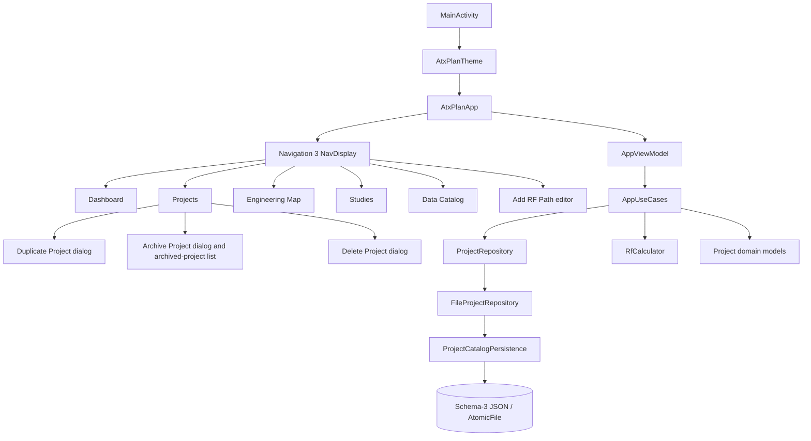
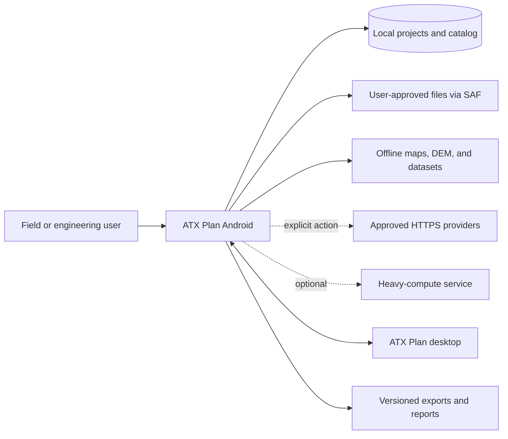
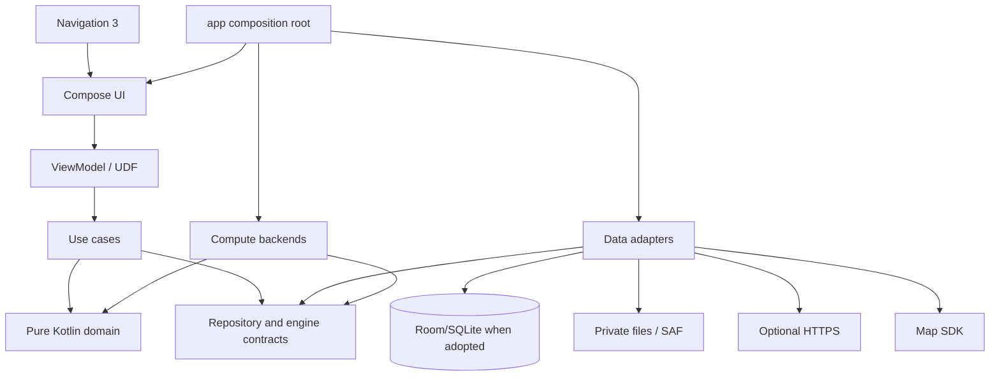
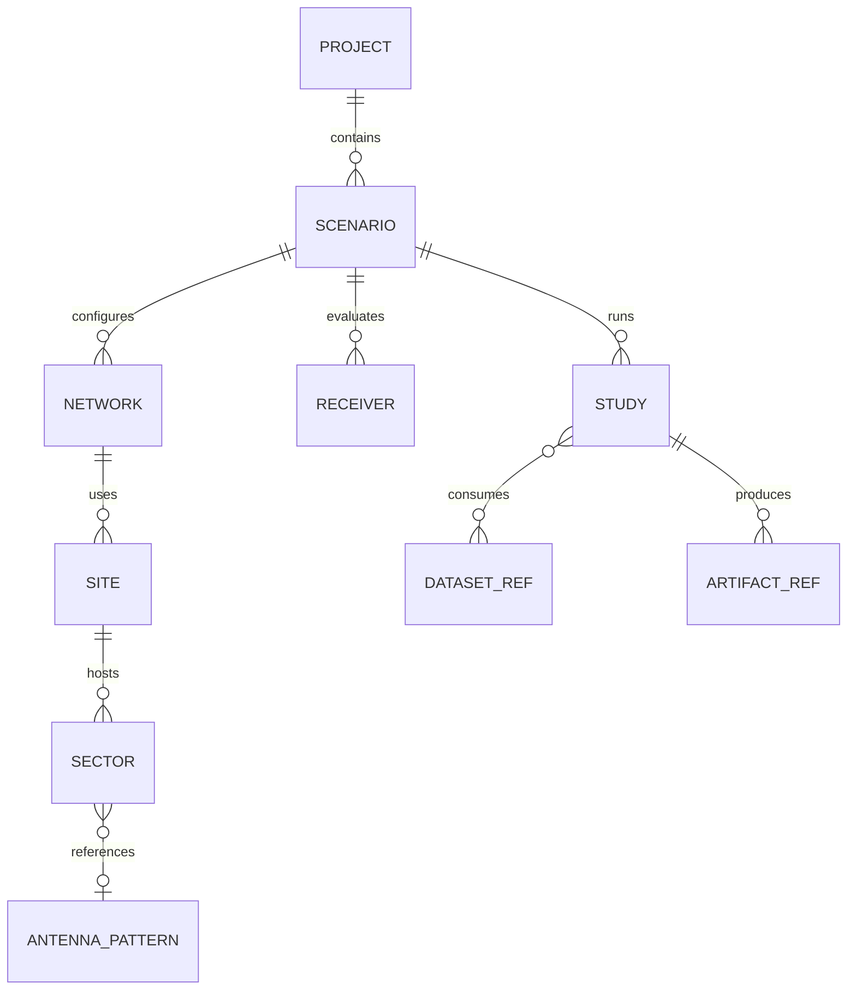

# Android Architecture

> Architecture baseline and target as of August 27, 2026. The repository contains a working Compose application, typed/saveable Navigation 3 routes, explicit UDF and use-case boundaries, a transactional schema-3 JSON repository with explicit 1→2→3 and 2→3 migrations, validated RF-domain models, transactional project rename, duplication, archive, restore, and bounded hard deletion, a combined Add RF Path editor, and a bounded RF calculator. Sections labeled Target or Planned describe the next architecture and must not be read as delivered functionality.

## 1. Architecture goals

The architecture must let the application:

- operate offline with local projects and previously installed data;
- preserve ATX domain meaning, units, precision, and provenance;
- keep Compose and Android out of the numerical core;
- survive rotation, Activity recreation, and process death;
- execute I/O and heavy computation off the main thread with progress and cancellation;
- replace map, elevation, storage, and compute adapters;
- migrate durable data without loss;
- exchange an explicitly supported project subset with desktop;
- scale from local Kotlin to native code or an optional service without changing study semantics;
- remain testable by layer and by complete workflow;
- expose all product-facing code, UI, tests, diagnostics, and documentation in English.

## 2. Current implementation

### 2.1 Runtime structure



### 2.2 Current status by concern

| Concern | Status | Current implementation | Important limitation |
|---|---|---|---|
| Composition root | Delivered | `MainActivity` applies the theme and hosts `AtxPlanApp`. | Dependency construction still occurs in the ViewModel factory. |
| UI shell | Delivered | Compose Material 3, edge-to-edge, custom light/dark theme. | Full accessibility/device-matrix validation remains. |
| Adaptive navigation | Delivered | Bottom navigation on compact width; navigation rail at 720 dp or wider; rail labels/header collapse to accessible icons below 520 dp height. | Feature contents are not all adaptive list/detail layouts. |
| Navigation 3 | Foundation | Serializable stable-ID `AtxRoute` keys, a saveable typed back stack, safe unknown-route fallback, and nested RF-path and project-name editors have saved-instance-state tests. | Deep links, deleted-ID UX, route ownership, and true process-death/rotation/device-matrix flows remain. |
| State management | Foundation | Immutable state, explicit actions/effects, structured problems/recovery, injected use cases/dispatchers, an explicit mutation-completion counter, cancellation, and ViewModel tests. Serialized catalog mutations rebase generically on the latest repository catalog and publish only after persistence; rejected/no-op outcomes return that latest catalog without writing. | One application ViewModel remains; cross-instance catalog observation, DI/scoping, durable jobs, broader observability, accessibility, and system recovery remain. |
| Repository boundary | Delivered | `ProjectRepository` interface separates ViewModel from file implementation. | Only the project catalog uses a repository. |
| JSON persistence | Delivered baseline | Strict UTF-8 serialization, schema 3, explicit chained 1→2→3 and direct 2→3 migrations, private `AtomicFile`, `fd.sync`, 5 MiB limit, and mutex-protected latest-catalog read-transform-write transactions have migration/fault/no-op/concurrency tests. | Unreadable/future-catalog recovery/export, external asset/file ownership, jobs, backup, multi-process policy, storage-exhaustion system evidence, and the long-term store decision remain. |
| Domain | Foundation | Schema-3 active/archive catalog invariants, `ArchivedProject` lifecycle metadata, project/network/site/sector/receiver/study models, engineering value types, and receiver/sector network-reference validation are implemented. | Legacy primitive entity fields need staged migration; no scenario, dataset, artifact, or full study model exists. |
| Project workflow | Delivered bounded slices | Create/select/rename/duplicate/archive/restore/delete use cases operate through repository transactions. Archive retains the complete aggregate with its timestamp/original index while excluding it from active selection/metrics; restore reinserts it deterministically and selects it. Complete reviewed snapshots protect archive, restore, and hard delete from stale concurrent state. | Local archive is not backup/export/sync or hard-delete recovery. Unreadable/future-catalog recovery, external asset ownership/recovery, independent RF CRUD/linked deletion, and source-lineage/duplication-provenance remain. |
| RF-path workflow | Delivered bounded slice | A saveable Compose draft calls a validated, deterministic use case and persists one linked network/site/sector/receiver transaction. | It is not complete entity CRUD, a terrain link study, or process-death system proof. |
| RF engine | Delivered | Pure Kotlin FSPL, EIRP, received power, margin, midpoint Fresnel radius, noise floor, and SNR; results carry explicit in-memory model and implementation provenance. | Synchronous bounded calculation only; no terrain, geodesy, patterns, or persisted execution manifest. |
| Engineering map | Foundation | Compose Canvas plots normalized site coordinates and active azimuth rays. | It is not a cartographic renderer or GIS engine. |
| Dataset catalog | Foundation | Static capability screen. | No dataset inventory or file operation exists. |
| Tests | Delivered baseline | The current 162 JVM tests and 40 Android 16/API 36 emulator instrumented tests pass. They cover domain, RF, schema migration/fault/latest-catalog concurrency, archive/restore/duplication/deletion conflict/selection/no-op policies, forms, ViewModel behavior, source-language rules, durable UI state, and Activity recreation. | A fresh physical run of the expanded instrumented suite, broader accessibility automation, performance, export, true system-reclaim process death, and a formal device matrix remain. |
| Build automation | Delivered baseline | CI runs unit tests, lint, and debug/test APK assembly; current local lint has 0 errors and 12 dependency/tooling warnings. | Connected test and signed release are outside current CI. |
| Product language | Delivered baseline | Production UI/errors/demo/tests are English and a unit test scans for common Portuguese source terms. | The blacklist is partial and must cover future resource/file types. |

## 3. Principles

1. **Domain first:** entities, units, and formulas do not import Android, Compose, persistence, network, or map SDKs.
2. **Unidirectional data flow:** UI emits intent; ViewModels coordinate; immutable state returns to UI.
3. **Local source of truth:** network operations update validated local state; the UI does not render transient remote responses as authoritative data.
4. **Repository boundary:** features depend on contracts, never directly on DAO, HTTP, SAF, or a map SDK.
5. **Version every durable boundary:** catalog, project, dataset, engine request/result, and artifact format carry a version.
6. **Reproducible results:** physical outputs record effective inputs, implementation, edition, hashes, fallbacks, and warnings.
7. **Explicit capability:** unsupported or missing data produces a diagnostic, never silent loss or fabricated values.
8. **Progressive modularization:** keep package boundaries now and extract Gradle modules only when the API and benefit are proven.
9. **Mobile resources are finite:** memory, storage, battery, thermal behavior, and time are study inputs.
10. **Replaceable compute:** Kotlin, native, and optional remote backends implement one versioned contract.
11. **English-only product:** code identifiers, UI, errors, tests, and documentation use English, except proper names and required source terminology.

## 4. Target context



Rules:

- local projects and supported results remain available without HTTPS or service access;
- external access states purpose, source, license, and impact;
- desktop exchange uses schema/capability negotiation;
- every external file is untrusted, including files selected by the user.

## 5. Target layers and dependency direction



### UI layer

Renders state, collects actions, manages presentation navigation, accessibility, and adaptive layout. It does not read files/databases or implement RF formulas.

#### Information-density and typography contract

ATX Plan is an information-dense engineering tool, so compact layout is a functional requirement rather than a reason to disable Android accessibility settings. The UI therefore:

- honors the system font scale and never clamps or replaces it;
- uses compact semantic type roles instead of display-sized text for routine screen headings;
- keeps interactive targets at least 48 dp even when visual padding is reduced;
- reduces redundant outer, card, and section spacing before reducing readable type;
- uses multi-column fields only when measured width and font scale leave every label, value, and unit readable;
- never truncates engineering values, units, provenance, warnings, or limitations to gain space;
- may constrain noncritical navigation labels and decorative summaries when their full meaning remains available through semantics;
- validates compact phones and larger windows separately instead of applying one fixed-density layout everywhere.

The current compact pass is measured on a physical Android 16 phone at approximately 394 dp portrait width and `fontScale = 1.15`. Responsive fallbacks were also inspected in portrait at `fontScale = 1.30`, after which the original setting was restored. Baseline landscape checks verified the short-height navigation rail, wide feature layouts, and the resized project-name editor with the IME before rotation was restored. This physical evidence remains bounded to one reference device.

The compact adaptive Duplicate Project and Delete Project dialogs were separately validated on an Android 16/API 36 emulator at 1080 × 2400 pixels and 420 dpi, at `fontScale = 1.0` and `fontScale = 1.30`, in portrait and short landscape with Gboard open and closed. Archive Project/actions and the archived-project card were reachable in portrait at font scales 1.0, 1.30, and 2.0 and in landscape at 1.30. The exact `DELETE` field remained fully visible, and the actions remained reachable through the bounded responsive/scroll layouts. No system font-scale override or clamp was used. These physical-device and emulator observations are not a complete accessibility or device matrix.

A bounded manual force-stop/relaunch retained an archived record. After restore, a second force-stop/relaunch retained that project as active and selected. This confirms the observed local schema-3 path only; it is not proof of Android Backup, system-reclaim restoration, every process-death timing, or broader device support.

### Domain/application layer

Contains entities, value objects, policies, use cases, and repository/engine contracts. It remains pure Kotlin wherever possible.

### Data/infrastructure layer

Implements repositories, DAOs, codecs, file catalogs, network clients, GIS adapters, and external engines. Infrastructure models are mapped at the boundary.

### Composition root

The `:app` module selects concrete adapters, scopes dependencies, starts navigation, and applies process-level policies. Feature Composables do not construct repositories.

## 6. Module plan

The current single `:app` module is acceptable while boundaries stabilize. The target topology is incremental:

```text
:app                 composition root, Activity, top-level navigation
:core:model          IDs, shared domain models, problems, provenance
:core:units          physical quantities and angular conventions
:core:database       Room, DAOs, schemas, and migrations
:core:files          private files, SAF, imports/exports, atomic staging
:core:network        controlled HTTP, authentication, cache policy
:core:compute        job/engine contracts, scheduler, backends
:core:geo            coordinates, CRS, grids, tiles, GIS contracts
:core:designsystem   theme, components, icons, accessibility
:core:testing        fixtures, fakes, matchers, golden utilities

:feature:projects
:feature:rf
:feature:map
:feature:datasets
:feature:antenna
:feature:link
:feature:coverage
:feature:measurements
:feature:settings
:feature:help
```

Rules:

- a feature may depend on core contracts, not another concrete feature;
- feature coordination uses typed navigation or shared use cases;
- `core:model` and `core:units` remain Android-free;
- database/network/file models do not leak to UI;
- native engines remain behind `core:compute`;
- circular module dependencies are prohibited.

Extract a module only when its API is stable, tests need Android-free execution, backend substitution is required, or build isolation has measured value.

## 7. UDF and ViewModel

### Current flow

The current app implements an explicit unidirectional application path:

```text
Composable callback
  -> AppUiAction
  -> AppViewModel
  -> injected application use case
  -> transactional repository or RF calculator boundary
  -> AppUiState and optional AppUiEffect
  -> lifecycle-aware Compose collection
```

This is a tested application foundation. It is not yet the final per-feature UDF or durable-job contract.

Current strengths:

- immutable top-level state;
- private mutable `StateFlow` and read-only public state;
- lifecycle-aware collection;
- explicit `AppUiAction` and one-time `AppUiEffect` types;
- structured problem codes, English user messages, and recovery actions;
- constructor-injected use cases plus replaceable storage/computation dispatchers;
- cancellation propagation and stale-result protection for link calculations;
- a mutex-protected mutation path that waits for catalog load, evaluates every mutation against the latest catalog inside `ProjectRepository.updateCatalog`, persists changes before publishing, and rebases rejected/no-op outcomes to that latest catalog without a write;
- ViewModel tests for success, recoverable failure/retry, invalid mutation, archive/restore/duplication/deletion conflict and no-op behavior, ordering, concurrency, cancellation, and stale calculation results.

Current gaps:

- one application-wide ViewModel owns unrelated feature state;
- dependency assembly still occurs in the ViewModel factory and no DI/scoping policy is approved;
- effects are currently limited to notices and do not yet cover external navigation/pickers;
- durable jobs, progress/checkpoints, correlation, and sanitized diagnostic export are not modeled;
- selected durable state and feature context still need true process-death system-flow evidence;
- accessibility and adaptive feature-flow validation remain incomplete.

### Target feature contract

```kotlin
// Planned contract example; not current repository code.
data class LinkUiState(
    val input: LinkInputUi,
    val result: LinkResultUi?,
    val execution: ExecutionUi,
    val problem: ProblemUi?,
)

sealed interface LinkAction
sealed interface LinkEffect
```

Rules:

- durable state belongs to repositories, not `remember`;
- small draft state may use `SavedStateHandle`;
- files, rasters, and results travel by ID, never through Bundle/back stack;
- one-time external picker/navigation work uses effects;
- physical validation remains in domain;
- ViewModels do not own Activity, map view, or navigation controller.

Every data screen models empty, loading, content, recoverable error, blocking problem, retry, and progress/cancellation where relevant.

## 8. Navigation 3

### Current implementation

- Navigation 3 runtime and UI version 1.1.6 are dependencies;
- a sealed `AtxRoute : NavKey` contract serializes bounded stable IDs instead of class names;
- five top-level routes plus `RfPathEditorRoute(projectId)` feed `NavDisplay`;
- `rememberSerializable` and `NavBackStackSerializer` save and restore the typed stack through Android saved instance state;
- unsupported, oversized, or malformed persisted route IDs resolve through a bounded safe fallback;
- routes carry only stable project IDs and the repository resolves project content;
- a compact bottom bar and expanded rail select destinations;
- top-level selection intentionally replaces the stack while the RF-path and project-name editors nest above Projects;
- Dashboard can navigate to Projects, Map, and Studies;
- instrumentation covers the Dashboard-to-Studies smoke path and serialized restoration of top-level, unknown, malformed, and nested-editor routes.

### Current limits

- saved-instance-state restoration tests do not replace a true system process-kill/relaunch flow;
- no external deep links or feature registration/ownership API exists;
- a project removed while an editor route is restored has bounded empty/error handling but not a complete recovery workflow;
- rotation, background/foreground, phone/tablet, and broad device-matrix behavior remain unverified;
- top-level replacement means back navigation between areas is intentionally minimal.

### Target contract

- typed route keys with no scattered strings;
- observable, saveable, restorable back stack;
- routes carry small IDs; repositories resolve full objects;
- each feature registers entries through an explicit API;
- central parser validates external deep links;
- adaptive list/detail keeps business rules shared;
- Activity Result API remains at the UI boundary;
- missing or deleted IDs produce a recoverable destination state.

Initial target destinations:

```text
Dashboard
Projects
ProjectDetail(projectId)
EntityEditor(projectId, entityType, entityId?)
EngineeringMap(projectId, selectionId?)
DataCatalog
LinkSetup(projectId, sectorId?, receiverId?)
LinkResult(studyId)
Settings
Help(topic?)
```

Adoption closes only after rotation, process death, invalid deep link, and phone/tablet tests pass.

## 9. Domain model

### Delivered foundation

The current pure Kotlin/serialization domain includes:

- schema-3 `ProjectCatalog` with active and archived collections, selected active-project ID, uniqueness across both collections, and stale-selection fallback that never selects an archived project;
- `ArchivedProject`, which retains one unchanged `PlannerProject` aggregate plus a non-negative archive timestamp and original active-list index used as a bounded restoration hint;
- `PlannerProject` with identity, name, customer, notes, timestamps, demo flag, networks, sites, receivers, and study summaries;
- `RfNetwork` with system, downlink frequency, and bandwidth validation;
- `RadioSystem` values for generic, FM, TV, LTE, 5G NR, land mobile, FWA, and air-to-ground;
- `RadioSite` with validated location, optional elevation, and unique sectors;
- `GeoPoint` latitude/longitude validation;
- `Sector` with active flag, azimuth, electrical tilt, height, power, gain, feeder loss, frequency, and a backward-compatible nullable network reference;
- `Receiver`/CPE with typed coordinate, height, gain, system loss, sensitivity, noise figure, azimuth/tilt, and a required project-local network reference;
- aggregate duplicate and referential-integrity validation for receivers and linked sectors;
- a validated `DuplicateProjectCommand`/result/use case that reads the latest durable source inside the transaction, generates a fresh route-safe root project ID and root timestamps, preserves the project-scoped nested graph and references, appends the copy, and selects it without changing the source;
- an `ArchiveProjectCommand`/result/status/use case that treats the complete reviewed active aggregate as an optimistic conflict token, retains it unchanged with an archive timestamp/original index, removes it from active selection/metrics, and selects the next, previous, or empty active state deterministically;
- a `RestoreProjectCommand`/result/status/use case that compares the complete reviewed archive record, reinserts its unchanged aggregate at the original index clamped to the latest active list, removes the archive record, and selects the restored project;
- a `DeleteProjectCommand`/result/status/use case that treats the complete reviewed aggregate as an optimistic conflict token, compares it structurally with the latest durable project, returns unchanged stale/missing outcomes, and atomically removes only an unchanged target while preserving other aggregate instances/order and choosing the next, previous, or empty selection deterministically;
- a validated `AddRfPathCommand`/result/use case that generates stable IDs and creates one linked network, site/sector, and receiver as one immutable catalog transition;
- `StudySummary`, study types, and lifecycle statuses;
- factory-created user projects and a synthetic demonstration project.

An enum entry or summary does not mean the corresponding study engine exists.

### Target aggregate



Delivered engineering value objects:

- `LatitudeDegrees`, `LongitudeDegrees`, and `GeoCoordinate`;
- `DistanceKm` and `HeightM`;
- `FrequencyMHz` and `BandwidthMHz`;
- `PowerDbm`, `GainDbi`, and `LossDb`;
- `AzimuthDegrees` and `TiltDegrees`.

They validate construction and deserialization and retain primitive numeric JSON representation. The combined Add RF Path command uses them at the UI/domain boundary. Existing legacy `RfNetwork`, `GeoPoint`, and `Sector` persisted fields remain primitive `Double` values and require staged migration rather than an incompatible rewrite.

Still-planned unit/domain types include linear power, dBW, elevation angle, CRS/NoData policy, dataset hash, engine ID/version, and study/artifact provenance values.

Target conventions:

- SI is canonical and conversions happen at boundaries;
- dB, dBm, dBW, dBi, dBd, and dBµV/m are distinct types;
- interfering powers are summed linearly;
- `Double` is the numerical reference precision;
- longitude is canonical in `[-180, 180)`;
- azimuth starts north and increases clockwise;
- elevation is positive above the horizon;
- positive-down electrical tilt is converted explicitly;
- NoData, below threshold, not computed, and failed are distinct;
- grids preserve CRS, transform, extent, resolution, NoData, and resampling policy.

Study inputs reference immutable snapshots. Recalculation creates a new execution/result and preserves prior evidence.

## 10. RF computation

### Delivered calculator

`RfCalculator` is pure Kotlin and validates finite/positive operational inputs. It currently computes:

```text
FSPL = 32.447783 + 20 log10(f_MHz) + 20 log10(d_km)
EIRP = TX power - TX loss + TX antenna gain
Received = EIRP - FSPL - additional loss + RX gain - RX loss
Noise = -174 + 10 log10(bandwidth_Hz) + receiver noise figure
Margin = received power - receiver sensitivity
SNR = received power - noise floor
Fresnel radius = sqrt(lambda * d1 * d2 / total distance)
```

The current screen calculates the first Fresnel radius at the path midpoint. Tests cover the 900 MHz/10 km FSPL baseline, explicit signs, invalid physical inputs, thermal-noise bandwidth conversion, and result terms.

### Not delivered by the calculator

- endpoint coordinate distance or geodesy;
- Earth curvature or effective-Earth factor;
- terrain profile, LOS, or Fresnel clearance;
- clutter/building/indoor loss derived from datasets;
- HRP/VRP or directional antenna gain;
- diffraction, troposcatter, fading, time/location variability;
- Hata, 3GPP, ITM, P.1812, P.1546, P.528, or FCC curves;
- persisted request/result, engine edition, provenance manifest, or parity bench.

### Application use cases

Delivered use cases load and transactionally update the catalog, create/select/rename/duplicate/archive/restore/delete projects, add the combined RF path, and calculate the bounded link budget. `RenameProjectUseCase` changes the validated name, may advance the update timestamp, preserves project identity and its nested graph, and rejects a command whose expected durable name is stale. `DuplicateProjectUseCase` intentionally resolves the source from the latest durable catalog inside the repository transaction. It normalizes and validates the requested name, creates a fresh route-safe root ID and fresh root creation/update timestamps, deep-copies the aggregate containers while retaining project-scoped nested IDs, references, data, order, demonstration flag, and study timestamps, leaves the source unchanged, appends the copy, and selects it. It does not yet record source-project lineage or a duplication-provenance marker.

`ArchiveProjectUseCase` compares the complete reviewed active aggregate with the latest durable aggregate. A successful transition moves that unchanged aggregate into `archivedProjects` with an injected archive timestamp and its original active index, removes it from active selection and metrics, and applies the same deterministic next/previous/empty selection policy used by permanent deletion. `RestoreProjectUseCase` compares the complete reviewed `ArchivedProject` record with the latest durable record, reinserts the unchanged aggregate at its original index clamped to the latest active-list size, removes the archive record, and selects the restored project. Stale, already-archived/already-active, and missing outcomes are typed no-ops. The UI publishes archive/restore success only when the committed catalog makes it observable.

`DeleteProjectUseCase` compares the complete reviewed active aggregate with the latest durable aggregate inside the transaction. A changed, missing, or archived target is a typed no-op; an unchanged active target is removed as one catalog transition while other projects and order remain unchanged and selection moves to the next project, the previous project when last, or none when empty. The compact UI requires exact `DELETE`, reports current project-scoped collection counts, and waits for observable durable absence. Hard deletion remains distinct from archive: the local archive cannot recover a permanently deleted project and is not backup, export, synchronization, or external-asset recovery. `AddRfPathUseCase` accepts typed drafts and injected ID/clock providers; its result carries the committed catalog projection and linked entities.

Remaining target use cases include:

```text
UpdateProjectMetadata
Create/Edit/Delete Network, Site, Sector, and Receiver
InstallDatasetPackage
BuildTerrainProfile
ImportAntennaPattern
RunLinkStudy
RunCoverageStudy
CompareSnapshots
ImportMeasurements
ExportStudyPackage
InspectProvenance
```

Use cases accept domain commands, define transaction boundaries, return typed problems/warnings, and expose progress/cancellation for long work.

## 11. Repositories and ports

### Current repository

`ProjectRepository` exposes `loadCatalog()` and `updateCatalog(transform)`. The update contract loads the latest durable catalog, applies one pure transform, avoids storage writes when the result is equal, and otherwise atomically writes the replacement while the complete transaction is serialized. `AppViewModel` now uses this as the generic rebase boundary for every catalog mutation instead of computing against a potentially stale UI catalog. It publishes only the repository-returned catalog after persistence succeeds; rejected or no-op outcomes publish the latest durable catalog without writing. This policy covers rename, duplication, archive, restore, deletion, selection, creation, and Add RF Path. `FileProjectRepository` and the Android-independent `ProjectCatalogPersistence`:

- store `atx_project_catalog_v1.json` in private app files, retaining the legacy filename so installed schema-1 catalogs are discovered;
- use strict UTF-8 typed JSON with defaults and unknown-key tolerance;
- seed the demo catalog only when the file does not exist;
- reject files above 5 MiB;
- reject a future schema, malformed UTF-8/JSON, and invalid domain content without overwriting original bytes;
- explicitly migrate schema 1 through 2 to 3 or schema 2 directly to 3 and atomically promote the migrated document;
- remove a same-named `archivedProjects` field from untrusted schema-1/2 input before decoding because archive storage did not exist in those versions;
- preserve the complete source document if migration promotion fails;
- save only schema 3;
- use `AtomicFile.startWrite/finishWrite/failWrite` plus `fd.sync`;
- share a process-wide mutex across repository instances;
- run storage work through the injected storage dispatcher in application use cases.

Automated storage tests cover direct and chained schema migration, hostile legacy archive-field injection, failed promotion, malformed/invalid/future payload preservation, strict UTF-8, size limits, failed writes, no-op writes, and concurrent transactions rebased on the latest durable catalog. `AtomicFile` still protects the final Android replacement; the mutex is in-process and is not a multi-process locking policy.

### Target ports

```text
ProjectRepository
RfCatalogRepository
AntennaRepository
DatasetRepository
ElevationProvider
MapSourceRepository
StudyRepository
ArtifactRepository
MeasurementRepository
ComputeBackend
ProjectExchangeCodec
```

A repository exposes domain models or stable projections, not Room entities, cursors, raw URIs, HTTP responses, or map-SDK types.

## 12. Persistence evolution

### Current durable format

```text
private files/
  atx_project_catalog_v1.json
```

This is an intentionally bounded first durable boundary. It is suitable for the current small catalog, not for rasters, large artifacts, job checkpoints, or full project interchange.

### Current guarantees

- schema 3 is serialized, with fixture-backed direct 2→3 and chained 1→2→3 migrations;
- writes are atomic and synced;
- complete read-transform-write catalog mutations are serialized in-process and evaluated against the latest durable catalog;
- invalid UTF-8, malformed/invalid JSON, future schema, and failed migration promotion do not replace original bytes;
- size is limited;
- archive records retain the complete project aggregate, archive timestamp, and original active-list index; archived projects are excluded from active selection/metrics;
- restore reinserts an unchanged aggregate at a deterministic bounded index and selects it;
- the ViewModel publishes only the repository-committed catalog, rebases rejected/no-op outcomes without writing, and exposes structured recovery state on storage failure;
- project hard deletion is a complete catalog transition; a failed write retains the previous project aggregate and selection.

### Current gaps

- no recovery UI or export of an unreadable catalog;
- no true Android `AtomicFile` interruption/full-storage system test;
- no multi-process locking or external-writer conflict policy;
- no durable job/checkpoint store;
- no separate project asset/file ownership or external-asset recovery;
- no immutable study artifacts;
- no approved transition plan for JSON versus Room/SQLite;
- no selective backup policy because backup is disabled.
- local archive does not provide hard-delete undo/recovery, backup, export, synchronization, or project-owned external-asset cleanup.

### Target storage layout

Room/SQLite is the preferred candidate for relational operational state after an ADR and migration plan. Large files remain outside BLOB columns.

```text
files/
  projects/      manifests and small assets by ID
  datasets/      authorized packages and inventory
  artifacts/     immutable study outputs
  staging/       partial imports/downloads not yet promoted

databases/
  atx-mobile.db  projects, entities, jobs, and file references
```

Policy:

- export every public Room schema;
- test forward migration from every public version;
- prohibit destructive fallback for user data;
- preserve ID, unit, precision, and references in migration tests;
- stage, sync, validate, hash, and atomically promote large files;
- reference only validated final files from the database;
- garbage-collect only proven unreferenced files;
- use DataStore for small non-relational preferences;
- use Android Keystore for credentials;
- copy result-affecting preferences into study snapshots.

Backup remains disabled until the policy explicitly includes recoverable project data and excludes secrets, staging, recomputable cache, and data restricted by license/size.

## 13. Offline-first data flow

```text
UI observes local state
  -> explicit acquisition/import action
  -> download/read into staging
  -> validate format, limits, license, hash, extent
  -> atomically promote file and metadata
  -> local repository emits new authoritative state
```

A network failure never deletes the last valid local state.

Target resource states:

```text
Absent
Planned
Downloading(progress, resumable)
Validating
Ready(version, hash)
Stale(reason)
Invalid(reason)
MissingExternalPermission
```

Dataset inventory fields include ID/edition, provider/source URL, license/attribution/acceptance, extent/CRS/resolution/NoData, size/SHA-256/ETag/date, parser version, validation result, dependencies, references, and update policy.

Community basemap endpoints must not be used for bulk prefetch. Offline packages require user files, an authorized source, or compatible infrastructure.

## 14. Map and GIS

### Current Canvas

The existing `EngineeringMapScreen` is a useful offline diagnostic foundation:

- computes a local extent from selected-project sites;
- normalizes coordinates into the Canvas;
- renders a visual grid, site markers, and active sector azimuth rays;
- lists coordinates and active transmitter counts;
- provides a semantic content description;
- explicitly labels itself local and without tiles.

It does not perform a geographic projection and must not be called a cartographic basemap or GIS result.

### Target map adapter

MapLibre Native Android is a preferred candidate because it aligns conceptually with desktop, but adoption requires a lifecycle/offline/license/size/performance spike.

The feature depends on app-owned contracts:

```text
MapViewport
MapLayerSpec
MapFeature
MapSelection
MapCommand
MapEvent
```

SDK types do not cross the adapter boundary.

GIS rules:

- EPSG:4326 is the canonical geographic input;
- distance and area use geodesy or an appropriate projection, never degrees directly;
- reprojection/resampling is explicit and versioned;
- imports require or declare CRS;
- vertex, band, pixel, compression, and size limits protect resources;
- physical, classified, and rendered layers remain separate;
- attribution remains visible and enters exported artifacts when required.

Format priorities:

- P0: validated GeoJSON/CSV, HGT/GeoTIFF elevation, approved offline basemap;
- P1: output GeoTIFF, KMZ, and dataset packages;
- P2: GeoPackage, large vectors, clutter, buildings, and population.

## 15. Compute backends

### Common target contract

```text
ComputeRequest
  requestId, studyType, schemaVersion
  engineRequirement, inputSnapshot, datasetRefs, resourceBudget

ComputeProgress
  stage, completed, total, message, checkpoint

ComputeResult
  engineId, engineVersion, implementation
  outputs, intermediateTerms, warnings, fallbacks, validity
  inputFingerprint, outputFingerprint
```

### Level 1 — Local Kotlin

The current RF calculator demonstrates this level. Keep Kotlin as the first choice for units, geodesy, FSPL, LOS/Fresnel, link budget, and acceptable small grids. It is the numerical baseline before optimization.

### Level 2 — Planned native backend

Adopt only after benchmarks prove need and golden cases prove equivalence. Requirements include minimal versioned JNI, ABI tests, explicit memory ownership, cooperative cancellation, crash containment, diagnostics, SBOM/license, and Kotlin/native fixture comparison.

### Level 3 — Optional service

Use for large areas or heavy engines only when justified. It is not part of the offline MVP. Require explicit opt-in, Keystore credentials, data-transfer preview, idempotent fingerprinted request, resumable transfer, encryption, retention policy, progress/cancel/recovery, local result persistence, and engine/dataset identity.

Before execution, estimate cells/profiles/samples, input/intermediate/output memory, temporary/final storage, expected time, network need, and measured battery/thermal impact. Never reduce physical resolution silently.

## 16. Concurrency and durable work

Storage and computation dispatchers are injected through `AppUseCases`. Catalog read-transform-write operations are serialized by the repository and ViewModel mutation boundaries, and link calculations cancel superseded UI work. The current RF calculation is still small and bounded; durable or heavy work requires:

- structured Kotlin coroutines;
- injected dispatchers;
- `viewModelScope` only for screen-bound recoverable work;
- WorkManager for durable downloads/jobs that must survive process death;
- foreground service only for policy-compliant, user-visible long work;
- persistent job ID and progress;
- cooperative cancellation between blocks;
- checkpoints when resume is worthwhile;
- CPU, memory, network, and provider parallelism limits;
- no blocking wait or raster work on the main thread.

On process return, job state is read from a repository as queued, running, paused, completed, failed, canceled, or orphaned. The UI does not infer success.

## 17. Desktop interoperability

The desktop uses versioned `.atxp` projects and supports capabilities the Android app does not. Compatibility must use a codec contract, not improvised direct database access.

```text
ProjectInspection
  containerVersion
  schemaVersion
  capabilitiesPresent
  capabilitiesReadable
  capabilitiesWritable
  unsupportedItems
  requiredDatasets
  warnings
```

Open modes:

- **read-write** only when supported content can be preserved;
- **read-only** for safe inspection without rewriting unknown content;
- **import copy** with a conversion/loss report;
- **rejected** for unsafe version, integrity, or capability.

Unknown items are never discarded on save. `.rp3` has a separate provenance/security/parser gate. Automatic multi-user synchronization is outside the MVP.

## 18. Dependency injection

No DI framework is currently present. Use cases, repository, dispatchers, calculator, ID generator, and clock use constructor/factory injection, while `AppViewModel.factory` still chooses `FileProjectRepository`. This is testable for the bounded foundation but does not define application/activity/ViewModel scopes or scale to alternate runtime backends.

The DI decision must provide clear Application/Activity/ViewModel scopes, backend/flavor bindings, easy fakes, measured startup cost, diagnostic errors, and no global service locator. Constructor injection remains the default contract regardless of framework.

## 19. Problems, diagnostics, and observability

Current code defines `AppProblem` with stable problem code, English user message, and recovery action. It distinguishes catalog load/save and link-budget failures, preserves invalid storage, blocks mutation after failed load, exposes Retry for catalog recovery, and emits one-time notice effects. The broader target taxonomy is:

```text
ValidationProblem
MissingDataProblem
UnsupportedCapabilityProblem
PermissionProblem
StorageProblem
NetworkProblem
IntegrityProblem
ComputeProblem
Canceled
UnexpectedProblem(correlationId)
```

Each problem separates English user message, recovery action, sanitized technical details, internal cause, severity, and whether a partial result is usable.

Logging rules:

- structured local logs with correlation/job/study ID;
- no tokens, project content, external paths, or coordinates by default;
- debug detail only in appropriate builds;
- diagnostic export requires preview and consent;
- remote telemetry is opt-in and needs approved privacy policy;
- numerical reproduction relies on a manifest, not logs.

## 20. Security and privacy

- request minimal permissions in context;
- use SAF instead of broad storage access;
- keep credentials in Android Keystore;
- use HTTPS, timeouts, bounded retries, and honest client identity;
- disable cleartext in production;
- limit import size, count, dimensions, compression, paths, and nesting;
- test path traversal, decompression bombs, malformed JSON/GIS, and polyglot files;
- never treat staging as valid data;
- validate ownership of database/file references;
- keep exported components minimal;
- exclude secrets, staging, and unsuitable datasets from any future backup;
- send no engineering data to an optional service without explicit consent.

Private Android storage alone is not a claim of application-level encryption. Encryption decisions require a threat model.

## 21. Reproducibility manifest

Persisted study executions target a manifest such as:

```json
{
  "studyId": "uuid",
  "createdAt": "ISO-8601",
  "application": {"version": "semver", "build": "commit"},
  "requestSchema": 1,
  "model": {"id": "fspl", "edition": "declared-edition"},
  "engine": {"id": "kotlin-local", "version": "version", "implementation": "implementation"},
  "inputs": [{"id": "input-id", "sha256": "hash"}],
  "parameters": {},
  "units": {},
  "crs": "EPSG:4326",
  "fallbacks": [],
  "warnings": [],
  "artifacts": [{"id": "artifact-id", "sha256": "hash"}]
}
```

Canonical serialization is versioned. Irrelevant timestamps and local paths do not enter the physical fingerprint.

## 22. Test architecture

### Current evidence

The current automated baseline contains 162 passing JVM tests and 40 passing Android 16/API 36 emulator instrumented tests. The connected run completed on `Medium_Phone_API_36.1` at font scale 1.30 with no failures or skips. Local lint reports 0 errors and 12 dependency/tooling warnings.

- project/domain tests cover schema-3 defaults, active/archive uniqueness, archive lifecycle metadata, validation, engineering-value boundaries, primitive JSON, receiver/sector references, legacy compatibility, and exact round trips;
- application tests cover transactional project archive/restore/duplication/deletion, complete aggregate preservation, timestamps/original indices, deterministic active selection/restoration position, latest-durable behavior, stale/repeated/missing no-op policy, fresh/colliding route-safe duplication IDs, source immutability, deterministic Add RF Path success, atomic failure, references, and JSON precision;
- persistence tests cover direct 2→3 and chained 1→2→3 migrations, hostile legacy archive-field removal, failed migration promotion, malformed/invalid/future data, strict UTF-8, size limits, atomic write failure, no-op writes, and concurrent repository instances rebased on the latest durable catalog;
- ViewModel tests cover load/create/select/rename/duplicate/archive/restore/delete/Add RF Path transitions, persist-before-publish behavior, generic latest-catalog rebase, structured failures/retry, mutation-completion accounting, ordering/concurrency, stale/repeated/missing outcomes without writes, invalid mutations, calculation cancellation, and stale-result suppression;
- RF and form tests cover implemented formulas, invalid physical inputs, unit parsing, defaults, and typed command conversion;
- the English-only source test scans production Kotlin/XML for common Portuguese terms;
- the current 40-test instrumented suite passes on an Android 16/API 36 emulator and covers the Dashboard-to-Studies smoke path, saved-instance-state restoration for supported, unknown, malformed, nested RF-path, and nested project-name routes, explicit mutation-completion and transient pending-save recovery, rename/duplication/archive/restore behavior, archive snapshot refresh and recreation, exact hard-delete confirmation and restoration behavior, deterministic selection, and create-project -> persist-RF-path -> Activity recreation; the preceding 18-test revision passed on the physical Android 16 reference phone;
- manual API 36 emulator checks cover Duplicate Project/Delete Project at font scales 1.0/1.30 in portrait and short landscape with Gboard open/closed, plus Archive Project/actions and the archived-project card in portrait at font scales 1.0/1.30/2.0 and landscape at 1.30;
- a bounded manual force-stop/relaunch retained the archived record, and a second cycle after restore retained that project as active and selected; this is not Android Backup or system-reclaim restoration proof and does not establish every process-death timing or a support matrix;
- lint/build evidence remains part of the debug baseline, but accessibility automation, performance, broader device/system flows, and release validation remain open.

### Target matrix

| Layer | Target | Examples |
|---|---|---|
| Unit | Pure domain | Units, angles, catalog policies, RF formulas. |
| Property | Invariants | Conversion round trip, HRP periodicity, monotonic distance. |
| Numerical golden | Engines | Profiles, Fresnel clearance, losses, known grids. |
| ViewModel/UDF | State transitions | Action→state/effect, error, retry, cancellation. |
| Repository | Contracts | Local-first behavior, failed atomic write, conflict, cache. |
| Persistence | Database/files | Migration, interruption, storage pressure, garbage collection. |
| GIS | Adapters | CRS, NoData, bounds, hostile import, provider absence. |
| Compose | Behavior | Forms, accessibility, focus, phone/tablet. |
| Navigation | Back stack | Deep link, rotation, process death, invalid ID. |
| Instrumented | Android integration | SAF, WorkManager, lifecycle, map, Keystore. |
| Performance | Resource use | Startup, jank, memory, battery, thermal, storage. |
| Interoperability | Desktop/mobile | Fixtures by schema and capability negotiation. |
| System | Vertical slice | Create→calculate→save→export→reopen offline. |

Numerical fixtures need independent sources, declared absolute/relative tolerance, intermediate-term comparison where possible, and the same suite across backends.

Migration tests retain every public schema fixture, exercise chained migration, verify IDs/references/precision/units/hashes, inject interruption, and never pass by recreating an empty store.

## 23. Performance and device matrix

The product gate must define minimum, reference, and high-capability devices, supported Android versions, and ABIs if native code is introduced.

Measure cold/warm startup, recomposition/jank, map feature scaling, 10/50/100 km profiles, reference grids, heap/temp storage, cancellation, process recovery, battery, and thermal behavior.

Until measured targets exist, absolute requirements are:

- no heavy CPU or I/O on the main thread;
- validate resource budget before large work;
- support cancellation;
- preserve consistency when Android kills the process;
- reduce resolution only with explicit consent.

## 24. Pending ADRs

| ADR | Decision | Gate |
|---|---|---|
| ADR-A001 | Product license, privacy, English-only policy, device matrix | G0 |
| ADR-A002 | Navigation 3 deep links, feature ownership, deleted-ID recovery, and system process restoration | G2 |
| ADR-A003 | Post-schema-3 JSON evolution, Room schema, files, unreadable/future-catalog recovery/export, backup, and migration | G3 |
| ADR-A004 | Geographic renderer and offline map format | G4 |
| ADR-A005 | Dataset catalog and acquisition | G4 |
| ADR-A006 | Compute contract and scheduler | G5/G6 |
| ADR-A007 | Kotlin versus native backend | G6 |
| ADR-A008 | Optional service and privacy | G6/G8 |
| ADR-A009 | `.atxp` interoperability | G7 |
| ADR-A010 | DI framework and scopes | G2 |
| ADR-A011 | Project security and backup | G3/G9 |

## 25. Prohibited anti-patterns

- RF formulas in Composables, DAOs, or map adapters;
- ViewModels calling map SDK, SAF, or HTTP clients directly;
- large entities in the navigation stack;
- global `Context` as a service locator;
- treating online cache as an offline guarantee;
- converting NoData to zero;
- adding dBm values directly;
- overwriting a previous study result on recalculation;
- destructive persistence fallback in production;
- silently changing resolution/model to fit resources;
- writing a final file before staging validation/hash;
- introducing JNI before Kotlin golden baseline and benchmark;
- requiring a service to open local projects/results;
- rewriting desktop projects with unknown capabilities;
- describing study enums, demo summaries, screens, or dependencies as complete engines;
- mixing Portuguese user-facing text into the English product baseline.

## 26. Incremental path from the current foundation

1. maintain the English-only source guard and extend it to new resource types;
2. preserve `MainActivity` as a thin host and move dependency assembly into an approved composition-root/DI policy;
3. split the application-wide ViewModel into feature contracts and introduce durable job/effect/problem contracts as flows grow;
4. complete deep-link/deleted-ID handling and prove navigation plus durable selection through true process death, rotation, accessibility, and the device matrix;
5. continue project lifecycle after delivered rename/duplication/archive/restore/hard-delete with hard-delete recovery/export and a lineage/provenance policy, and add independent network/site/sector/receiver edit/delete with linked-deletion impact while staging remaining primitive-field migration;
6. decide the long-term operational store, external project asset/file ownership and recovery, unreadable/future-catalog recovery/export, backup, and multi-process policy beyond schema 3;
7. add scenario, immutable study request/result, provenance, and artifact models;
8. add a geographic map behind an adapter while retaining the technical Canvas only as a diagnostic if useful;
9. add dataset inventory and DEM;
10. extend the current Kotlin RF baseline to project-linked terrain-aware studies;
11. persist manifests and artifacts;
12. benchmark before coverage, native code, or an optional service;
13. extract Gradle modules only after boundaries are proven.

This path builds directly on the implemented foundation and its measured evidence.
