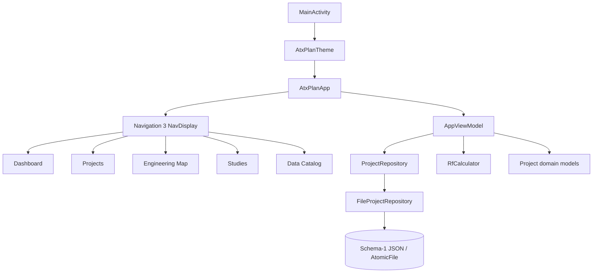
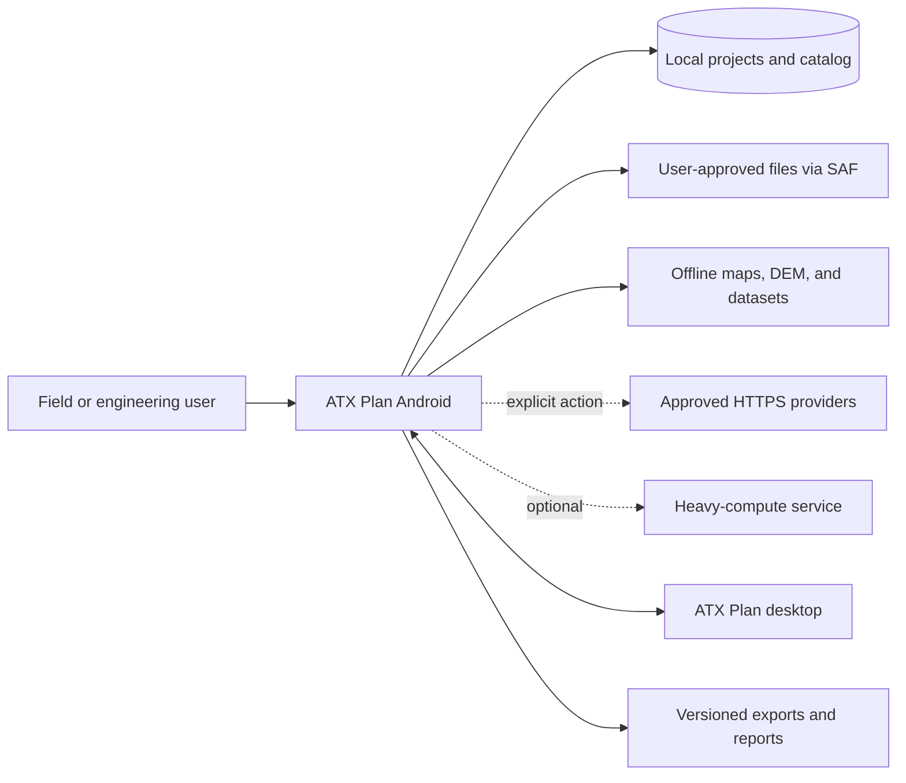
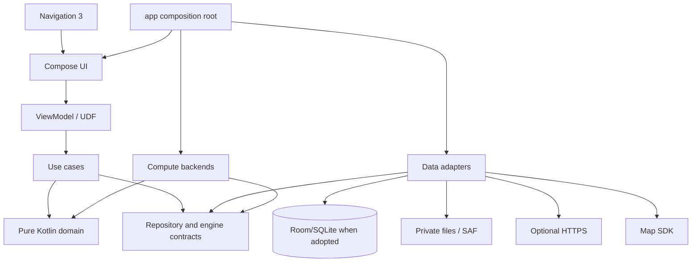
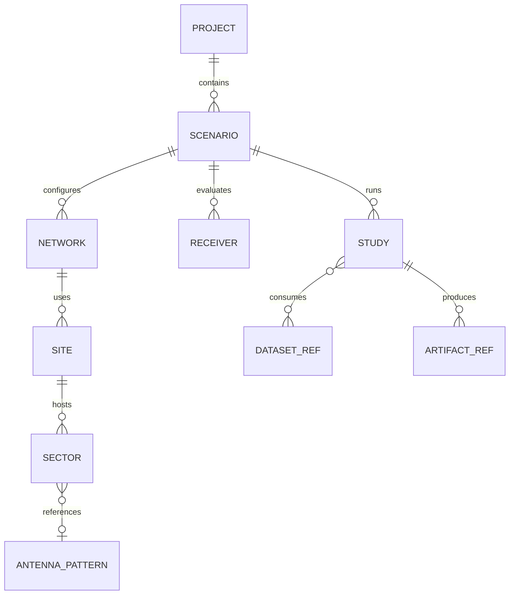

# Android Architecture

> Architecture baseline and target as of August 24, 2026. The repository already contains a working Compose/Navigation 3 application foundation, an atomic JSON repository, validated project-domain models, five screens, and a bounded RF calculator. Sections labeled Target or Planned describe the next architecture and must not be read as delivered functionality.

## 1. Architecture goals

The architecture must let the application:

- operate offline with local projects and previously installed data;
- preserve ATX domain meaning, units, precision, and provenance;
- keep Compose and Android out of the numerical core;
- survive rotation, Activity recreation, and process death;
- execute I/O and heavy computation off the main thread with progress and cancellation;
- replace map, elevation, storage, and compute adapters;
- migrate durable data without loss;
- exchange an explicitly supported project subset with desktop;
- scale from local Kotlin to native code or an optional service without changing study semantics;
- remain testable by layer and by complete workflow;
- expose all product-facing code, UI, tests, diagnostics, and documentation in English.

## 2. Current implementation

### 2.1 Runtime structure



### 2.2 Current status by concern

| Concern | Status | Current implementation | Important limitation |
|---|---|---|---|
| Composition root | Delivered | `MainActivity` applies the theme and hosts `AtxPlanApp`. | Dependency construction still occurs in the ViewModel factory. |
| UI shell | Delivered | Compose Material 3, edge-to-edge, custom light/dark theme. | Full accessibility/device-matrix validation remains. |
| Adaptive navigation | Delivered | Bottom navigation on compact width; navigation rail at 900 dp or wider. | Feature contents are not all adaptive list/detail layouts. |
| Navigation 3 | Foundation | `NavDisplay`, five object routes, in-memory top-level stack. | Back stack is not saved, routes use `Any`, no deep links or nested flows. |
| State management | Foundation | Immutable `AppUiState`, `StateFlow`, lifecycle collection, ViewModel callbacks, notice/error state. | No explicit action/effect protocol, use cases, or ViewModel tests. |
| Repository boundary | Delivered | `ProjectRepository` interface separates ViewModel from file implementation. | Only the project catalog uses a repository. |
| JSON persistence | Delivered baseline | kotlinx.serialization, schema 1, private file, `AtomicFile`, `fd.sync`, 5 MiB limit. | Atomicity is per write; saves are not serialized. No migration, concurrency, recovery, or fault-injection tests exist. |
| Domain | Foundation | Project/catalog/network/site/sector/coordinate/study-summary models with validation. | No receiver, scenario, dataset, artifact, canonical unit types, or full study model. |
| RF engine | Delivered | Pure Kotlin FSPL, EIRP, received power, margin, midpoint Fresnel radius, noise floor, SNR. | Synchronous bounded calculation only; no terrain, geodesy, patterns, or engine manifest. |
| Engineering map | Foundation | Compose Canvas plots normalized site coordinates and active azimuth rays. | It is not a cartographic renderer or GIS engine. |
| Dataset catalog | Foundation | Static capability screen. | No dataset inventory or file operation exists. |
| Tests | Delivered baseline | Nine unit tests and one Android 16 Compose smoke test pass. | No repository, ViewModel, restoration, migration, accessibility, or performance tests. |
| Build automation | Delivered baseline | CI runs unit tests, lint, and debug/test APK assembly. | Connected test and signed release are outside current CI. |
| Product language | Delivered baseline | Production UI/errors/demo/tests are English and a unit test scans for common Portuguese source terms. | The blacklist is partial and must cover future resource/file types. |

## 3. Principles

1. **Domain first:** entities, units, and formulas do not import Android, Compose, persistence, network, or map SDKs.
2. **Unidirectional data flow:** UI emits intent; ViewModels coordinate; immutable state returns to UI.
3. **Local source of truth:** network operations update validated local state; the UI does not render transient remote responses as authoritative data.
4. **Repository boundary:** features depend on contracts, never directly on DAO, HTTP, SAF, or a map SDK.
5. **Version every durable boundary:** catalog, project, dataset, engine request/result, and artifact format carry a version.
6. **Reproducible results:** physical outputs record effective inputs, implementation, edition, hashes, fallbacks, and warnings.
7. **Explicit capability:** unsupported or missing data produces a diagnostic, never silent loss or fabricated values.
8. **Progressive modularization:** keep package boundaries now and extract Gradle modules only when the API and benefit are proven.
9. **Mobile resources are finite:** memory, storage, battery, thermal behavior, and time are study inputs.
10. **Replaceable compute:** Kotlin, native, and optional remote backends implement one versioned contract.
11. **English-only product:** code identifiers, UI, errors, tests, and documentation use English, except proper names and required source terminology.

## 4. Target context



Rules:

- local projects and supported results remain available without HTTPS or service access;
- external access states purpose, source, license, and impact;
- desktop exchange uses schema/capability negotiation;
- every external file is untrusted, including files selected by the user.

## 5. Target layers and dependency direction



### UI layer

Renders state, collects actions, manages presentation navigation, accessibility, and adaptive layout. It does not read files/databases or implement RF formulas.

### Domain/application layer

Contains entities, value objects, policies, use cases, and repository/engine contracts. It remains pure Kotlin wherever possible.

### Data/infrastructure layer

Implements repositories, DAOs, codecs, file catalogs, network clients, GIS adapters, and external engines. Infrastructure models are mapped at the boundary.

### Composition root

The `:app` module selects concrete adapters, scopes dependencies, starts navigation, and applies process-level policies. Feature Composables do not construct repositories.

## 6. Module plan

The current single `:app` module is acceptable while boundaries stabilize. The target topology is incremental:

```text
:app                 composition root, Activity, top-level navigation
:core:model          IDs, shared domain models, problems, provenance
:core:units          physical quantities and angular conventions
:core:database       Room, DAOs, schemas, and migrations
:core:files          private files, SAF, imports/exports, atomic staging
:core:network        controlled HTTP, authentication, cache policy
:core:compute        job/engine contracts, scheduler, backends
:core:geo            coordinates, CRS, grids, tiles, GIS contracts
:core:designsystem   theme, components, icons, accessibility
:core:testing        fixtures, fakes, matchers, golden utilities

:feature:projects
:feature:rf
:feature:map
:feature:datasets
:feature:antenna
:feature:link
:feature:coverage
:feature:measurements
:feature:settings
:feature:help
```

Rules:

- a feature may depend on core contracts, not another concrete feature;
- feature coordination uses typed navigation or shared use cases;
- `core:model` and `core:units` remain Android-free;
- database/network/file models do not leak to UI;
- native engines remain behind `core:compute`;
- circular module dependencies are prohibited.

Extract a module only when its API is stable, tests need Android-free execution, backend substitution is required, or build isolation has measured value.

## 7. UDF and ViewModel

### Current flow

The current app implements a simple unidirectional path:

```text
Composable callback
  -> AppViewModel method
  -> ProjectRepository or RfCalculator
  -> AppUiState update
  -> lifecycle-aware Compose collection
```

This is a real foundation. It is not yet the final per-feature UDF contract.

Current strengths:

- immutable top-level state;
- private mutable `StateFlow` and read-only public state;
- lifecycle-aware collection;
- local persistence on an I/O dispatcher inside the repository;
- optimistic catalog update with rollback after save failure;
- distinct storage and calculator error fields.

Current gaps:

- calculation is called directly by the ViewModel rather than a use case/engine contract;
- UI callbacks are not explicit typed actions;
- snackbar notices are state strings rather than a documented effect protocol;
- one application-wide ViewModel owns unrelated feature state;
- dispatchers and repository construction are not injected by a composition framework;
- no ViewModel transition tests exist.
- overlapping optimistic saves are not serialized and can complete or roll back out of order.

### Target feature contract

```kotlin
// Planned contract example; not current repository code.
data class LinkUiState(
    val input: LinkInputUi,
    val result: LinkResultUi?,
    val execution: ExecutionUi,
    val problem: ProblemUi?,
)

sealed interface LinkAction
sealed interface LinkEffect
```

Rules:

- durable state belongs to repositories, not `remember`;
- small draft state may use `SavedStateHandle`;
- files, rasters, and results travel by ID, never through Bundle/back stack;
- one-time external picker/navigation work uses effects;
- physical validation remains in domain;
- ViewModels do not own Activity, map view, or navigation controller.

Every data screen models empty, loading, content, recoverable error, blocking problem, retry, and progress/cancellation where relevant.

## 8. Navigation 3

### Current implementation

- Navigation 3 runtime and UI version 1.1.6 are dependencies;
- five object routes feed `NavDisplay`;
- a compact bottom bar and expanded rail select destinations;
- top-level selection clears the in-memory stack and adds one route;
- Dashboard can navigate to Projects, Map, and Studies;
- the instrumented smoke test covers Dashboard → Studies.

### Current limits

- stack is created with `remember`, not a saved/restored navigation-state mechanism;
- route type is `Any` rather than a public sealed/serializable route contract;
- no nested details, route arguments, deep links, or capability guards;
- process-death behavior is not tested;
- top-level replacement means back navigation between areas is intentionally minimal.

### Target contract

- typed route keys with no scattered strings;
- observable, saveable, restorable back stack;
- routes carry small IDs; repositories resolve full objects;
- each feature registers entries through an explicit API;
- central parser validates external deep links;
- adaptive list/detail keeps business rules shared;
- Activity Result API remains at the UI boundary;
- missing or deleted IDs produce a recoverable destination state.

Initial target destinations:

```text
Dashboard
Projects
ProjectDetail(projectId)
EntityEditor(projectId, entityType, entityId?)
EngineeringMap(projectId, selectionId?)
DataCatalog
LinkSetup(projectId, sectorId?, receiverId?)
LinkResult(studyId)
Settings
Help(topic?)
```

Adoption closes only after rotation, process death, invalid deep link, and phone/tablet tests pass.

## 9. Domain model

### Delivered foundation

The current pure Kotlin/serialization domain includes:

- `ProjectCatalog` with schema version, selected-project ID, unique project IDs, and stale-selection fallback;
- `PlannerProject` with identity, name, customer, notes, timestamps, demo flag, networks, sites, and study summaries;
- `RfNetwork` with system, downlink frequency, and bandwidth validation;
- `RadioSystem` values for generic, FM, TV, LTE, 5G NR, land mobile, FWA, and air-to-ground;
- `RadioSite` with validated location, optional elevation, and unique sectors;
- `GeoPoint` latitude/longitude validation;
- `Sector` with active flag, azimuth, electrical tilt, height, power, gain, feeder loss, and frequency validation;
- `StudySummary`, study types, and lifecycle statuses;
- factory-created user projects and a synthetic demonstration project.

An enum entry or summary does not mean the corresponding study engine exists.

### Target aggregate



Initial value objects:

- latitude, longitude, and coordinate;
- distance and height;
- frequency and bandwidth;
- linear power, dBm, and dBW;
- gain dBi and loss dB;
- azimuth, elevation angle, and electrical tilt;
- CRS ID and NoData policy;
- dataset hash, engine ID, and engine version.

Conventions:

- SI is canonical and conversions happen at boundaries;
- dB, dBm, dBW, dBi, dBd, and dBµV/m are distinct types;
- interfering powers are summed linearly;
- `Double` is the numerical reference precision;
- longitude is canonical in `[-180, 180)`;
- azimuth starts north and increases clockwise;
- elevation is positive above the horizon;
- positive-down electrical tilt is converted explicitly;
- NoData, below threshold, not computed, and failed are distinct;
- grids preserve CRS, transform, extent, resolution, NoData, and resampling policy.

Study inputs reference immutable snapshots. Recalculation creates a new execution/result and preserves prior evidence.

## 10. RF computation

### Delivered calculator

`RfCalculator` is pure Kotlin and validates finite/positive operational inputs. It currently computes:

```text
FSPL = 32.447783 + 20 log10(f_MHz) + 20 log10(d_km)
EIRP = TX power - TX loss + TX antenna gain
Received = EIRP - FSPL - additional loss + RX gain - RX loss
Noise = -174 + 10 log10(bandwidth_Hz) + receiver noise figure
Margin = received power - receiver sensitivity
SNR = received power - noise floor
Fresnel radius = sqrt(lambda * d1 * d2 / total distance)
```

The current screen calculates the first Fresnel radius at the path midpoint. Tests cover the 900 MHz/10 km FSPL baseline, explicit signs, invalid physical inputs, thermal-noise bandwidth conversion, and result terms.

### Not delivered by the calculator

- endpoint coordinate distance or geodesy;
- Earth curvature or effective-Earth factor;
- terrain profile, LOS, or Fresnel clearance;
- clutter/building/indoor loss derived from datasets;
- HRP/VRP or directional antenna gain;
- diffraction, troposcatter, fading, time/location variability;
- Hata, 3GPP, ITM, P.1812, P.1546, P.528, or FCC curves;
- persisted request/result, engine edition, provenance manifest, or parity bench.

### Target use cases

```text
CreateProject
UpdateProjectMetadata
CreateSite / UpdateSector / CreateReceiver
InstallDatasetPackage
BuildTerrainProfile
ImportAntennaPattern
RunLinkStudy
RunCoverageStudy
CompareSnapshots
ImportMeasurements
ExportStudyPackage
InspectProvenance
```

Use cases accept domain commands, define transaction boundaries, return typed problems/warnings, and expose progress/cancellation for long work.

## 11. Repositories and ports

### Current repository

`ProjectRepository` exposes `loadCatalog()` and `saveCatalog()`. `FileProjectRepository`:

- stores `atx_project_catalog_v1.json` in private app files;
- uses UTF-8 typed JSON with defaults and unknown-key tolerance;
- seeds the demo catalog only when the file does not exist;
- rejects files above 5 MiB;
- rejects a future schema without overwriting it;
- preserves malformed content and returns a storage problem;
- saves only the current schema;
- uses `AtomicFile.startWrite/finishWrite/failWrite` plus `fd.sync`;
- performs I/O on `Dispatchers.IO`.

`AtomicFile` protects one replacement from a torn write. It does not serialize multiple `saveCatalog()` calls into a logical transaction; the repository currently has no mutex or write queue.

### Target ports

```text
ProjectRepository
RfCatalogRepository
AntennaRepository
DatasetRepository
ElevationProvider
MapSourceRepository
StudyRepository
ArtifactRepository
MeasurementRepository
ComputeBackend
ProjectExchangeCodec
```

A repository exposes domain models or stable projections, not Room entities, cursors, raw URIs, HTTP responses, or map-SDK types.

## 12. Persistence evolution

### Current durable format

```text
private files/
  atx_project_catalog_v1.json
```

This is an intentionally bounded first durable boundary. It is suitable for the current small catalog, not for rasters, large artifacts, job checkpoints, or full project interchange.

### Current guarantees

- schema number is serialized;
- writes are atomic and synced;
- invalid/future content is not silently replaced;
- size is limited;
- failed save rolls UI catalog state back to the previous value.

### Current gaps

- no migration implementation beyond accepting schema 1;
- no recovery UI or export of an unreadable catalog;
- no fault-injection test around `AtomicFile`;
- no serialization of concurrent saves or stale-rollback protection;
- no optimistic-concurrency or multi-process policy;
- after a failed future-schema/corrupt load, an explicit create action can save the empty UI catalog over the preserved file; recovery/export UX is required first;
- no separate project asset ownership;
- no immutable study artifacts;
- no selective backup policy because backup is disabled.

### Target storage layout

Room/SQLite is the preferred candidate for relational operational state after an ADR and migration plan. Large files remain outside BLOB columns.

```text
files/
  projects/      manifests and small assets by ID
  datasets/      authorized packages and inventory
  artifacts/     immutable study outputs
  staging/       partial imports/downloads not yet promoted

databases/
  atx-mobile.db  projects, entities, jobs, and file references
```

Policy:

- export every public Room schema;
- test forward migration from every public version;
- prohibit destructive fallback for user data;
- preserve ID, unit, precision, and references in migration tests;
- stage, sync, validate, hash, and atomically promote large files;
- reference only validated final files from the database;
- garbage-collect only proven unreferenced files;
- use DataStore for small non-relational preferences;
- use Android Keystore for credentials;
- copy result-affecting preferences into study snapshots.

Backup remains disabled until the policy explicitly includes recoverable project data and excludes secrets, staging, recomputable cache, and data restricted by license/size.

## 13. Offline-first data flow

```text
UI observes local state
  -> explicit acquisition/import action
  -> download/read into staging
  -> validate format, limits, license, hash, extent
  -> atomically promote file and metadata
  -> local repository emits new authoritative state
```

A network failure never deletes the last valid local state.

Target resource states:

```text
Absent
Planned
Downloading(progress, resumable)
Validating
Ready(version, hash)
Stale(reason)
Invalid(reason)
MissingExternalPermission
```

Dataset inventory fields include ID/edition, provider/source URL, license/attribution/acceptance, extent/CRS/resolution/NoData, size/SHA-256/ETag/date, parser version, validation result, dependencies, references, and update policy.

Community basemap endpoints must not be used for bulk prefetch. Offline packages require user files, an authorized source, or compatible infrastructure.

## 14. Map and GIS

### Current Canvas

The existing `EngineeringMapScreen` is a useful offline diagnostic foundation:

- computes a local extent from selected-project sites;
- normalizes coordinates into the Canvas;
- renders a visual grid, site markers, and active sector azimuth rays;
- lists coordinates and active transmitter counts;
- provides a semantic content description;
- explicitly labels itself local and without tiles.

It does not perform a geographic projection and must not be called a cartographic basemap or GIS result.

### Target map adapter

MapLibre Native Android is a preferred candidate because it aligns conceptually with desktop, but adoption requires a lifecycle/offline/license/size/performance spike.

The feature depends on app-owned contracts:

```text
MapViewport
MapLayerSpec
MapFeature
MapSelection
MapCommand
MapEvent
```

SDK types do not cross the adapter boundary.

GIS rules:

- EPSG:4326 is the canonical geographic input;
- distance and area use geodesy or an appropriate projection, never degrees directly;
- reprojection/resampling is explicit and versioned;
- imports require or declare CRS;
- vertex, band, pixel, compression, and size limits protect resources;
- physical, classified, and rendered layers remain separate;
- attribution remains visible and enters exported artifacts when required.

Format priorities:

- P0: validated GeoJSON/CSV, HGT/GeoTIFF elevation, approved offline basemap;
- P1: output GeoTIFF, KMZ, and dataset packages;
- P2: GeoPackage, large vectors, clutter, buildings, and population.

## 15. Compute backends

### Common target contract

```text
ComputeRequest
  requestId, studyType, schemaVersion
  engineRequirement, inputSnapshot, datasetRefs, resourceBudget

ComputeProgress
  stage, completed, total, message, checkpoint

ComputeResult
  engineId, engineVersion, implementation
  outputs, intermediateTerms, warnings, fallbacks, validity
  inputFingerprint, outputFingerprint
```

### Level 1 — Local Kotlin

The current RF calculator demonstrates this level. Keep Kotlin as the first choice for units, geodesy, FSPL, LOS/Fresnel, link budget, and acceptable small grids. It is the numerical baseline before optimization.

### Level 2 — Planned native backend

Adopt only after benchmarks prove need and golden cases prove equivalence. Requirements include minimal versioned JNI, ABI tests, explicit memory ownership, cooperative cancellation, crash containment, diagnostics, SBOM/license, and Kotlin/native fixture comparison.

### Level 3 — Optional service

Use for large areas or heavy engines only when justified. It is not part of the offline MVP. Require explicit opt-in, Keystore credentials, data-transfer preview, idempotent fingerprinted request, resumable transfer, encryption, retention policy, progress/cancel/recovery, local result persistence, and engine/dataset identity.

Before execution, estimate cells/profiles/samples, input/intermediate/output memory, temporary/final storage, expected time, network need, and measured battery/thermal impact. Never reduce physical resolution silently.

## 16. Concurrency and durable work

Current JSON file I/O is dispatched to `Dispatchers.IO`; current RF work is small and synchronous. Heavy work requires:

- structured Kotlin coroutines;
- injected dispatchers;
- `viewModelScope` only for screen-bound recoverable work;
- WorkManager for durable downloads/jobs that must survive process death;
- foreground service only for policy-compliant, user-visible long work;
- persistent job ID and progress;
- cooperative cancellation between blocks;
- checkpoints when resume is worthwhile;
- CPU, memory, network, and provider parallelism limits;
- no blocking wait or raster work on the main thread.

On process return, job state is read from a repository as queued, running, paused, completed, failed, canceled, or orphaned. The UI does not infer success.

## 17. Desktop interoperability

The desktop uses versioned `.atxp` projects and supports capabilities the Android app does not. Compatibility must use a codec contract, not improvised direct database access.

```text
ProjectInspection
  containerVersion
  schemaVersion
  capabilitiesPresent
  capabilitiesReadable
  capabilitiesWritable
  unsupportedItems
  requiredDatasets
  warnings
```

Open modes:

- **read-write** only when supported content can be preserved;
- **read-only** for safe inspection without rewriting unknown content;
- **import copy** with a conversion/loss report;
- **rejected** for unsafe version, integrity, or capability.

Unknown items are never discarded on save. `.rp3` has a separate provenance/security/parser gate. Automatic multi-user synchronization is outside the MVP.

## 18. Dependency injection

No DI framework is currently present. `AppViewModel.factory` constructs `FileProjectRepository`, which is acceptable for the bounded foundation but does not scale to alternate backends.

The DI decision must provide clear Application/Activity/ViewModel scopes, backend/flavor bindings, easy fakes, measured startup cost, diagnostic errors, and no global service locator. Constructor injection remains the default contract regardless of framework.

## 19. Problems, diagnostics, and observability

Current code distinguishes storage and calculator errors, preserves invalid storage, and shows a storage banner/snackbar. Target taxonomy:

```text
ValidationProblem
MissingDataProblem
UnsupportedCapabilityProblem
PermissionProblem
StorageProblem
NetworkProblem
IntegrityProblem
ComputeProblem
Canceled
UnexpectedProblem(correlationId)
```

Each problem separates English user message, recovery action, sanitized technical details, internal cause, severity, and whether a partial result is usable.

Logging rules:

- structured local logs with correlation/job/study ID;
- no tokens, project content, external paths, or coordinates by default;
- debug detail only in appropriate builds;
- diagnostic export requires preview and consent;
- remote telemetry is opt-in and needs approved privacy policy;
- numerical reproduction relies on a manifest, not logs.

## 20. Security and privacy

- request minimal permissions in context;
- use SAF instead of broad storage access;
- keep credentials in Android Keystore;
- use HTTPS, timeouts, bounded retries, and honest client identity;
- disable cleartext in production;
- limit import size, count, dimensions, compression, paths, and nesting;
- test path traversal, decompression bombs, malformed JSON/GIS, and polyglot files;
- never treat staging as valid data;
- validate ownership of database/file references;
- keep exported components minimal;
- exclude secrets, staging, and unsuitable datasets from any future backup;
- send no engineering data to an optional service without explicit consent.

Private Android storage alone is not a claim of application-level encryption. Encryption decisions require a threat model.

## 21. Reproducibility manifest

Persisted study executions target a manifest such as:

```json
{
  "studyId": "uuid",
  "createdAt": "ISO-8601",
  "application": {"version": "semver", "build": "commit"},
  "requestSchema": 1,
  "model": {"id": "fspl", "edition": "declared-edition"},
  "engine": {"id": "kotlin-local", "version": "version", "implementation": "implementation"},
  "inputs": [{"id": "input-id", "sha256": "hash"}],
  "parameters": {},
  "units": {},
  "crs": "EPSG:4326",
  "fallbacks": [],
  "warnings": [],
  "artifacts": [{"id": "artifact-id", "sha256": "hash"}]
}
```

Canonical serialization is versioned. Irrelevant timestamps and local paths do not enter the physical fingerprint.

## 22. Test architecture

### Current evidence

- four project-model tests: trim/timestamps, stale selection fallback, demo serialization round trip, invalid coordinates/duplicate IDs;
- four RF tests: FSPL baseline, explicit gain/loss signs and result terms, invalid inputs, thermal noise;
- one English-only source test that scans production Kotlin/XML for common Portuguese terms;
- one Compose Android test: Dashboard entry point opens Studies on Android 16;
- latest reports show nine unit tests and one instrumented test with zero failures;
- latest lint report shows zero errors and nine dependency-version warnings.

### Target matrix

| Layer | Target | Examples |
|---|---|---|
| Unit | Pure domain | Units, angles, catalog policies, RF formulas. |
| Property | Invariants | Conversion round trip, HRP periodicity, monotonic distance. |
| Numerical golden | Engines | Profiles, Fresnel clearance, losses, known grids. |
| ViewModel/UDF | State transitions | Action→state/effect, error, retry, cancellation. |
| Repository | Contracts | Local-first behavior, failed atomic write, conflict, cache. |
| Persistence | Database/files | Migration, interruption, storage pressure, garbage collection. |
| GIS | Adapters | CRS, NoData, bounds, hostile import, provider absence. |
| Compose | Behavior | Forms, accessibility, focus, phone/tablet. |
| Navigation | Back stack | Deep link, rotation, process death, invalid ID. |
| Instrumented | Android integration | SAF, WorkManager, lifecycle, map, Keystore. |
| Performance | Resource use | Startup, jank, memory, battery, thermal, storage. |
| Interoperability | Desktop/mobile | Fixtures by schema and capability negotiation. |
| System | Vertical slice | Create→calculate→save→export→reopen offline. |

Numerical fixtures need independent sources, declared absolute/relative tolerance, intermediate-term comparison where possible, and the same suite across backends.

Migration tests retain every public schema fixture, exercise chained migration, verify IDs/references/precision/units/hashes, inject interruption, and never pass by recreating an empty store.

## 23. Performance and device matrix

The product gate must define minimum, reference, and high-capability devices, supported Android versions, and ABIs if native code is introduced.

Measure cold/warm startup, recomposition/jank, map feature scaling, 10/50/100 km profiles, reference grids, heap/temp storage, cancellation, process recovery, battery, and thermal behavior.

Until measured targets exist, absolute requirements are:

- no heavy CPU or I/O on the main thread;
- validate resource budget before large work;
- support cancellation;
- preserve consistency when Android kills the process;
- reduce resolution only with explicit consent.

## 24. Pending ADRs

| ADR | Decision | Gate |
|---|---|---|
| ADR-A001 | Product license, privacy, English-only policy, device matrix | G0 |
| ADR-A002 | Navigation 3 typed/restorable stack | G2 |
| ADR-A003 | JSON evolution, Room schema, files, and migration | G3 |
| ADR-A004 | Geographic renderer and offline map format | G4 |
| ADR-A005 | Dataset catalog and acquisition | G4 |
| ADR-A006 | Compute contract and scheduler | G5/G6 |
| ADR-A007 | Kotlin versus native backend | G6 |
| ADR-A008 | Optional service and privacy | G6/G8 |
| ADR-A009 | `.atxp` interoperability | G7 |
| ADR-A010 | DI framework and scopes | G2 |
| ADR-A011 | Project security and backup | G3/G9 |

## 25. Prohibited anti-patterns

- RF formulas in Composables, DAOs, or map adapters;
- ViewModels calling map SDK, SAF, or HTTP clients directly;
- large entities in the navigation stack;
- global `Context` as a service locator;
- treating online cache as an offline guarantee;
- converting NoData to zero;
- adding dBm values directly;
- overwriting a previous study result on recalculation;
- destructive persistence fallback in production;
- silently changing resolution/model to fit resources;
- writing a final file before staging validation/hash;
- introducing JNI before Kotlin golden baseline and benchmark;
- requiring a service to open local projects/results;
- rewriting desktop projects with unknown capabilities;
- describing study enums, demo summaries, screens, or dependencies as complete engines;
- mixing Portuguese user-facing text into the English product baseline.

## 26. Incremental path from the current foundation

1. maintain the English-only source guard and extend it to new resource types;
2. preserve `MainActivity` as a thin host and move dependency assembly to the composition root;
3. split the application-wide ViewModel into feature contracts as flows grow;
4. harden Navigation 3 with typed/restorable routes;
5. introduce canonical unit value objects and receiver/scenario/study models;
6. add persistence migration/fault tests before schema 2;
7. complete site/sector/receiver CRUD;
8. add a geographic map behind an adapter while retaining the technical Canvas only as a diagnostic if useful;
9. add dataset inventory and DEM;
10. extend the current Kotlin RF baseline to project-linked terrain-aware studies;
11. persist manifests and artifacts;
12. benchmark before coverage, native code, or an optional service;
13. extract Gradle modules only after boundaries are proven.

This path builds directly on the implemented foundation and its measured evidence.
